== INTRODUCTION

Before reading this manual you should read (at least) the introductory chapter of the _PLIB Reference_ manual.

This manual describes the C functions in the WLIB library that access the services of the _window server_.

This manual completely supersedes previous versions and takes account of:

* version 4 of the window server
* the Series 3a and Series 3 corporate computers

The window server is a system process (with process name `SYS$WSRV`) that runs under the EPOC operating system to provide "client" processes with shared access to the screen, keyboard and (if there is one) a pointing device.

image:media/image1-new.png[]

A server process is required because EPOC is a _single-user_ multi-tasking operating system as opposed to a multi-user system.
On a single-user system, all the application processes must share the same screen and keyboard.
Using a server process to share a resource is a common technique on multi-tasking operating systemsfootnote:[File servers and printer servers are commonly used to share centralised mass storage devices and printers respectively on, for example, a network. A file server is also used in EPOC (with process name _SYS$FSRV_, described in the _Files_ chapter of the _PLIB Reference_ manual).] and EPOC has particularly good support for client-server architectures (see the chapter _Processes and Inter-Process messaging_ in the _PLIB Reference_ manual).

Having connected to the window server, a client requests services by sending the window server an interprocess message.
However, the application programmer does not program at the message passing level but uses the C function interface described in this manual.

===  Versions of the window server

This section summarises the differences between window servers that run on the following computers:

* the HC range of hand-held corporate computers
* the Series 3 palm-top computer (abbreviated to S3)
* the Series 3a palm-top computer (abbreviated to S3a)
* the Work__about__ corporate hand-held computer
* the MC range of notebook computers (MC400 and MC200)

As well as different versions on different machines, the process of continuous development has produced four generations of the window server:

[cols="1h,3"]
|===
|version 2
|found on MCs with ROM versions less than 2.40

|version 3
|found on HCs with ROM versions less than 1.50

|version 3.5
|found on S3s, HCs with ROM versions of 1.50 or greater and on MCs with ROM versions of 2.40 or greater

|version 4
|found on the S3a and Work__about__.
|===

You can obtain the machine type and whether it is version 2, 3 (which includes 3.5) or 4 of the window server from the information returned by `wConnect`.

====  Version 4

The following lists the changes for version 4 of the window server:

[cols="1h,3"]
|===
|Task keys now cycle round all instances of applications
|On the S3a, where more than one instance of an application is running, pressing the kbd:[TASK] key for that application (ie one of the membrane keys) causes control to cycle round from one instance to the next, bringing each one into foreground in turn; the kbd:[SHIFT+TASK] key cycles round in reverse.
Where the S3a is running in S3 compatibility mode, the diamond key must now be used to switch modes.
This key generates a `W_KEY_MODE` event.

|Double pixel mode
|All graphics commands now handle drawing with double sized pixels.
This feature is designed for the S3a to run in S3 compatibility mode.
It is also available in individual windows by setting the `W_WIN_DOUBLE_PIXEL` flag; this causes all graphics in that window to work in double pixel mode.
A new flag `G_GC_FLAG_DOUBLE` can be set in a graphics context (GC) to draw in double pixel mode.
Note that the Work__about__ does not use double pixel mode when running in S3 compatibility mode.

|Bitmaps
|A set of new bitmap functions are available that open a bitmap file and permit bitmaps within the file to be loaded or drawn directly.
Multiple bitmaps can be loaded from a file without needing to close and reopen it for each bitmap.
Part or all of a bitmap can be drawn directly from the file.

|Merging of HC and S3 features
|Some HC features from the later releases of version 3.5 of the window server have now been added to the S3a variant of the window server. These are:

- the window server system flags set by calls to `wSystem` that were previously relevant to the HC but not the S3a, are now relevant to both.
The initial value of these flags is loaded from the environment variable `$WS_FL` as in the HC variant.

|`$WS_FNTS` environment variable
|The environment variable `$WS_FNTS` contains a series of words each of which contains the index of a font used by the window server.
The fonts are as follows:

* System font
* Notifier/Alert font
* Status Window font
* Symbols font used for the status window diamond symbol
* Medium 2 digital clock font
* Medium 2 date font
* Notifier/alert button font
* Small status window clock font

|Font ID indirection
|Font IDs based on `WS_FONT_BASE` will be available for this and all future versions.

Font IDs based on `WS_FONT_BASE2` are for internal use only.
Developers may use these fonts but *NO* guarantee is given that they will be available in future versions.

|Keyboard/event buffer size
|The keyboard/event buffer size has been increased from 8 to 16 events per application.

|Date changed event
|Whenever the date changes, a `WM_DATE_CHANGED` message is delivered to any application in non-compatibility mode on the S3a while in foreground.
Applications in non-compatibility mode in background will receive the message when they come to foreground.
If this event occurs while the machine is off, the message will be delivered when the machine is next switched on.

|Default icon ID
|A new `#define` called `WS_DEFAULT_ICON` has been supplied to identify the built-in default icon; the grey part of the icon ID is `WS_DEFAULT_ICON+1`.

|Grey
|Grey is available on the S3a and Work__about__ (in one shade only). At a software level this has been implemented by introducing the concept of a plane.

There are two planes to which drawing can be directed, both of which have the usual background attributes. The normal plane can be thought of as being the 'original' plane, handling black. The grey plane as its name implies handles the display of grey.

Drawing is normally done to one or both planes.
However, the two planes are not entirely independent; for example, to display grey, the normal plane should be clear and the grey plane set.
If a pixel in the normal plane is set, it is displayed black regardless of the grey plane setting.
This is best thought of as the normal plane 'overlaying' the grey plane.

Appropriate values in a new flags field in the `G_GC` struct cause graphics to be directed either to the grey plane or to both planes.

|New window background modes
|New background modes have been added to the normal plane:

`W_WIN_BACK_CLR_NO_REDRAW`, `W_WIN_BACK_SET_NO_REDRAW` and `W_WIN_BACK_NONE_NO_REDRAW`.
The `..._NO_REDRAW` modes have the effect of telling the window server to set the background for the plane but that no drawing (or re-drawing) will be done to it. Note that `W_WIN_BACK_CLR` is the default background mode for the normal plane.

Similarly, the grey plane has corresponding background modes:

`W_WIN_BACK_GREY_CLR_NO_REDRAW`, `W_WIN_BACK_GREY_SET_NO_REDRAW` and `W_WIN_BACK_GREY_NONE_NO_REDRAW` as well as the expected `W_WIN_BACK_GREY_CLR`, `W_WIN_BACK_GREY_SET`, `W_WIN_BACK_GREY_NONE` and `W_WIN_BACK_GREY_BITMAP`. Note that the default background mode for the grey plane is `W_WIN_BACK_GREY_CLR_NO_REDRAW`.

|Scrolling/Moving windows
|Scrolling and moving windows has been optimised so that a plane is only moved if it has drawing enabled. Drawing to a plane is disabled by specifying any of the background modes: `..._NO_REDRAW`.

|Alert changes
|All existing calls to `wsAlertW` appear in a new style. The maximum number of message lines can be increased to four by OR'ing the `WS_ALERT_B` flag into the mode parameter and by building an appropriate text string.

|Load additional functions
| Additional graphics primitives can be loaded from a dynamic library (DYL).
The associated functions are `wLoadDYL`, `wCallDYL`, `wCallDYLReply`.

|Sprites
|These are animated sequences of bitmaps which are 'connected' to a window.
Unlike the pre-version 4 animated sequences, a sprite is not displayed as part of the window background.
The window server takes care of saving and restoring the contents of the underlying display.
This can give the impression of the sprite 'floating' above the underlying display.
|===

In addition to or in relation to the above mentioned topics, the following functions are new to version 4:

[cols="1m,3"]
|===
|wCompatibilityMode
|Sets or cancels S3 compatibility mode on the S3a and Work__about__.

|gInitBit
|Opens a bitmap file ready for calls to `gGetBit` or `gDrawBit`.

|gGetBit
|Loads a bitmap from the bitmap file opened by `gInitBit`.

|gDrawBit
|Loads the relevant scan lines (one at a time) from an opened bitmap file for drawing.
In effect, it performs a `gGetBit`, `gCopyBit` and `wFree`.

|gQueryBit
|Queries the size of a bitmap within a file opened by `gInitBit`.

|wFree
|Either:

closes the bitmap file opened by `gInitBit` but leaves loaded any bitmaps that came from that file

or:

frees a sprite.

|gInitMultiSave
|Opens and initialises a multiple bitmap file ready for calls to `gSaveMultiBit`, `gSaveMultiRect` and `gEndMultiSave`.

|gSaveMultiBit
|Saves a bitmap to a multiple bitmap file.

|gSaveMultiRect
|Saves part of a bitmap to a multiple bitmap file.

|gEndMultiSave
|Ends a multiple bitmap save and closes the file which was opened by `gInitMultiSave`.

|gInquireChecksum
|Calculates the checksum of a screen, a bitmap or backed up window.

|gOpenFontIndex
|Opens a font from a multiple font file as created by version 2.00 upwards of the font compiler or opens a font from a single font file.

|gConfigureFonts
|Configures a font group.

|gReadFontGroupHeader
|Reads a font group header from a font file.

|gReadFontHeader
|Reads a font header from a font file.

|wSetSystemFont
|Sets the system and other internal fonts.

|wsCreateClock2
|This is an enhanced version of `wsCreateClock` and allows the creation of new clock types.

|wStatusWindow
|Sets the state of the permanent status window.

|wsSetList
|Sets the list of modes to be displayed in the status window.

|wsSelectList
|Specifies the new position for the diamond symbol in the status window list.

|wInquireStatusWindow
|Returns the state and extent of the various status windows available and the status window currently displayed.

|wInquireCompatibility
|Returns the current state of the compatibility flags of the calling client.

|wSupportInfo
|Returns information on supported features such as grey and compatibility mode.

|wDisablekeyClick
|Disables the key click for an application.
After setting this state, the window server disables the key click while the application is in foreground and resets it when the application goes to background.

|wGetEventSpecial
|Asynchronously requests selected events.
This is an enhanced version of `wGetEvent` and allows the selection of the type of event to be delivered.

|wGetEventUpdate
|Changes the event types previously enabled in an outstanding `wGetEvent` or `wGetEventSpecial` call.

|wSetPriorityControl
|Sets process priority handling to on or off.

|wInformOnAll
|Enables or disables the reception of `WM_ON` events. If enabled, `WM_ON` events are delivered to a client whether it is in foreground or background.

|gShadowText
|Prints shadowed text.

|gBorder2Rect
|Draws a shadowed border within a specified rectangle.

|gBorder2
|Draws a shadowed border as for `gBorder2Rect` but lying within a rectangle which is set to the whole window or bitmap.

|gDrawObject
|Draws a graphics object scaled to fit within a specified rectangle.

|wDrawButton2
|Draws a button.
The function can draw both the old S3 style buttons and the new S3a style buttons.

|wCreateSprite
|This function creates a sprite for a given window, a sprite being a sequence of up to 13 bitmap sets.
Each bitmap set can have up to 6 bitmaps, 3 for the normal plane and 3 for the grey plane.

|wSetSprite
|Changes the bitmap sets and position of a sprite.
|===

The following functions have been enhanced or changed:

[cols="1m,3"]
|===
|wSystem
|New flags have been added to allow certain features of the status window to be disabled: `WSERV_FLAG_SW_NO_LOW_BATTERY`, `WSERV_FLAG_SW_NO_PACKS`, `WSERV_FLAG_SW_NO_LINK`, `WSERV_FLAG_SW_NO_CAPS`.

|wTextCursor
|A new flag `W_CURSOR_GREY` can be set in the flags member of the `W_CURSOR` struct to make the text cursor appear grey.

|wSetWinBitmap
| A member of a bitmap sequence can be made to appear grey by OR'ing the `WS_WIN_BITMAP_GREY` flag into the mode member of the `WS_WIN_BITMAP` structure.

|gFillPattern

gCopyBit
|Both functions now have a special way of handling grey when working on backed up windows with grey planes.

|gPeekBit
|Setting the most significant bit of the window/bitmap ID parameter causes the "peeking" to select the grey plane.

|gSaveBit
|This function will now save a double bitmap when saving the screen or a backed up window with a grey plane.
|===

====  Version 3.5

The following lists the changes for version 3.5 of the window server:

[cols="1,3"]
|===
|Notifier can be handled by the window server
|where the window server optionally hooks the `p_notify` and `p_notifyerr` calls (removing the need for the `SYS$NTFY` process).
Can also (optionally on the HC) take on the responsibility for automatically notifying the user of a process that terminates with a panic or a negative reason code.
The window server also provides the notifier-like alert services `wsAlertw` and `wsAlertA`. Only available on HC and S3.

|Going dea
|On the HC and the S3, the window server now presents a "Hung up" status window when the foreground client does not respond ("listen") to redraw events (within 5 seconds).
On the MC (and previously on the HC), the window server "slimes" invalid areas with a grey pattern.

|Setting task keys
|where the window server can be set to respond to two keys that cycle through the tasks in the two directions (see `wSetTaskKey`, `wSetBackTaskKey`, `wCancelTaskKey` and `wCancelBackTaskKey`).
These task keys are in addition to the normal system task keys on the HC and MC and this feature is provided for the S3 (which does not have a system task key on the keyboard).

|Password support
|where the window server can be set to activate the password alert when the machine is switched on. Only available on HC and S3.

|Faster text drawing
|where a font that has no character wider than 8 pixels and is represented in a special fixed-width form is drawn significantly faster.

|Mono and italic font styles
|A proportional font may be drawn mono-spaced (`G_STY_MONO`).
A font may be drawn italicised by shifting the top half of each character across by one pixel (`G_STY_ITALIC`).

|Info/busy messages
|Info messages (see `wInfoMsg` and `wInfoMsgCorner`) are transient messages displayed in a corner of the screen.
A flashing busy message may be displayed using `wSetBusyMsg`.
Can also (optionally on the HC) take on the responsibility for using an info message to inform the user of a low battery when the machine is switched on.
Only available on HC and S3.

|Status window drawing
|where a task status window is drawn by the window server as controlled by calls to `wsEnable`, `wsDisable`, `wsEnableTemp` and `wsDisableTemp`.
Intended primarily for the S3 but available also on the HC.
Not available on the MC.

|Clock drawing
|where an analogue or a digital clock image is redrawn and updated automatically by the window server (see `wsCreateClock` and `wsSetClock`).
Only available on HC and S3.

|Inter-client commands
|A client of the window server can send up to 127 bytes of data to another client (see `wSendCommand`, `wGetCommand` and the `WM_COMMAND` event).
On the S3, this provides the mechanism by which the System task (`SYS$SHLL`) sends commands to application tasks to, for example, save their data and exit.

|Link paste handled by the window serve
|On the S3 and HC, the window server handles the services that are needed to link paste data from one application to another (provided by `SYS$SHLL` on the MC).

|Terminating clients
|When a client disconnects, the window server makes the client's owner foreground (the owner is the last process to `p_presume` the disconnecting client).
If the owner cannot be found, the shell is made foreground.
Applies to the HC and S3 only.

m|SYS$WSRV.$05
|The task that handled keyboard events no longer exists on the HC and S3 versions, causing most process numbers to start one lower than before.
|===

In addition to those mentioned above, the following miscellaneous functions are new to version 3.5:

[cols="1m,3"]
|===
|wSystem
|Changes the system wide behaviour of the window server.
For example, to set whether the window server automatically reports a process terminating with a panic.

|gTextCount
|Calculates the number of characters that can be displayed in a given pixel width.

|wGetWidthTable
|Gets the font width table.

|wTextCursor
|An enhanced version of `wTextCursor`, supporting an obloid text cursor and the disabling of the cursor flash.

|wInformOn
|If the foreground client has called this function, the window server sends it a `WM_ON` event when the machine is switched on.

|wDrawButton
|Draws an S3 style button, depressed or otherwise. Not available on the MC.

|gSetOpenAddress
|Used immediately before `gOpenFont`, `gOpenBit` or `gOpenMouseIcon` to load the font, bitmap or mouse icon from anywhere within the file.

|wGetProcessLis
|Returns an array of the process IDs of the clients of the window server.

|wAppKeyHandler
|Special handling of the S3 membrane keys.
Intended for use by the S3 System task only.
|===

The following functions have been enhanced:

[cols="1m,3"]
|===
|gBorder gBorderRect
|These functions take the following new flags: `W_BORD_CORNER_1`, `W_BORD_TOP_ON`, `W_BORD_TOP_OFF`, `W_BORD_BOT_ON`, `W_BORD_BOT_OFF`.

|wConnect
|Takes the new `W_CONNECT_DISABLE_LEAVES` flag. Equivalent to calling `wDisableLeaves(TRUE)` except that it also affects whether `wConnect` itself leaves or returns an error.

|wDisableLeaves
|Now returns the old state.
|===

====  Version 3

The following lists the changes for version 3 of the window server:

[cols="1,3"]
|===
|Backed-up windows
|where a window may optionally be created (as determined by a parameter to `wCreateWindow`) such that any drawing to it is also drawn to a back-up bitmap.
Many of the functions that operate on bitmaps can also operate on the backup bitmap through the ID of the window it is backing up.

|Capturing keys
|where a client may capture specific keys regardless of whether it has the foreground or not; provided by `wCaptureKey` and `wCancelCaptureKey`.

|System modal clients
|where a client may alter its system modal state; provided by `wSystemModal` and `wCancelSystemModal` (a client can connect as a system modal client in any version).

|Pause key
|where the foreground client can be paused by the user pressing the pause key.
The pause key may be enabled and disabled using `wEnablePauseKey` and `wDisablePauseKey`.

|Windows
|A function `wGetWindowPosition` gets the position of a window in its sibling list.
An obscure function `wReassignRootWindow` reassigns the root window (only used for development).

|Graphics output
|Additional graphics output functions for improved screen aesthetics: `gInvObloid`, `gXPrintText`, `gBorderRect`, `gBorder` and `gCheckBitmapID`.
|===

All the above are available on version 3 and 3.5 of the window server.

==== Specific to the MC

[cols="1,3"]
|===
|Console implemented by window server
|On the HC, S3 and the S3a, the console device LDD `CON:` is implemented by connecting directly to the window server.
On the MC, the console device is implemented by an intermediate `SYS$CONS` display process that draws and redraws the console window.

|Pointing device
|The window server supports a pointing device only on the MC.
The functions associated with a pointing device are: `wCaptureMouse`, `wReleaseMouse`, `gOpenMouseIcon`, `wRubberBand`.

|View multiple tasks
|On the MC only, the windows belonging to more than client process may simultaneously be visible on the screen.
The functions associated with viewing multiple tasks are: `wClientIconised`, `wAttachToClient`, `wAttachToForegroundClient`, `wDetachClient`.

|Load additional functions
|On the MC only, additional graphics primitives can be loaded from a dynamic library (DYL).
The associated functions are `wLoadDYL`, `wCallDYL`, `wCallDYLReply`.
|===

===  Using WLIB

On all machines other than the MC, the WLIB library may be used in conjunction with:

* the CLIB library (with the CLIB startup module)
* with both CLIB and PLIB (with the CLIB startup module)
* the PLIB library (with the PLIB startup module)

Because the console is implemented by a separate process on the MC, you can't reasonably use the WLIB functions with the CLIB startup module.
On the MC, we recommend using the PLIB library with the PLIB startup module (as described in more detail below).

==== The WLIB header 

To get the constants and typedefs for the functions in the WLIB library, you should include:

[source,c]
----
#include <wlib.h>
----

as well as the header files for using CLIB and/or PLIB.

===  Connecting to the window server

To use the services of the window server, a process must first connect to it by calling `wConnect` (or a function that calls `wConnect` such as `wStartup`).

Not all processes are clients of the window server but an application process that is presenting a user interface is likely to be a clientfootnote:[One exception to this rule is on the MC where an application uses the services of the console process (with process name _SYS$CONS_) to access the screen and keyboard. In this case it is _SYS$CONS_ that is the client of the window server -- not the application process. On the MC, an OPL program (which is really a process of _SYS$OPLR_) uses _SYS$CONS_ to draw to the screen.].

How you connect to the window server depends on whether you are using the CLIB or the PLIB C startup module and what machine you are running on.

Note that the default project files set up by the installation of the SDK use the CLIB startup module.

==== Using the CLIB startup module on the HC, S3, S3a or Work__about__

The CLIB startup module automatically opens a channel to the console device `CON:`.
This channel is used to implement the CLIB functions that access the screen display and the keyboard.
For example, such functions as `printf`, `gets`, `cprintf` and `cgets`.

On an HC and all Series 3 machines, the console device is implemented such that opening it connects to the window server, making the process a client of the window server.
When using the CLIB startup module, you take advantage of this console connection -- as described in this section.
If you mistakenly attempt to connect a second time by calling `wConnect` or `wStartup` in your program, the process will be panicked with panic number 100.

When the CLIB startup module opens `CON:`, it puts the channel in the static variable winHandle, which may be referenced as:

[source,c]
----
GLREF_D VOID *winHandle;
----

As well as connecting to the window server, opening a channel to the console creates and initialises a backed-up window (which does not have to be redrawn).

As described in the _Console_ chapter of the _I/O Devices Reference_ manual, you can obtain the ID of the console window using the F_INQ I/O function, as in the following program:

[source,c]
----
#include <plib.h>
#include <p_cons.h>
#include <wlib.h>

GLDEF_C INT main(VOID)
{
    CONSOLE_INFO cinfo;
    WS_EV event;
    p_iow(winHandle,P_FINQ,&cinfo);
    gCreateGC0(cinfo.window_handle);
    gPrintText(10,20,"Hello world!",12);
    do
    {
        wGetEventWait(&event);
    } while (event.type!=WM_KEY);
    return(0);
}
----

where `cinfo.window_handle` is the console window ID. After displaying the "Hello world!" message, the program waits for a key press event and then exits.

In CLIB programs you can prevent the automatic opening of a console channel by defining the function `p_xwind` in your code, as in the following example:

[source,c]
----
extern void *winHandle;

void p_xwind(void)
{
    winHandle=(void *)1;
}

int main(void)
{
    ...
    return(0);
}
----

You should ignore the warning, given during the linking of your program, that the symbol `_p_xwind` is duplicated.

If you use this technique, your CLIB program should not, of course, make any reference to stdin, stdout or stderr, unless you have redirected them.
Setting winHandle to 1 (an illegal value for a handle) will guarantee that any such reference will fail with a panic.

====  Using the PLIB startup module on the HC, S3, S3a or Workabout

The PLIB startup model does not open a channel to the console and the simplest way to get going is to use the `wStartup` function that:

* connects to the window server
* creates and initialises a backed-up window to cover the whole screen
* creates a permanent graphics context on that window

After calling `wStartup`, you are in position to draw to the graphics context -- as in the following example:

[source,c]
----
#include <plib.h>
#include <wlib.h>

GLDEF_C INT main(VOID)
{
    WS_EV event;

    wStartup();
    gPrintText(10,20,"Hello world!",12);
    do
    {
        wGetEventWait(&event);
    } while (event.type!=WM_KEY);
    return(0);
}
----

==== Using the CLIB startup module on the MC

On the MC, the console device is implemented quite differently from the HC.
When the `CON:` device is opened on an MC, a console display process is created by loading the `SYS$CONS.IMG` executable from the ROM.
When the opener of the console device calls the channel's I/O functions, the console sends inter-process messages to the console display process which then sends inter-process messages to the window server.
The console process keeps a character map of the console screen which it uses to redraw its window as necessary.
The console process also manages a title bar that allows the window to be moved and/or resized and a menu bar that allows the program to be stopped.

Because the console device is implemented in this way, the console does not support the `P_FINQ` I/O function as described above for using the CLIB startup module on the HC.
Because it is the console and not the application process that is the client of the windows server, you can't use the console's window.
There is nothing to stop you from connecting to the window server using `wStartup` or `wConnect` but you will then be running an application with two independent window systems and two clients.
The console channel is still in winHandle so you can close the console and terminate the display process but this is hardly satisfactory.

In conclusion, on the MC, you are better off embracing the EPOC system more completely and using the PLIB startup module.
Despite what is said elsewhere, you can use _some_ CLIB functions with the PLIB header -- those that do not rely on any initialisation.
You can, for example, use `strcpy` -- but you can't use any I/O function such as open, or a memory allocation function such as malloc.

==== Using the PLIB startup module on the MC

As on the HC, the simplest way to get going is to use the `wStartup` function.

The MC is available with both version 2 and 3.5 of the window server.
Version 2 does not support bitmap backed-up windows.
Even with version 3.5 on the MC, backed-up windows are less attractive on a large screen where the bitmaps consume large amounts of memory and the processing overhead of maintaining the bitmap is likely to be more noticeable.

You can still call `wStartup` but, with version 2 of the window server, you get a window that is not backed-up and you have to deal with redraw events, as in the following example:

[source,c]
----
#include <plib.h>
#include <wlib.h>

GLREF_D UINT wMainWid;

GLDEF_C INT main(VOID)
{
    WS_EV event;

    wStartup();
    do
    {
        wGetEventWait(&event);
        if (event.type==WM_REDRAW)
        {
            wBeginRedrawWin(wMainWid);
            gPrintText(10,20,"Hello world!",12);
            wEndRedraw();
        }
    } while (event.type!=WM_KEY);
    return(0);
}
----

The global variable `wMainWid` contains the ID of the window that is created by `wStartup`.

On the MC with its larger screen, `wStartup` is probably too simplistic (for example, it creates a window the full size of the screen) and is best seen as a quick starting point for exploratory programming.
In due course, you should look to using `wConnect` to implement a startup that is appropriate to your application.

=== Error handling

==== How errors are signalled

Should an error (such as out of system memory) occur in one of the window server functions, the window server will do one of the following:

* call `p_leave`, passing it the (negative) error number
* return the error number

By default, the window server calls `p_leave`.
You can make it return the error number by calling `wDisableLeaves(TRUE)`.
From version 3.5 onwards of the window server, you can also set the `W_CONNECT_DISABLE_LEAVES` flag when calling `wConnect`.
This is equivalent to calling `wDisableLeaves(TRUE)` except that it also affects whether `wConnect` itself leaves or returns an error.

The enter and leave mechanism (which uses `p_enter`; and `p_leave`) is commonly used to implement structured error recovery.
See the _Error Handling_ chapter of the _PLIB Reference_ manual.

With the enter and leave mechanism, a call to `p_leave` should only occur within the protection of a `p_enter` harness.
If you don't use `p_enter` and you don't call `wDisableLeaves` and `p_leave` is called, the process will be panicked with panic number 47.

==== Errors in blind operations

In the interests of performance, many of the functions performed by the window server have a "blind" interface in the sense that the client does not receive any acknowledgement that the operation has been performed.

Blind operations may be stored in a client-side buffer to be processed in batches when some condition causes the buffer to be flushed (as described later).
The functions that perform blind operations don't return anything and are declared as `VOID`.

Many of the blind operations can't reasonably fail -- such as drawing a line by calling `gDrawLine`.
However, some functions can fail.
For example, increasing or even decreasing the size of a bitmap backed-up window by calling `wSetWindow` can fail to allocate the additional memory (which is required transiently when decreasing the size of a backed-up window).

If an error occurs in a blind operation, the window server goes into a special state in which it discards all further blind operations until a function that can fail is called (such as `wCreateWindow`).

When such a non-blind function is called, it immediately fails -- either by calling `p_leave` or by returning an error number, as described above.

When a failure does occur while drawing, you often don't care exactly where it failed and you can happily wait until a non-blind function is called (which might mean waiting until `wGetEventWait`, `wGetEvent` or `wGetEventSpecial` is next called).

However, if you need to establish that the processing has been successful thus far, you can call `wCheckPoint` which flushes the buffer and signals any failure (by calling `p_leave` or by returning an error number).

==== Cleaning up after an error

When handling an error while using the window server (say in response to a `p_leave`), you can use `wCleanUp` to clean up any dangling window server resources where `wCleanUp`:

* frees the temporary graphics context (if it exists)
* ends a redraw if one was in progress

If there is a current graphics context that is attached to a window, `wCleanUp` also invalidates that window so that it is not left in a partly drawn state.

==== Panic numbers

See the _Error Handling_ chapter of the _PLIB Reference_ manual for a discussion of panics and panic numbers.

The window server panics a client that attempts an illegal operation, using the following panic numbers:

[cols="1,6"]
|===
|81
|font does not exist

|82
|illegal window or bitmap ID

|83
|illegal window ID

|84
|null handle given to server

|85
|illegal graphics context ID

|86
|illegal GMODE value (V2 only)

|87
|illegal TEXTMODE value (V2 only)

|88
|illegal font ID (V2 only)

|89
|`wBeginRedraw` called while already in a redraw

|90
|mouse icon does not exist

|91
|illegal bitmap ID

|92
|window tree is already initialised

|93
|`wEndRedraw` called when there isn't a redraw to end

|94
|attempted to change the background of a backed-up window

|95
|`wInitialiseWindowTree` called when the _parent_ window is not initialised

|96
|illegal parameters passed to `wsAlertW`, `wsAlertA` or `wsAlertUpdate`

|97
|illegal length in `gPeekBit` (V2 only)

|98
|illegal x+length value in `gPeekBit` (V2 only)

|99
|illegal ypos in `gPeekBit` (V2 only)

|100
|tried to connect a second time

|101
|tried to access a permanent graphics context while a temporary graphics context exists

|102
|illegal opcode in message

|103
|command buffer received by `wserv` is too long

|104
|generally bad message received

|105
|`wFree` was called with an ID that doesn't refer to a freeable object

|106
|illegal DYL ID

|107
|out of range count sent to `wSetWinBitmap`

|108
|a bitmap was freed while still in use by a `wSetWinBitmap` command

|109
|illegal window-bitmap ID

|110
|bad data or version in connect message

|111
|called `wGetEvent` while the previous call was still pending

|112
|function not available

|113
|illegal clock ID in `wsSetClock`

|114
|illegal sprite ID (V4 only)

|115
|client already has a sprite (V4 only)

|120
|corrupt control block (possibly not connected)

|121
|function number out of range
|===

Note that because of client-side buffering, there may be a gap between calling the offending function and the call to `p_panic`.
When tracking down the cause of a window server panic, you may need to insert temporarily calls to `wFlush` or `wCheckPoint` to precipitate the panic.

=== Series 3 compatibility mode

To enable existing applications that were designed to run on the S3, to run successfully on the S3a and Work__about__ while keeping the same 'look' and 'feel', version 4 of the window server can run in what is called compatibility mode for that application.
This mode is set or cleared by use of the `wCompatibilityMode` function.

As far as is practicable, the window server on the S3a attempts to emulate its behaviour on the S3.
For example, in compatibility mode, all drawing to the screen is done in double pixel mode to overcome the fact that the S3a has a screen of 480 x 160 pixels compared to the S3 screen of 240 x 80 pixels.

When running in compatibility mode on the S3a or Work__about__, the `version_id` member of the `CONNECT_INFO` sub-structure will have `WS_VERSION_4` set.
This constitutes the only difference between the S3, S3a and Work__about__ in compatibility mode.

The Work__about__ has two different types of compatibility mode.
In the first type, a 240 x 80 S3 display is centred on the screen, leaving an unused area above and below the display.
In this type of compatibility mode, the only difference between the S3 and the Work__about__ is the `version_id` member of `CONNECT_INFO`, as described above.

In the second type of compatibility mode for the Work__about__, the display covers the full 240 x 100 Work__about__ screen and uses a restyled status window.
This type is intended for use by only those applications that can adjust the dimensions of their windows to match the available screen size.
It is recommended that this type of compatibility mode should be used only if a centred 240x80 display is truly unacceptable.

References to compatibility mode will occur throughout this manual.

=== Clients and the window server

==== Client-side functions

In the interests of performance, not all the window server functions cause an inter-process message to be sent.

For example, the function `gTextWidth`, which calculates the printed width of a text string, is implemented entirely on the "client side" without requiring any context switch between client and window server.

==== Client-side buffer and flushing

Also in the interests of performance, functions that perform "blind" operations that have no return values (such as most drawing operations) are not sent directly to the window server but are queued in a client-side buffer.

In most cases, the client-side buffer is flushed automatically, when:

* the buffer is about to overflow
* an operation that requires a return value is requested
* an input event is requested by calling `wGetEventWait`, `wGetEvent` or `wGetEventSpecial`

Applications should not, however, make any assumptions as to whether a particular window server function call will or will not cause the buffer to be flushed.

The client-side buffer can be flushed explicitly (for example, to animate an image) by calling `wFlush`.
In practice, it is rarely necessary to use `wFlush` and, although otherwise harmless, using `wFlush` unnecessarily will degrade performance.

As described earlier, you can also flush the client-side buffer by calling `wCheckPoint`.

The client-side buffer is allocated from the heap when `wConnect` is called and is approximately 300 bytes long.
The address of the data structure that contains the client-side buffer is held in the reserved static variable `wClientData` which may be referenced from C by declaring:

[source,c]
----
GLREF_D VOID *wClientData;
----

==== Testing for a connection

If a process has connected to the window server, `wClientData` will contain a non-zero value.
If a process has not connected to the window server, it will contain zero.

==== Foreground and background clients

Of all the clients of the window server one client is the _foreground_ client and all the other clients are _background_ clientsfootnote:[On large screen versions of the window server when one or more clients have attached to a client, you can have multiple foreground clients (in the sense that they all last received a foreground event) but only one of them (the frontmost client) receives key events.].

The foreground client is the client that receives keyboard input from the user.

Some special key presses (such as the kbd:[TASK] key as described below) are processed by the window server.
A client can capture specific key presses (in which case it is sent the key whether it is foreground or not) by calling `wCaptureKey`.

The foreground client has its windows in front of the windows of any background client.
On small screen versions of the window server, that is, on the HC, S3, S3a and Work__about__, the windows of any background clients are not visible at all.

==== Events

For each client, the window server keeps a queue of events that inform the client of user input and other events.
The different types of window server events include:

* key presses
* foreground/background changes
* redraw events (described later)
* mouse events (if the machine has a pointing device)

Mouse and key events are time stamped with a 16-bit time in system ticks which may be used to calculate the time between successive events that occur within a short time period (such as a double click).

Redraw and mouse events are directed at a particular window by a window handle event parameter.
This handle is specified by the client when the window is created (and is commonly the address of a client data structure that contains the window ID).

The client can read the next event by calling `wGetEventWait`, which only returns when there is an event to deliver.
If the client's event queue is empty, `wGetEventWait` will wait indefinitely for an event to occur.

Applications that need to respond to events other than just window server events (for example, serial input) would use either of the _asynchronous_ functions `wGetEvent` or `wGetEventSpecial` which request an event without waiting.
Asynchronous requests are described in the chapter _Asynchronous Requests and Semaphores_ in the _PLIB Reference_ manual.

Note that `wGetEventSpecial` is only available in version 4 of the window server and is a generalisation of `wGetEvent` in that it permits the caller to select which events are to be delivered.
Calling `wGetEventSpecial(WE_EVENT_NORM)` is equivalent to calling `wGetEvent`.

==== Task switching

The window server keeps all the clients in a front to back _task order_.
Position zero in the task order is the front position and is held by the foreground client.
Position 1 is held by the frontmost background task and so on.

When a program connects to the window server, it normally takes the foreground.
(A program can connect in background by setting a parameter to `wConnect`.)

On an S3, an S3a or an HC that is running version 3.5 of the window server, when a process disconnects, the window server attempts to make the "owner" of the process foreground.
Here, the owner is the process which last resumed it (by calling `p_resume`).
If the owner has terminated or is not a client of the window server, the shell is made foreground.

A client may bring itself or any other client to foreground (or put itself or any other client to background) by calling `wClientPosition`.

Unless an application has taken steps to disable task switching, the user may switch tasks using the machine-dependent task-switching keys, as described next.

==== Task switching on the HC

On an HC with an alpha-numeric keyboard (as opposed to just numeric), the window server brings the foremost background client (at client position 1) to the foreground when the kbd:[TASK] key (kbd:[SHIFT+LEFT ARROW]) is pressed (the former foreground client is moved to the end of the task list).

On an HC, an application can disable task switching in one of two ways:

* locking itself into foreground by calling `wSystemModal(0)`
* capturing the task key by calling `wCaptureKey`

=== Task switching on the Work__about__

On a Work__about__, the window server brings the foremost background client (at client position 1) to the foreground when the kbd:[TASK] key (kbd:[SHIFT+ESC]) is pressed (the former foreground client is moved to the end of the task list).

On a Work__about__, an application can disable task switching in one of two ways:

* locking itself into foreground by calling `wSystemModal(0)`
* capturing the task key by calling `wCaptureKey`

=== Task switching on the S3 and the S3a

Task switching is controlled by the 8 membrane keys (called application keys) above the main keyboard.
Actually, the window server handles 16 application keys where a second set of 8 keys are accessed by pressing the kbd:[CONTROL] key.

These keys are handled co-operatively by the window server and the shell.
(The shell has process name `SYS$SHLL` and is known by the user as the System task.)

When the system starts up, the shell calls `wAppKeyHandler` to declare itself as the handler of the application keys.
The shell maintains two data structures pointed to by the reserved statics `DatApp1` and `DatApp2` which control the assignment of the application keys to particular applications.

When the system starts up, each application key is assigned to an in-built application.
Using the shell's user interface, the application keys other than the 2 System application keys (14 in all) may be reassigned.

The application keys are handled as follows:

* On both the S3 and the S3a, if an application key (kbd:[SHIFT]ed or otherwise) of an application different from that of the foreground is pressed, the window server makes the frontmost process of that application foregroundfootnote:[The application is identified by its name. For an S3 or S3a application process, the window server reads the associated application name from the reserved static `DatProcessNamePtr`.].
If no process of that application exists, the application key handler (that is, the shell) is made foreground and sent a `WM_TASK_KEY` event.
* On the S3 only, if an application key of the same application as that of the foreground is pressed, the window server sends the foreground task a `WM_KEY` event with key code `W_KEY_MODE`.

(Applications normally cycle through their display modes in response to this event.)

* On the S3 only, if a kbd:[SHIFT]ed application key of the same application as that of the foreground is pressed, the window server brings the frontmost background client of that application to the foreground (the former foreground client is moved to the end of the task list).
* On the S3a under version 4 of the window server, pressing an application key of the same application as that of the foreground brings the frontmost background client of that application to the foreground (the former foreground client is moved to the end of the task list).
Pressing the kbd:[SHIFT]ed application key of the same application as that of the foreground does the reverse.

In response to the kbd:[DIAMOND] key being pressed, the window server sends the foreground task a `WM_KEY` event with key code `W_KEY_MODE`.
(Applications normally cycle through their display modes in response to this event.)

Note, however, that a foreground application running on the S3a in S3 compatibility mode will also receive this event when the DIAMOND key is pressed.

* On both the S3 and the S3a, if a kbd:[PSION] shifted application key is pressed, the window server makes the application key handler foreground and sends it a `WM_TASK_KEY` event.

The shell responds to a `WM_TASK_KEY` event (which indicates which key was pressed in a parameter) by positioning to the appropriate icon.

The kbd:[SYSTEM] application key is permanently assigned to the shell.

The kbd:[CONTROL+SYSTEM] application key is assigned to a notional RunImg application such that if this key is pressed, the window server makes the shell foreground and sends it a kbd:[WM_TASK_KEY] event.
The shell then positions to the RunImg icon (a bubble containing the word IMG).

The shell calls `wSetTaskKey` to assign kbd:[SHIFT+SYSTEM] as a task key.
The window server responds to a task key by moving the foreground client to the end of the task list thus bringing the client previously at position 1 to the foreground.

The shell also calls `wSetBackTaskKey` to assign kbd:[SHIFT+PSION+SYSTEM] to the "back-task" key which brings the task furthest from the front to the foreground.

On the S3 and the S3a, an application can disable task switching in one of two ways:

* locking itself into foreground by calling `wSystemModal(0)`
* capturing all the application keys key by making 8 calls to `wCaptureKey` (capturing all shift states in each call)

===  Task switching on the MC

On the MC, the windows of a foreground or background client that has a lower task position will, if they overlap, obscure (partially or wholly) the windows of background client with a higher task position.

The user can change the task ordering by:

* pressing the kbd:[TASK] to move the foreground client to the end of the task list thus bringing the client previously at position 1 to the foreground
* pressing kbd:[SHIFT+TASK] to cycle through tasks in the reverse direction
* pressing kbd:[CTRL+TASK] and kbd:[CTRL+SHIFT+TASK] that cycle in either direction in such a way that iconised tasks are skipped
* using the digitiser to click on a background task's window

On the MC, it is also possible to attach a client to another (by calling `wAttachToClient` or `wAttachToForegroundClient`) such that the attached client and the client it is attached to behave as one task (with the attached client in front).

An application can disable task switching by locking itself into foreground by calling `wSystemModal(0)`.

====  Iconised clients

On large screen version of the window server such as the MC, a client can mark itself as iconised by calling `wClientIconised`.

A client that marks itself as iconised is excluded from a form of window server controlled task switching in which only non-iconised tasks are brought into the foreground.
On an MC, if the user holds down the kbd:[CONTROL] key while pressing the kbd:[TASK] key, the window server selects only non-iconised tasks.

If an iconised client is brought to the foreground by a call to `wClientPosition` (normally by another process), the window server sends that client a `WM_DEICONISE` event (which would normally prompt the client to deiconise itself).

Note that it is the client's responsibility to make any changes to its appearance as a result of a change in its iconised state.

====  Client priorities

The window server can be instructed (by a parameter to `wConnect` or by a call to `wSetPriorityControl`) to adjust automatically the process priority of a client when it gains and loses the foreground such that the foreground client runs at a higher priority than any background clients.

A higher priority foreground client that is performing a computationally intensive task (for example, a spreadsheet program that is calculating) will totally and indefinitely block any lower priority background clients that are ready to run.
This can be undesirable -- particularly on the MC where the windows belonging to background clients may be visible.

To avoid robbing background tasks of all processing, computationally intensive processing should be bracketed with calls to `wStartCompute` and `wEndCompute`.
In between the calls to `wStartCompute` and `wEndCompute`, the window server holds the client's priority at the background client level regardless of whether it has the foreground or not.

On machines using the small screen versions of the window server, where the windows belonging to background clients are never visible, the arguments for using `wStartCompute` and `wEndCompute` are less compelling but there may be circumstances when their use is still appropriate.
For example, if a user switches from a task which is printing to continue a game of chess, should the foreground chess task halt the background task from printing?

====  System-modal clients

There is sometimes a requirement to disable task switching by locking a so called _system modal_ task in the foreground.
For example, to notify the user of a condition that must be acknowledged or rectified before proceeding.

A client may declare itself system modal by a parameter to `wConnect`, or may subsequently change its system modal state by calling `wSystemModal` or `wCancelSystemModal`.

The window server limits task switching to only those processes that have a lower client position than the frontmost system modal task (if there is one).

A client that is system modal would normally be in one of the following client positions:

* take the foreground in which case task switching is disabled
* be furthest in the background (that is, with the highest client position) in which case task switching excludes the system modal task

On larger screen versions of the window server (such as on an MC or a PC) where windows belonging to different clients are typically simultaneously visible on the screen, a system modal client would normally takes steps to make its windows invisible unless it has the foreground (since clicking on them will not bring them to foreground).

====  Client management

The window server is in a natural position to undertake most of the work necessary to manage clients, for example:

* handling foreground/background task switching
* automatically adjusting client process priorities
* notifying the user of clients which terminate abnormally (on machines other than the MC)
* supporting the link paste mechanism on the S3, S3a and Work__about__

However, there are a few functions to support a special client (typically the shell, `SYS$SHLL`) taking on some client management.
These functions are:

[cols="1m,3"]
|===
|wGetProcessList
|Gets the process IDs of the clients of the window server, in front to back order.

|wClientPosition
|Used to bring a client into the foreground.

|wSendCommand wGetCommand
|Used to transfer up to 127 bytes from one window server client to another.

|wAppKeyHandler
|Used by the shell on the S3 and S3a to handle membrane keys (application keys) in partnership with the window server.

|wSystem
|Modify the behaviour of the window server on a non-client-specific level.
For example, to determine whether the window server handles the `p_notify` service.
See also the section _System start-up_ at the end of this chapter.

|wSetTaskKey wCancelTaskKey wSetBackTaskKey wCancelBackTaskKey
|Sets the window server to respond to additional keys that cycle through the tasks in the two directions.
Provided mainly for the S3 and S3a (which do not have a system task key on the keyboard).
|===

=== Windows

A _window_ is a rectangle in _screen coordinates_ that provides a coordinate system for clipped drawing.

Once a window has been created using `wCreateWindow`, its initial position and size may be changed (using `wSetWindow`).

Note that at the window server layer, a window is invisible unless it is drawn to.
If a window has a boundary (or any other features) it is because the owning client drew it.

Most drawing is done to a _graphics context_ to which a window has been assigned.
Off-screen _bitmaps_ can also be assigned to a graphics context.
Both windows and bitmaps are sometimes called _drawables_.

==== Window trees 

Windows are linked in a hierarchy or tree with the screen as the _root window_.

A window is created relative to its _parent window_ and is called the _child window_ of the parent window. A child window may be a parent of further child windows and so on to any depth.

The position of a child window is held relative to its parent.
If a parent window is moved, all descendant windows move by the same amount.
You can obtain the offset between any two windows (wherever they are in the hierarchy) by calling `wInquireWindowOffset`.

A child window

* is in front of the parent (and will obscure any drawing to the parent window)
* is clipped to the boundaries of its parent.

Note that a child window may be smaller or larger than its parent.
A window is often _tiled_ with multiple child windows which are smaller than the parent and where parts of the parent window may or may not be visible depending on whether there are any gaps between the boundaries of the child windows.
A window may have a single child window that is slightly smaller than its parent and where the parent provides a frame around the child window -- any drawing to the child window is clipped to the boundaries of the child window and will not corrupt the frame.
A window may have as its child a larger window that is providing a clipped scrolling view of some information (such as a list) where the view is scrolled by simply moving the child window in its parent's coordinates.

A window is said to be the descendant of a window if it is its child or its grandchild and so on.
All windows are descendants of the root window.
Child windows of the root window are sometimes called _top-level windows_.

Child windows of the same parent are called _sibling windows_.
Sibling windows have a front to back order which is apparent if they overlap.

==== Ownership of windows 

Except for the root window, all windows are owned by a particular client.
A client does not have access to windows belonging to other clients and can only create child windows of the root window (that is, toplevel windows) or of its own windows.

On larger screen versions of the window server such as on an MC or a PC, windows belonging to different clients may (and typically are) simultaneously visible on the screen.

On small screen versions of the window server, only the foreground client's windows are visible at any time.

==== Background client drawing 

Background clients can still draw to their windows whether they are visible or not and programs do not normally take any special measures to avoid drawing while in background.
In fact, applications are typically oblivious of whether they are foreground or background -- they just don't get delivered any key presses while in background.

In practice, background clients rarely draw to their windows on a _small screen_ version of the window server because they have been robbed of keyboard input.
Exceptions are a client that is switched to background while it is still processing and a client that is driven by events other than just key presses -- for example a terminal emulation program or a clock program.

Background clients of a _large screen_ version of the window server commonly draw to their windows while in background for two reasons.
First, to take on the appearance of a background client (otherwise, unless its windows are partially obscured by an overlapping window, it is difficult to differentiate between background and foreground tasks).
Second, to _redraw_ its windows after being exposed by changes (of position, size, front to back ordering or visibility) to windows that previously obscured it.

==== Drawing region

When you draw to a window, the drawing is clipped to the visible part of the window -- called the _drawing region_.
When the window is partially obscured by overlapping windows, the drawing region is not a simple rectangle (it is actually represented by a variable-length array of rectangles).

For example, suppose an application is displaying a clock as part of its main display area.
On the completion of a timer informing the application to update the appearance of the clock, the application can happily go through the motions of drawing the entirety of the clock, without worrying whether part of that display is being obscured by an overlapping dialog box or pulled-down menu.
The window server ensures that only drawing to unobscured portions of the window is effective:

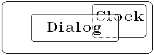

In the diagram, any drawing to the dotted region in the Clock window will fail to appear.

The window server will discard a drawing region (since it can be recalculated at any time) rather than maintain it unless the window is being drawn to or is assigned to a permanent graphics context.

==== Backed-up windows

A window can be created in such a way that all drawing to it is duplicated to off-screen bitmaps.
The window server can then automatically redraw the window without bothering the client.
Prior to version 4, the window needs to be created with a `W_WIN_BACK_BITMAP` background.
In version 4 upwards of the window server the window can be created with one or both `W_WIN_BACK_BITMAP` and `W_WIN_BACK_GREY_BITMAP` backgrounds (see _creating and initialising a window_ in the _Windows_ chapter).

This makes life much easier for the programmer.
(Otherwise, the programmer has to respond to _redraw events_ and has to adopt a more sophisticated programming style, as described below.)

Prior to version 4, when a backed-up window is created, a single backup bitmap is also created with an appropriate size.
This bitmap is initialised with zeros corresponding to a clear screen (white on an LCD).

In version 4 of the window server, when a backed-up window is created which is enabled for drawing both black and grey, two backed-up bitmaps are created with an appropriate size, one for the 'normal' plane and one for the grey plane (see the _Graphics_ chapter for a fuller discussion of grey).

If the size of a backed-up window is subsequently increased, the backup bitmaps are also increased and the additional area (to the right and below) is filled with zeros.

If a backed-up window is scrolled using `wScrollRect` or `wScrollWin`, the area that is scrolled in from outside the window is filled with zeros.

The disadvantages of using bitmap backed-up windows are:

* it takes longer to draw the image in the first place (since all drawing is duplicated)
* additional storage is required to store the backup bitmap(s)

Although the original drawing is slower, the window server _redraws_ a backed-up window with blinding speed.

Keeping backed-up bitmaps for a screen-sized window incurs a storage cost which varies according to the machine type:

* On the HC (160 by 80 pixels), a backed-up bitmap occupies a modest 1600 bytes.
* On the S3 (240 by 80 pixels), a backed-up bitmap occupies 2400 bytes.
* On the Work__about__ (240 by 100 pixels) using version 4 of the window server, a backed-up bitmap requires 3000 bytes.
However, if the window is enabled to use both black and grey, two backedup bitmaps are needed, thus doubling the space required to 6000 bytes.
* On the S3a (480 by 160 pixels) using version 4 of the window server, a backed-up bitmap requires 9600 bytes.
However, if the window is enabled to use both black and grey, two backedup bitmaps are needed, thus doubling the space required to 19200 bytes.
* On the MC400, a full screen (640 by 400 pixels) bitmap requires 32K bytes.

Slowing down screen drawing is clearly more of a problem on a larger screen and, in summary, using backed-up windows on an HC or an S3 with their smaller screens (and smaller windows) makes more sense than on an MC.
Using backed-up windows on an S3a or Work__about__ enabled to draw both black and grey is questionable.

Note, however, that the size of the screen does not limit the size of the window.
In most practical situations, the windows will be smaller on a smaller screen model, but it is sometimes useful to create windows that are larger (and possibly much larger) than the screen.
For example, when presenting a scrolling view of a map that is much larger than the screen size.
With such large windows it would not be desirable to use a backed-up window.

==== No-redraw windows

As well as backed-up windows, the programmer in search of an easy life should also consider windows created with the `W_WIN_NO_REDRAW` bit set (as a parameter to `wCreateWindow`).

For such windows, the window server does not invalidate the window or generate redraw events.
What it does do when the window is partly or wholly invalidated (that is, when the backup bitmaps would have been used if they existed) depends on the background parameter to `wCreateWindow` as follows:

[cols="1m,3"]
|===
|W_WIN_BACK_CLR
|prior to version 4, clears the pixels in the window (this is the default).
This is useful, for example, when the window is tiled with child windows but does not itself contain any images.
in version 4, clears the pixels in the normal (black) plane of the window.

|W_WIN_BACK_GREY_CLR
|available in version 4 only, clears the pixels in the grey plane of the window.

|W_WIN_BACK_SET
|prior to version 4, sets the pixels in the window.
This may be used, for example, to implement a black thick border to a child window that is slightly smaller and inset from its parent.
in version 4, sets the pixels in the normal (black) plane of the window.

|W_WIN_BACK_GREY_SET
|available in version 4 only, sets the pixels in the grey plane of the window.
|===

prior to version 4, either `W_WIN_BACK_CLR` or `W_WIN_BACK_SET` may be used when a window is entirely covered with its child windows. For example, when a larger child window provides, in conjunction with its parent, a scrolling view over a larger image.

In version 4, in addition to using either `W_WIN_BACK_CLR` or `W_WIN_BACK_SET`, one of the corresponding grey plane attributes `W_WIN_BACK_GREY_CLR` or `W_WIN_BACK_GREY_SET` may also be used, if appropriate.

Note that you should not rely on the fact that a window is always totally obscured by another window (such as a child window) to suppress redraw events since the window server can send unnecessary redraw events when there is insufficient free system memory to maintain update regions.
For guaranteed suppression of redraw events you should specify the `W_WIN_NO_REDRAW` bit to `wCreateWindow` -- even when a window is always totally obscured.

In version 4 of the window server, redrawing can also be suppressed on a per-plane basis by setting the `..._NO_REDRAW` modes. _This method is much preferred_.

The `W_WIN_NO_REDRAW` bit does not need to be set.

The `..._NO_REDRAW` background flags can be used as follows:

[cols="1m,3"]
|===
|W_WIN_BACK_CLR_NO_REDRAW
|suppresses re-drawing to the normal plane but the window server clears the pixels.

|W_WIN_BACK_SET_NO_REDRAW
|suppresses re-drawing to the normal plane but the window server sets the pixels.

|W_WIN_BACK_NONE_NO_REDRAW
|suppresses re-drawing to the normal plane; the window server does nothing to the pixels in this plane -- it neither sets nor clears them.

|W_WIN_BACK_GREY_CLR_NO_REDRAW
|suppresses re-drawing to the grey plane but the window server clears the pixels.

|W_WIN_BACK_GREY_SET_NO_REDRAW
|suppresses re-drawing to the grey plane but the window server sets the pixels.

|W_WIN_BACK_GREY_NONE_NO_REDRAW
|suppresses re-drawing to the grey plane; the window server does nothing to the pixels in this plane -- it neither sets nor clears them.
|===

==== Bitmap sequences

A window may be given an animated image by attaching a sequence of up to twelvefootnote:[The limit derives from the requirement to fit the sequence in the client-side buffer.] bitmaps to the window by calling `wSetWinBitmap`.
The sequence is modified by calling `wChangeWinBitmap` and freed by calling `wFree` (destroying the window automatically frees the bitmap sequence).

Each entry in the sequence specifies

* a source bitmap
* the position of the bitmap in the window
* the transfer mode
* the time to wait (in tenths of a second) before copying the next bitmap in the sequence to the window

You should be careful about defining too short an interval between bitmaps (especially in combination with large bitmaps) as the computational effort to maintain the sequence may leave little processor bandwidth for the application to run.
Note that the window server runs at a higher priority than its clients.
If the sequence contains a single bitmap, the bitmap is not animated.

Whether animated or not, a rectangle on the window that is currently covered by a bitmap in the sequence is automatically redrawn when that part of the window is invalidated.

Any number of bitmap sequences may be attached to a window.
Where there is an overlap, bitmaps from sequences attached after another sequence appear _behind_ that sequence.

Bitmap sequences are not designed to be used with backed-up windows and are typically used to produce:

* a window with a changing background bitmap for other drawing (however, if there is only one bitmap in the sequence, the background does not change)
* a window that is only drawn from the bitmaps in the one or more bitmap sequences and which, like backed-up windows, does not have to be redrawn (and the window should be created with the `W_WIN_NO_REDRAW` attribute).

Unless the window is created with the `W_WIN_NO_REDRAW` attribute, the window server invalidates the target rectangle in the window after it has copied a bitmap (it also invalidates any parts of the previous rectangle that is not covered by the new bitmap).
The resulting redraw event is intended to prompt the client to draw on top of the bitmap.
If you do not intend to draw on top of the bitmap, you should create the window with the `W_WIN_NO_REDRAW` attribute.

As well as the changes that occur as the bitmaps in the sequence are cycled through by the window server, you can make all manner of changes to the bitmaps themselves -- for example, switching bitmaps and drawing to them.

In version 4 of the window server, bitmap sequences are, by default, drawn to the normal (black) plane only and the grey plane will display the appropriate grey background as specified in the call to `wCreateWindow`.
However, there is nothing to prevent the client from drawing to the grey plane as a result of a redraw event.

A member of a bitmap sequence can be made to appear grey by setting `WS_WIN_BITMAP_GREY` for that member in the call to `wSetWinBitmap` in which case the normal plane will display the appropriate normal background.

If bitmap sequences are required which make use of both black and grey, then sprites (discussed later) may be used instead.

===  Using an attached bitmap to avoid redraws

If you set up a no-redraw window with an attached bitmap sequence consisting of a single bitmap that fills the window, you can draw to the bitmap and have that bitmap copied to the window by calling `wInvalidateWin` to invalidate the window.
For flicker-free operation the window background should be set to `W_WIN_BACK_NONE`.

In some cases, this may be more efficient than using backed-up windows (where everything is drawn twice).

In version 4 of the window server, as mentioned before, the bitmap can be made to appear grey by setting `WS_WIN_BITMAP_GREY` in the call to `wSetWinBitmap`.

The following program uses the technique described above and works on all versions of the window server.

[source,c]
----
#include <plib.h>
#include <wlib.h>

#define NWS_HANDLE 0
#define MAIN_WIN 1

GLDEF_D WSERV_SPEC wspec;
GLDEF_D UINT gcid;
GLDEF_D UINT wid;
GLDEF_D P_POINT winsize={160,80};
GLDEF_D WS_WIN_BITMAP bitseq;

GLDEF_C VOID CreateBitmap(VOID)
{
    G_GC gc;
    bitseq.bitmap=gCreateBit(0,&winsize);
    bitseq.pos.x=0;
    bitseq.pos.y=0;
    bitseq.rect.tl.x=0;
    bitseq.rect.tl.y=0;
    bitseq.rect.br=winsize;
    bitseq.mode=G_TRMODE_REPL;
    gc.style=G_STY_BOLD|G_STY_DOUBLE;
    gcid=gCreateGC(bitseq.bitmap,G_GC_MASK_STYLE,&gc);
    gClrRect(&bitseq.rect,G_TRMODE_CLR);
}

GLDEF_C VOID CreateWindow(VOID)
{
    W_WINDATA windata;

    windata.flags=W_WIN_NO_REDRAW;
    windata.extent.tl.x=0;
    windata.extent.tl.y=0;
    windata.extent.width=winsize.x;
    windata.extent.height=winsize.y;
    windata.background=W_WIN_BACK_NONE;
    wid=wCreateWindow(0,W_WIN_NO_REDRAW
        |W_WIN_EXTENT
        |W_WIN_BACKGROUND,&windata,MAIN_WIN);
    wSetWinBitmap(wid,1,&bitseq);
    wInitialiseWindowTree(wid);
}

GLDEF_C INT main(VOID)
{
    WS_EV event;
    P_RECT box;
    TEXT bb[32];

    wConnect(&wspec,NWS_HANDLE,W_CONNECT_PRIORITY);
    CreateBitmap();
    CreateWindow();
    box=bitseq.rect;
    p_insrec(&box,1,1);
    gDrawBox(&box);
    wInvalidateWin(wid);
    p_insrec(&box,1,1);
    for (;;)
    {
        wGetEventWait(&event);
        if (event.type==WM_KEY)
        {
            p_atos(&bb[0],"Key code: %d",event.p.key.keycode);
            gPrintBoxText(&box,50,G_TEXT_ALIGN_CENTRE,0,&bb[0],p_slen(&bb[0]));
            wInvalidateWin(wid);
            if (event.p.key.keycode==W_KEY_RETURN)
            {
                break;
            }
        }
    }
    return(0);
}
----

==== Sprites

In version 4 of the window server a window may be given an animated image by attaching a sprite to the window.

A sprite is created at a specified position within the window and the animation produced by creating a sequence of up to 13 bitmap sets attached to the sprite by calling `wCreateSprite`.
The bitmap sets and the position of the sprite in the window can be changed by calling `wSetSprite`; the sprite itself can be freed by calling `wFree`.

Each bitmap set specifies:

* up to three source bitmaps for the normal plane, i.e. one for each of the three possible transfer modes (set, clear and invert)
* up to three source bitmaps for the grey plane, i.e. one for each of the three possible transfer modes (set, clear and invert)
* the position of the bitmaps relative to the sprite
* the time to wait (in tenths of a second) before displaying the next bitmap set

Unlike the pre-version 4 animated sequences, a sprite is not displayed as part of the window background.
The window server takes care of saving and restoring the contents of the underlying display even if this changes during the sprite's existence.
This can give the impression that the animation 'floats' above the underlying display.

When the sprite is created, setting the flag `W_SPRITE_CLIP_CHILDREN` allows child windows of the window to which the sprite is attached, to clip the sprite.
If the flag is not set, the sprite can only be clipped by the edges of the window to which it is attached or by other non-related windows.

If the sequence contains a single bitmap set, the resulting display is not animated.

Only one sprite may be created for each client of the window server.

=== Redrawing

Windows that are not backed up by bitmaps or an attached bitmap or are not created as no-redraw windows must be _redrawn_ as well as drawn.

If you intend to avoid redraws by using only backed-up windows, no-redraw windows and windows that are drawn from bitmap sequences, none of this section applies.

==== Redraw events 

A window should be redrawn by a client when it receives a _redraw event_ from the window server (after calling `wGetEventWait`, `wGetEvent` or `wGetEventSpecial`).

A redraw event indicates

* the window to be redrawn
* a rectangle within the window that needs to be redrawn

The rectangle is often ignored (especially for simple windows) and the whole window is drawn instead.

The window server keeps an _update region_ for each window to record that part of a window that is _invalid_.
When the update region is not empty and the event queue is otherwise empty, the window server will complete a client's call to `wGetEventWait`, `wGetEvent` or `wGetEventSpecial` with a redraw event.

Note that user input events and foreground/background change events are effectively delivered at a higher priority than redraw events. This is sometimes desirable and sometimes not.

Note also that, unlike other events, the sending of a redraw event by itself does not clear or otherwise reduce the update region (this is described below).
The window server will continue to send redraw events indefinitelyfootnote:[A client that just ignores redraw events will loop indefinitely and "hog" the processor.] until the update region is reduced by the client _validating_ a part or the whole of the region normally by the client calling `wBeginRedraw` (or a variant thereof), as described below.

==== Update region 

The update region is similar to the drawing region in that it consists of a list of rectangles that are used to clip graphics output. Whereas the drawing region is used for _drawing_, the update region is used for _redrawing_. The update region is also used to generate redraw events as described above.

The drawing region describes that part of the window that is visible. The update region describes that part of the window that is both visible and invalid.

The window server automatically adds to a window's update region when:

* the window is first created
* the window's size is increased
* a previously obscured part of the window is exposed by changes (of position, size, front to back ordering or visibility) to a window that previously obscured it
* the contents of a window is scrolled using `wScrollRect` or `wScrollWin`

A backed-up window always has an empty update region because the window server copies the data from the backup bitmap rather than add to the update region.

=== Invalidating rather than drawing 

The client can itself add to the update region by _invalidating_ a part of the window or all of the window by calling `wInvalidateRect` or `wInvalidateWin` respectively.

It is often simpler for an application (at the expense of performance) to invalidate a part of a window or the whole of the window rather than draw to it.footnote:[If a window is not visible or is substantially obscured, invalidating can actually be more efficient than drawing. However, this occurs rarely in practice.]
Invalidating causes the window server subsequently to send redraw events to the client.

The update region of a window is automatically reduced by the window server as a window becomes obscured by other windows.
However, in practice, the update region is normally reduced (partially or wholly) _before_ the client draws or redraws to it.

==== Validating before drawing or redrawing

You always automatically validate before redrawing (by calling a variant of `wBeginRedraw`) and you would normally also validate before drawing (by calling `wValidateWin` or `wValidateRect`).

As well as reducing the update region, validating can also prepare the background, depending on the value of the background window attribute, as follows:

[cols="1m,3"]
|===
|W_WIN_BACK_CLR
|prior to version 4 of the window server, clear the pixels in the window (this is the default)

in version 4, clear the pixels in the normal (black) plane (this is the default)

|W_WIN_BACK_SET
|prior to version 4 of the window server, set the pixels in the window in version 4, set the pixels in the normal (black) plane

|W_WIN_BACK_NONE
|do nothing; in version 4, this is specific to the normal (black) plane
|===

In version 4 of the window server the above attributes can be OR'd with one of the following:

[cols="1m,3"]
|===
|W_WIN_BACK_GREY_CLR
|clear the pixels in the grey plane

|W_WIN_BACK_GREY_SET
|set the pixels in the grey plane

|W_WIN_BACK_GREY_NONE
|do nothing; specific to the grey plane
|===

The `W_WIN_BACK_CLR` background is the easiest to deal with and is often used -- particularly for simple windows or for windows with no grey.
For flicker-free drawing or redrawing, use `W_WIN_BACK_NONE` (and `W_WIN_BACK_GREY_NONE` if using grey) and then program such that every pixel is covered when the drawing code executes (for example, using `gPrintBoxText` rather than `gPrintText`).

==== Drawing

You normally draw to a window when the data it is displaying has changed (say as a result of user input).

When drawing a particular rectangle of a (non-backed-up) window, a client should call `wValidateRect` before commencing the drawing.
When drawing the whole window (which is more common), the client first validates the whole window by calling `wValidateWin`.

You must validate before drawing if you are relying on the `W_WIN_BACK_CLR`, `W_WIN_BACK_SET`, `W_WIN_BACK_GREY_CLR` or `W_WIN_BACK_GREY_SET` window attribute to prepare the background.

If you are drawing to a window with a `W_WIN_BACK_NONE` or `W_WIN_BACK_GREY_NONE` background, you need not validate before drawing to the window.
If you don't validate, you will not preempt any redraw event when the same area happens to be invalid at the time and the same image may subsequently be redrawn unnecessarily (although, frankly, this is unlikely to be noticed by any user).

When drawing to a window, a client may use a permanent or a temporary graphics context.
(Note that all graphics output is directed at a current graphics context.)

When using a temporary graphics context, the calls to graphics output functions would be enclosed by calls to `gCreateTempGC` and `gFreeTempGC`.
If there is no requirement to change the default initial values of the graphics context, you would use `gCreateTempGC0` in place of `gCreateTempGC`.

When using a permanent graphics context (which was previously created and assigned to the window by a call to `gCreateGC` or `gCreateGC0`), you would typically use `gSetGC` or `gSetGC0` to make the appropriate permanent graphics context current before drawing.

==== Redrawing

While drawing is clipped to the window's drawing region, redrawing is clipped to the window's update region (for appearance and efficiency reasons).

The client informs the window server that it is redrawing rather than drawing by enclosing the graphics output function calls between calls to `wBeginRedraw` and `wEndRedraw`.
As well as informing the window server that the client is about to redraw rather than draw, the call to `wBeginRedraw` also validates that rectangle of the window (specified as a parameter to `wBeginRedraw`).

As with drawing, a client that is redrawing to a window may use a permanent or a temporary graphics context.

There are no fewer than six variants of `wBeginRedraw` which vary according to whether a temporary graphics context is created (and, if so, whether it is to be altered from its default settings) and whether a part or the whole of the window is being redrawn.
The full set is as follows:

[cols="1m,3"]
|===
|wBeginRedraw
|to redraw a part of the window using an independently created temporary or permanent graphics context

|wBeginRedrawWin
|to redraw the whole of the window using an independently created temporary or permanent graphics context

|wBeginRedrawGC
|to redraw a part of the window using a temporary graphics context that is created and initialised with specified values

|wBeginRedrawGC0
|to redraw a part of the window using a temporary graphics context that is created with default initial values

|wBeginRedrawWinGC
|to redraw the whole of the window using a temporary graphics context that is created and initialised with specified values
|wBeginRedrawWinGC0
|to redraw the whole of the window using a temporary graphics context that is created with default initial values
|===

When a begin redraw function is used to simultaneously create a temporary graphics context, the call to `wEndRedraw` automatically frees it.

Note that if you mistakenly enclose the graphics output function calls between calls to `wBeginRedraw` and `wEndRedraw` when _drawing_ (rather than redrawing in response to a redraw event), the drawing will probably not appear since it will be clipped to the update region (which is most likely to be null).

==== Going deaf

A client that owns one or more windows with invalid areas and which is not requesting events from the window server is said to have "gone deaf".

An application goes deaf because it is performing a task that takes an extended time to complete.

Examples of such extended tasks are:

* loading or saving a large file (or some other processing of a large file)
* a stalled write to the parallel port (say, because the printer is out of paper)
* computing _PI_ to a thousand decimal places
* a bug that has caused the process to "hang" in an indefinite loop

Applications that process redraw events have a responsibility to process them within a reasonable time.
If this is not done, the screen may contain images drawn by some other client (which is very confusing to the user).

With a window server in a preemptive multi-tasking operating system, deaf clients need not block the user from switching to another task (as happens in non-preemptive multi-tasked window environments such as Microsoft Windows and others, where a deaf application typically leads to an unwelcome mouse icon such as an hour glass, a watch or, arguably more positively, a bee).
With the window server handling the task switch key or keys, an aberrant application task that has hung does not require a system reset -- the user can task to a suitable system application and terminate the task.

To make it easier to diagnose when a client has gone deaf, the window server has mechanisms to detect deaf clients.
On the HC, S3, S3a and Work__about__, task switching to a deaf client will cause the "hung up" status window to be presented.
On the MC, the invalid areas are eventually covered with a grey pattern.
From the user's point of view, exposing a deaf client is preferable to leaving the debris of some other client's windows which may lead the user to blame the wrong application.

The window server does not detect a client which is reading redraw events but discarding them.

Applications can avoid going deaf within potentially blocking functions such as a write to a parallel port by performing such operations asynchronously -- as described in chapter _Asynchronous Requests and Semaphores_ in the _PLIB Reference_ manual.
The same chapter also describes how to use `p_ioyield` to poll at intervals for the receipt of a redraw message (after using the asynchronous `wGetEvent` or `wGetEventSpecial`) while performing an extended process.
Rather than polling, it is worth considering using `p_execc` to create a transient sub-process to perform an extended task and to use `p_logona` to be signalled when the process completes (as described in the chapter _Processes and Inter-Process Messaging_ in the _PLIB Reference_ manual).

Applications that are structured to present percentage done indicators or a cancel option (or preferably both) while performing an extended task are well structured to handle redraws and can easily avoid going deaf.
In any case, applications that are deaf (and dumb) to the user for extended periods are generally not welcomed by them.

==== Redraw priority

Although redraw events always have a lower priority than user input events and background/foreground events, there is a two-level redraw priority that operates between windows.

By default, windows are created at the lower priority and certain windows may be selected to receive their redraw events before the crowd by specifying the `W_WIN_PRIORITY` bit to `wCreateWindow` or `wSetWindow`.
This is very much fine tuning, though.

=== More about windows

==== Creating and initialising a window system

A window is created by calling `wCreateWindow` where you specify such things as the parent window, the position and size of the window (in the parent's coordinate system), whether the window is backed-up by bitmaps and so on.

When sibling windows are created, they are created in front of any existing siblings (this is only significant when sibling windows overlap -- they often don't).
You can set and sense the front-to-back position of a window in its sibling list using `wWindowPosition` and `wGetWindowPosition` respectively.

Each successful call to `wCreateWindow` returns a window ID.
The ID is used subsequently to refer to that window.

After a successful return from `wCreateWindow`, the window is just a dormant data structure in the window server's data segment with no visibility on the screen.
You can't draw to the window and you won't get any redraw events (or any mouse events if there is a pointing device) until the window is initialised by calling `wInitialiseWindowTree`.

As its name suggests, `wInitialiseWindowTree` initialises not just the window but all its descendants as well.
In practice, a tree of windows is often created as a logical whole and it is desirable to activate the whole tree at once by calling `wInitialiseWindowTree` (passing it the window ID of the parent) after having successfully set the tree up from the parent window down by successive calls to `wCreateWindow`.

The above is not meant to suggest that all new window systems take the form of a single tree with a single parent (although this is the more common case).
It is quite possible for the window system to be created to consist of a number of (say sibling) windows or window trees.
In such a case, you would still create the whole system with successive calls to `wCreateWindow` and then make multiple calls to `wInitialiseWindowTree` to initialise the system.

Note that `wCreateWindow` can fail through lack of system memory but `wInitialiseWindowTree` cannot.
When creating a window system you must be careful to destroy any partially created system should a call to `wCreateWindow` fail.

==== Destroying a window system

Just as windows are created a tree at a time, windows are, in general, destroyed a tree at a time by calling `wCloseWindowTree`.

A client that builds window systems would keep at least the window IDs of the windows in client-side data structures.
In the client's data space, the data structures that contain the window IDs are unlikely to be related in the same tree structure as the windows are in the window server.
Where this is the case, it may not be convenient for the client to recover the window side relationships and destroy windows a tree at a time (effectively bottom up) when destroying a window system.
If a client uses its relationships (which are probably tree-like but a different tree) to destroy a window system, some windows would be destroyed more than once (because `wCloseWindowTree` has to destroy any descendants as well as the specified window).

In recognition of this problem in destroying window systems, the window server does not consider it an error if a window is destroyed more than once.

This does (quite reasonably) assume that windows systems are destroyed without any intervening window creations.

==== Event sources other than the window server

You need only read this section if you are implementing a program that responds to event sources other than just the window server (and therefore the program is using one of the asynchronous functions `wGetEvent` or `wGetEventSpecial` rather than `wGetEventWait`).

This section assumes familiarity with asynchronous requests -- as described in the chapter _Asynchronous Requests and Semaphores_ in the _PLIB Reference_ manual.

When responding to window server events that are requested asynchronously using `wGetEvent` or `wGetEventSpecial`, you should completely process a window server event (after returning from `p_iowait` and having established that `wGetEvent` or `wGetEventSpecial` has completed) before calling either `wGetEvent` or `wGetEventSpecial` again to request the next event.

Bearing in mind the multi-tasking nature of the system and the fact that the window server runs at a higher priority than its clients, it is quite possible for the request made by a call to `wGetEvent` or `wGetEventSpecial` to complete while responding to an event from a source other than the window server (for example, the expiry of a timer or the receipt of some data from the serial port).

In particular, if one or more windows are directly destroyed in response to a non-window server event there is the possibility that the next window server event (a redraw event say) will relate to a window that has already been destroyed.

To guard against this possibility, you should not destroy a window or a window system directly in response to a non-window server event but use `wCancelGetEvent` to instruct the window server to send the caller a `WM_CANCELLED` event and then respond to the `WM_CANCELLED` event as you would otherwise have responded to the non-window server event.

After a call to `wCancelGetEvent`, the window server delivers the `WM_CANCELLED` event at the highest priority -- any other events waiting in the window server client event queue are overtaken.
The only window server event `WM_CANCELLED` can't overtake is one that has already been delivered.

==== Visibility of windows

A window is invisible when:

* it has been created (using `wCreateWindow`) but not yet initialised (using `wInitialiseWindowTree`)
* it has been made invisible by a call to `wMakeInvisible`;
* the window was created with the `W_WIN_FOREGROUND_ONLY` attribute set and belongs to a client that is currently a background client (this case only applies to large screen versions of the window server)

Note that `wInitialiseTree`, `wMakeInvisible` and `W_WIN_FOREGROUND_ONLY` all propagate their effect to descendant windows.

After being initialised, a window is marked as visible.
Once a window tree has been made invisible using `wMakeInvisible`, it may be made visible again by calling `wMakeVisible`.

A call to `wMakeVisible` or `wInitialiseWindowTree` does not necessarily make all descendants visible since wMakeInvisible may have been applied to a descendant.

The window server treats windows that are invisible as follows:

* if the window is backed-up, any drawing to it is drawn only to the backup bitmap(s)
* invalidating a window using `wInvalidateRect` or `wInvalidateWin` has no effect
* windows behave as if they do not exist with respect to mouse input (this only applies when there is a pointing device)

==== Scrolling

The contents of a window may be scrolled by a horizontal or vertical direction or a combination of the two using `wScrollWin` or `wScrollRect`.

Both these functions are better understood in terms of rectangle copying rather than scrolling where:

[cols="1m,3"]
|===
|wScrollRect
|copies a source rectangle in a window to a rectangle of the same size in the same window but displaced.

|wScrollWin
|works just like `wScrollRect` except that the source rectangle is defined by the boundaries of the window offset, in the opposite direction, by the amount of the scroll.
This is what is normally used to scroll the contents of a window.
|===

Both functions copy only those parts of the source rectangle that are both visible and valid.
This means that the copy excludes the following from the source rectangle:

* those parts that are in the update region
* those parts that are obscured or clipped by other windows
* those parts that are beyond the boundaries of the window

Although these parts are not copied, their existence causes the corresponding region of the target rectangle to be invalidated.

If the window is a backed-up window, the copy is also applied to the backup bitmap(s).
For a backed-up window:

* the update region is always empty
* those parts that are obscured or clipped can be recovered from the backup bitmap(s)
* those parts that are beyond the boundaries of the window are cleared.

Since these functions access the same window server operations that are applied when a window is moved using `wSetWindow`, the above comments about not copying invalid regions applies to window moving too.
If you wish to simultaneously move and change the appearance of a window you should use `wInvalidateWin` to invalidate those parts that are to change before using `wSetWindow` to move the window.

==== Continuous scrolling

The function `wScrollWin` is often used to scroll the contents of a window in response to user input (such as down arrow key presses, for example).
Calling this function necessarily introduces an invalid area at the upwind border (or borders) of the direction of scroll.

If the window is a backed-up window, these areas are automatically cleared by the window server by the `wScrollWin` operation and would subsequently be drawn by the client as part of the scroll processing.

If the window is not backed-up by a bitmap, the window server invalidates those areas brought in from outside the window and there is the temptation to leave it to the redraw event handling to draw these areas.

However, this is not good practice because redraw events are delivered only when there is no user input and in the quite typical case where the user holds down the key that is causing the scroll, the redraws are not processed until the user releases the key.
This means that the screen rapidly fills with a copy of the image that was at the upwind border of the scroll and the window is only redrawn with something sensible when the key is released.

When using non-backed-up windows you should program as for backed-up windows and calculate the area that needs to be drawn after the scroll and then validate and draw it.

==== Text cursor

A client can nominate at most one window at a time to contain a text cursor (which is optionally flashing) by calling `wTextCursor`.
The text cursor can subsequently be moved from one window to another by calling `wTextCursor` again.
To remove the text cursor from the window that contains it, you call `wEraseTextCursor`.

The cursor is specified as a rectangle which is, in principle, XORed with whatever is underneath it.
Applications typically define a text cursor as a vertical line in between characters, a horizontal line underneath characters or a block cursor that fits over characters.

In version 4 of the window server, the cursor can be made to appear grey on those machines that support grey such as the S3a and Work__about__.

The window server handles the flashing of the cursor and ensures that it does not interfere with any drawing or redrawing in its vicinity.

On large screen versions of the window server where the windows of more than one client are on the screen at a time, the window server automatically ensures that only the foreground text cursor is visible.

=== Bitmaps

==== Drawing to the screen from a bitmap 

A bitmap is a piece of off-screen memory that is organised in the same way as the screen bitmap.
A bitmap can rapidly be copied to a window for display using one of:

[cols="1m,3"]
|===
|gCopyBit
|to copy a rectangle from a bitmap to a given position in the current graphics context

|gDrawBit
|to copy a rectangle from an open bitmap file to a given position in the current graphics context. This is available in version 4 of the window server.

|gFillPattern
|to fill a rectangle in the current graphics context with repeated copies of a bitmap

|wSetWinBitmap
|to copy bitmaps to a window at specified time intervals from a sequence of bitmaps (as described earlier)
|===

All the above functions can copy a bitmap in one of four transfer modes:

[cols="1m,3"]
|===
|G_TRMODE_REPL
|where bits in the source pattern replace corresponding bits in the destination.

|G_TRMODE_SET
|where 1s in the source pattern set corresponding bits in the destination (0s in the source do not change corresponding bits in the destination).
This would normally be used to copy a bitmap on to a previously cleared destination.

|G_TRMODE_CLR
|where 1s in the source pattern clear corresponding bits in the destination (0s in the source pattern do not change corresponding bits in the destination).
This would normally be used to copy a bitmap on to a previously set bitmap.
|G_TRMODE_INV
|where 1s in the source pattern toggle corresponding bits in the destination (0s in the source pattern do not change corresponding bits in the destination).
This is suitable for copying over an existing pattern and may be reversed by a second identical application.
|===

==== Creation and storage of bitmaps 

A bitmap is created uninitialised by calling `gCreateBit` or (more likely) it is loaded from a file that contains one or more bitmaps using `gOpenBit` or `gGetBit`.
A bitmap is freed using `wFree`.

The function `gSetOpenAddress` may be used immediately before `gOpenBit` or `gGetBit` to load the bitmap from anywhere within the file (typically used to load a bitmap which has been embedded into the program file).

In version 4 of the window server, `gInitBit` is used to open a multiple bitmap file ready for calls to `gGetBit` or `gDrawBit`.

When a bitmap is successfully created, `gCreateBit`, `gOpenBit` and `gGetBit` return a bitmap ID (which is subsequently used to reference the bitmap).

The window server keeps a built-in ROM-based grey bitmap (with a chequerboard pattern).
This may be accessed with the bitmap ID `WS_BITMAP_GREY`. The bitmap has size `WS_BITMAP_GREY_SIZE_X` by `WS_BITMAP_GREY_SIZE_Y`.

Note that version 4 of the window server supports grey for those machines such as the Series 3a that can display true grey.

When a bitmap is created, it may be stored in the window server's data space or in a named memory segment (named memory segments are described in the _Memory Allocation_ chapter of the _PLIB Reference_ manual).

The window server automatically places bitmaps that are larger than 2K in named memory segments.
You can request that a bitmap be stored in a named segment rather than the window server's data segment (regardless of the size).

A bitmap that is in a named memory segment can be accessed directly by the client using `p_sgcopyfr` and `p_sgcopyto` (described in the _Memory Allocation_ chapter of the _PLIB Reference_ manual) or otherwise.

===  Drawing to bitmaps

Like windows, bitmaps can be drawn to using any of the window server graphics output functions.

However, unlike windows there is no drawing region or update region (so there is no such thing as validating before drawing).
Drawing is clipped only to the limits of the bitmap.

Bitmaps that are loaded from a file are typically read-only (which also makes them shareable).
If you are going to draw to a loaded bitmap, you should specify the `WS_BIT_WRITE` attribute when you call either `gOpenBit` or `gGetBit` to load the bitmap.

Graphics output is directed at a current graphics context (which may be assigned to a window or a bitmap). As with drawing to a window, a program may use a permanent or a temporary graphics context.

When using a temporary graphics context, the calls to graphics output functions would be enclosed by calls to `gCreateTempGC` and `gFreeTempGC`.
If there is no requirement to change the default initial values of the graphics context, you would use `gCreateTempGC0` in place of `gCreateTempGC`.

When using a permanent graphics context (which was previously created and assigned to the bitmap by a call to `gCreateGC` or `gCreateGC0`), you would typically use `gSetGC` or `gSetGC0` to make the appropriate permanent graphics context current before drawing.

==== Bitmap files

Bitmap files (which normally have the file name extension `.pic`) may be created in one of the following ways:

* by saving the contents of a bitmap, a screen or a backed-up window using `gSaveBit` (which saves the whole bitmap) or `gSaveRect` (which saves a rectangle of the bitmap).
In version 4 of the window server, if the screen or a backed up window uses grey, saving either of them will create a double bitmap.
* by saving the contents of a bitmap, a screen or a backed-up window using `gSaveMultiBit` (which saves the whole bitmap) or `gSaveMultiRect` (which saves a rectangle of the bitmap).
If the screen or a backed up window uses grey, saving either of them will create a double bitmap.
Available in version 4 only.
* by converting a PCX file using the _wspcx_ program (which runs on a PC).
Many PC-based graphics applications are able to produce PCX files.
* by saving the whole screen to a file by pressing kbd:[SHIFT+CTRL+PSION+S].
This is not possible on machines without a kbd:[CTRL] key (such as the HC).

==== Using `wspcx`

The `wspcx.exe` program (which is placed in the `\sibosdk\sys` directory by the installation) may be used to convert PCX files to window server bitmap files and vice versa and also to link a number of `.pic` files into one `.pic` file.

Where the `.pcx` file contains more than two colours, the following 'rules' apply:

* _white_ is converted to _white_
* _black_ is converted to _black_
* _all other colours_ are converted to _grey_

On conversion:

* If a `.pcx` file is marked as being black and white only, then the `.pic` file will contain a single bitmap.
* If a `.pcx` file is marked as being in colour, then the `.pic` file will contain a double bitmap, where the first bitmap represents the normal plane and the second represents the grey plane.
* If a `.pcx` file is marked as being in colour but only contains an image using the black and white "colours", then the `.pic` file will still contain a double bitmap.

To convert a `.pcx` file to a window server `.pic` bitmap file, use:

[source,shell]
----
wspcx -p <input> [-i] [-o<ouput>] [-s] [-x<width] [-y<height>]
----

where the `-p` indicates PCX to PIC conversion and <input> is the name of file to be converted (which is assumed to have a `.pcx` extension unless otherwise specified).
The remaining optional parameters are:

[cols="1m,3"]
|===
|-i
|Invert the bitmap while converting.

|-o<output>
|Specifies the output file name and directory (otherwise it is the same as the input file name with a `.pic` extension).

|-x<width>
|Clip or expand the bitmap to the specified size (in pixels). If expanded, the -y<height> bitmap is padded out with blank space.

|-s
|Suppresses output messages.
|===

For example:

[console]
----
wspcx -p -i sausage.pcx
----

produces the inverted `sausage.pic`.

To convert from a `.pic` file to a `.pcx` file, you use:

[source,console]
----
wspcx -w <input> [-i] [-o<output>] [-s]
----

To just invert the bits in a `.pic` file without any other conversion, you use:

[source,console]
----
wspcx -i <input> [-o<output>] [-s]
----

To link a number of `.pic` files into one output `.pic` file, you use:

[source,console]
----
wspcx -l <input> [-o<output>] [-s]
----

where <input> is a text file (with extension _.plk_) that lists the `.pic` files to be linked to produce a file with the same name as the `.plk` file but with the `.pic` extension.
A C header file (with extension `.ph`) is also generated that contains ``#define``s for the index number and dimensions of each component bitmap.

==== Capturing the screen to a bitmap file

Pressing kbd:[SHIFT+CTRL+PSION+S] on an MC, S3, S3a or a Work__about__ saves the current screen to a file called `screen.pic` in the current path of the window server.
Any existing file of the same name is replaced.

In practice, the current path of the window server on a SIBO machine is always `LOC::M:\` (it is defined when the window server process is started -- well before you have any chance of influencing it).

However, if an environment variable with the name `$WS_SD` exists, the window server uses its value to open the file to be created.
For example, running the following program:

[source,c]
----
#include <p_std.h>

GLDEF_C INT main(VOID)
{
    p_setenv("$WS_SD","B:\\SCREEN.PIC"); return(0);
}
----

subsequently causes the screen dump to be written to the root directory of the local `B:` drive.

If the save fails for any reason (such as disk full), the file is not produced and no notification of the failure is given.

You can use this behaviour to disable the kbd:[SHIFT+CTRL+PSION+S] screen dump key by setting up `$WS_SD` to contain an illegal file specification.
For example, just inserting the following line of code:

[source,c]
----
p_setenv("$WS_SD","");
----

disables the screen dump key.

==== Screen capture program for the HC

The following program illustrates how you can construct your own screen capture program on an HC, or an S3.
The program will work on an S3a or Work__about__ provided that the screen does not contain grey.
To capture grey, the program code needs to be changed in order to capture the grey plane as well as the normal plane (see `gPeekBit` in the _Graphics Output_ chapter and any reference manual on PCX file formats).

The program has a "quick and dirty" user interface constructed from the simple console functions `p_printf`, `p_getch` and `p_getl` (described in the _PLIB Reference_ manual).
The first call to `p_printf` automatically connects to the window server and must precede the call to `wCaptureKey`.

To save a screen (by default to `rem::screen.pic`), you task to the application and press kbd:[PSION+S].

[source,c]
----
/*
SCAPT.C - Capture the screen to a file
*/

#include <plib.h>
#include <wlib.h>

GLDEF_C VOID main(VOID)
{
    INT ret;
    TEXT name[64];
    p_scpy(&name[0],"rem::screen.pic");
    p_printf("\f");
    /* connect to window server */
    wCaptureKey(W_SPECIAL_KEY|'s',0,0);
    for (;;)
    {
        p_printf("\fCapture file is\r\n%s",&name[0]);
        p_printf("\nE to Exit\r\nN to set file Name\r\nPsion+S to capture");
        switch (p_getch())
        {
            case 'e':
            case 'E':
                p_exit(0);
            case 'n':
            case 'N':
                p_getl("Name:",&name[0],64);
                break;
            case W_SPECIAL_KEY|'s':
                ret=gSaveBit(&name[0],0);
                if (ret)
                {
                    p_notifyerr(ret,"Screen save failed",0,0,0);
                    break;
                }
        }
    }
}
----

==== Capturing the screen directly to a PCX file

It isn't that difficult to generate a PCX file directly from the screen or any other bitmap.
The module `pcxsave.c` (supplied in `\sdkdoc\demo`) contains the code which supports the function pcxScreenSave that saves the entire screen in PCX format of a given name.

The source of `pcxsave.c` is as follows:

[source,c]
----
/*
Save the screen to PCX file
*/

#include <plib.h>
#include <wlib.h>

#define BUFLEN 256

GLREF_D WSERV_SPEC *wserv_channel;
LOCAL_D VOID *fcb;
LOCAL_D UBYTE *pbuf;
LOCAL_D UBYTE *pobuf;
LOCAL_D UBYTE obuf[BUFLEN];

LOCAL_C VOID FlushBuffer(VOID)
{
    f_write(fcb,&obuf[0],pobuf-&obuf[0]);
    pobuf=&obuf[0];
}

LOCAL_C VOID putb(INT b)
{
    *pobuf++=b;
    if (pobuf==&obuf[BUFLEN])
    {
        FlushBuffer();
    }
}

LOCAL_C INT rev(INT dat)
{
    INT i;
    INT rdat;

    rdat=0;
    for (i=0;i<8;i++)
    {
        rdat|=((dat>>i)&1)<<(7-i);
    }
    return(rdat^0xff);
}

LOCAL_C VOID WritePCXLine(UBYTE *buf,UINT len)
{
    UBYTE *p;
    UINT end;
    UINT count;
    INT byte;

    p=buf;
    byte=*p++;
    count=1;
    do
    {
        end=(p==(&buf[0]+len));
        if (byte==*p && count<0x3f && !end)
        {
            count++;
            p++;
        }
        else
        {
            byte=rev(byte);
            if (count>1 || (byte&0xC0)==0xC0)
            {
                putb(count+0xC0);
            }
            putb(byte);
            byte=*p++;
            count=1;
        }
    } while (!end);
}

LOCAL_C VOID WriteHeader(TEXT *name,UINT width,UINT height,UINT bytewid)
{
    struct
    {
        UBYTE manuf;
        UBYTE hard;
        UBYTE encod;
        UBYTE bitpx;
        P_RECT rect;
        WORD hres;
        WORD vres;
        UBYTE clrma[48];
        UBYTE vmode;
        UBYTE nplanes;
        WORD bplin;
        UBYTE padding[60];
    } header;

    f_open(&fcb,name,P_FREPLACE|P_FSTREAM|P_FUPDATE);
    p_bfil(&header,sizeof(header),0);
    header.manuf=10;
    header.hard=3;
    header.encod=TRUE;
    header.bitpx=1;
    header.rect.br.x=width-1;
    header.rect.br.y=height-1;
    header.hres=640;
    header.vres=480;
    header.nplanes=1;
    header.bplin=bytewid;
    f_write(fcb,&header,sizeof(header));
}

#pragma save, ENTER_CALL

LOCAL_C INT WritePCXFile(TEXT *name)
{
    UINT len;
    P_POINT size;
    P_POINT line;

    size=wserv_channel->conn.info.pixels;
    len=((size.x+15)>>3)&~1;
    WriteHeader(name, size.x, size.y, len);
    pbuf=f_alloc(len);
    line.x=0;

    for (line.y=0; line.y<size.y; line.y++)
    {
        gPeekBit(0, &line,size.x,pbuf);
        WritePCXLine(pbuf, len);
    }
    FlushBuffer();
    return(0);
}

#pragma restore

GLDEF_C INT pcxScreenSave(TEXT *name)
{
    INT ret;

    fcb=NULL;
    pbuf=NULL;
    pobuf=&obuf[0];
    ret=p_enter2((VOID *)WritePCXFile,name);
    p_free(pbuf);
    p_close(fcb);
    return(ret);
}
----

The function `WritePCXFile` writes the PCX header and then loops extracting lines from the screen using `gPeekBit` and converting each line to PCX format.
Bytes are written to the output file as they are converted (by `WritePCXLIne`).
The above code can easily be converted to extract from arbitrary areas of the screen or from any bitmap.

Note the use of `p_enter` to implement structured error handling.

Some of the screen shots used in this manual were captured using `scapt.c` (also supplied in `\sibosdk\demo`) which uses the function `pcxScreenSave` in `pcxsave.c`. The source of `scapt.c` is:

[source,c]
----
/*
SCAPT.C - Capture the screen to a file
*/

#include <plib.h>
#include <wlib.h>

GLREF_D TEXT *DatCommandPtr;

GLREF_C INT pcxScreenSave(TEXT *name);

LOCAL_D WSERV_SPEC wSpec;

GLDEF_C INT main(VOID)
{
    INT ret;
    TEXT *pc;
    TEXT name[P_FNAMESIZE];

    pc=p_skipch(DatCommandPtr)+1;
    if (*pc)
    {
        pc=p_skipwh(pc+1);
    }
    ret=p_fparse(pc,"REM::SCREEN.PCX",&name[0],NULL);
    if (!ret)
    {
        wConnect(&wSpec,0,W_CONNECT_AT_BACK);
        ret=pcxScreenSave(&name[0]);
        p_sound(1,512);
    }
    return(ret);
}
----

To build `scapt.img` from `scapt.pr`, `scapt.c` and `pcxsave.c`, just enter:

[source,console]
----
tsc /m scapt
----

You might consider using TSCX rather than TSC.
See the _Installation_ chapter of the _General Programming Manual_ for more information.

The program `scapt.img` is designed to be run on the target from `MCLINK` on the PC.
In preparation, copy `scapt.img` to the root directory of the default drive on the target (an S3 say).
To capture the screen to say `fred.pcx` in the current directory of your PC, start MCLINK and enter:

[source,console]
----
run scapt fred
----

The target machine beeps faintly (from the call to `p_sound`) when the screen has been saved.
If you omit the `fred`, you get `screen.pcx` (from the related file name in the call to `p_fparse`).

==== The physical structure of bitmap files and bitmaps

Bitmap files start with a `PIC_HEAD` struct, defined in `wlib.h` as:

[source,c]
----
typedef struct
{
    P_FSIG sig;
    UWORD count;
    WS_PIC_HEADER wspic;
) PIC_HEAD;
----

The first member of this struct is a `P_FSIG` header:

[source,c]
----
typedef struct
{
    TEXT app_id[3]; /* application ID */
    UBYTE chk_sum;  /* application ID checksum */
    UBYTE file_vn;  /* file version number */
    UBYTE app_vn;   /* application version number */
} P_FSIG;
----

where the `P_FSIG` struct is defined in `p_file.h`. For a bitmap file, the appropriate values for the `P_FSIG` header are:

[source,c]
----
P_FSIG sig = {"PIC",'P'+'I'+'C',0x30,0x30};
----

The `P_FSIG` header is followed by a `WORD` count of the number of bitmaps in the file.
This is then followed by an array of that many `WS_PIC_HEADER` structs.
A `WS_PIC_HEADER` struct is defined in `wlib.h` as follows:

[source,c]
----
typedef struct
{
    UWORD checksum;
    P_POINT size;
    UWORD byte_size;
    ULONG offset;
} WS_PIC_HEADER;
----

The members of `WS_PIC_HEADER` are as follows:

[cols="1m,3"]
|===
|checksum
|is calculated by applying the `p_crc` function (described in the _PLIB Reference_ manual) to the bitmap that is referenced by the `WS_PIC_HEADER` struct (excluding all headers).

|size
|the pixel dimensions of the bitmap (`size.x` by `size.y`)

|byte_size
|the byte size of the bitmap.
|===

offset the relative offset from the end of this header to the start of the bitmap.

The bitmap consists of `size.y` scan lines from top to bottom.
Each scan line consists of an array of `((size.x+15)/16)` words describing the pixels in the scan line from left to right.
The leftmost pixel in a scan line corresponds to the least significant bit of the first word.

A named memory segment which contains a bitmap (created, for example, using `gOpenBit` or `gGetBit`) contains just the bitmap, without the `WS_PIC_HEADER` header.

One example of the use of the physical bitmap structures described above is to animate the screen from a previously generated sequence of equally sized bitmaps from a bitmap file.
After creating the bitmap memory segment using `gOpenBit`, `gCreateBit` or `gGetBit`, the steps in the animation sequence are:

* use `p_read` to read the bitmap from the file into a buffer
* use `p_sgcopyto` to copy the data to the bitmap segment
* use `gCopyBit` to draw the bitmap to the screen

Since the bitmaps are stored sequentially there is no need to position the file between each `p_read` -- you only have to position each time you return to the first bitmap in the sequence.

==== Embedded bitmap files

A bitmap file may be built into a program file by including its name in an add-file list.
This process is more fully described in the _Building an Application_ chapter of the _General Programming_ manual.

=== Text fonts

A text font is a bitmap that contains up to 256 bit-images called character graphics.
The character graphics in the font are indexed by a character code in the range 0 to 255.

Fonts are primarily used to implement the SIBO character set in different typefaces and sizes.

A font may also be used to implement any collection of bit-images that have the same height (as an alternative to using independent bitmaps).

A text font may not contain character graphics for the whole 256 code range and within the code range supported there may also be "holes" for which there is no character graphic.footnote:[If a client passes a character code for which there is no graphic, the graphic with the highest code is selected.]

Although all the character graphics in a font are of the same height, their widths may in general vary.
When all the characters with codes greater than 31 have the same width, the font is said to be _monospaced_ (otherwise it is said to be _proportional_).

The SIBO character set is compatible with the IBM code page 850 character set for character codes in the range 32 to 255.
In some proportional fonts, the code page 850 block graphics characters (for example, the box drawing characters) are absent.
The characters with codes less than 32 are not compatible with any standard and vary from font to font.

==== Fast fonts 

Fast fonts are stored in an expanded form that uses more memory but can be drawn faster.

All characters in a fast font must be less than or equal to 8 pixels wide.

The window server automatically recognises the difference between normal and fast fonts.
Window servers before version 3.5 do not recognise fast fonts and will refuse to load them.

==== ROM-based fonts 

An application can access the ROM-based fonts by font IDs that are known at compile time.
The ROM-based font IDs start at `WS_FONT_BASE` and you can use `WS_FONT_BASE+1` etc for as many fonts as are built into the ROM.

The default font of a newly created graphics context, sometimes called the system font, is in most cases the first font in the ROM -- with ID `WS_FONT_BASE`.

Whenever it is expecting a font ID, the window server converts the constant `WS_FONT_SYSTEM` to the system font (`WS_FONT_SYSTEM` is outside the range of possible font IDs).
You can also obtain the system font ID directly from the system_font member of the `W_SERVER_INFO` struct (as described under `wConnect` in the next chapter).

On the HC and the S3, the system font is determined by the `$WS_SF` environment variable which should contain a `WORD` binary value of `0` for `WS_FONT_BASE` and `1` for `WS_FONT_BASE+1` and so on.
If you change the value of `$WS_SF`, you must reset the machine by pressing the recessed reset button to effect the change.

In version 4 of the window server which runs on the S3a, the system fonts are determined by the `$WS_FNTS` environment variable.
This contains a series of words each of which contains the fonts used by the window server in various situations (listed in the changes section earlier).
The full list is repeated below and is given in the correct order.

* System font
* Notifier/Alert font
* Status Window font
* Symbols font used for the status window diamond symbol
* Medium 2 digital clock font
* Medium 2 date font
* Notifier/alert button font
* Small status window clock font

On the MC, the system font is determined in the same way except that two environment variables are used -- `$WS_SF2` and `$WS_SF4`.
If the screen has fewer than 300 lines (as on the MC200), `$WS_SF2` is used.
Otherwise (as on the MC400), `$WS_SF4` is used.

The following program illustrates how the environment variable may be changed.

[source,c]
----
#include <p_std.h>

GLDEF_C INT main(VOID)
{
    WORD flags;

    flags=1;
    /* choose WS_FONT_BASE+1 */
    return(p_setenviron("$WS_SF",6,&flags,2));
}
----

Changing the system font may upset existing applications.

In version 4 of the window server used on the Series 3a, fonts can be collected into what are called 'font groups'.
A more detailed discussion of this concept can be found in the description of `gConfigureFonts` in the _Graphics Output_ chapter of this manual.

Briefly, font groups are a collection of fonts with a single identity.
Essentially, each font within the group will have been specially designed with a style or a combination of styles in mind.
Where a font group is to be used to print text, the window server will select the best font from within this group according to criteria based on the style or combination of styles selected (i.e. bold, italics etc).
Having selected a font from within the group, it may, if necessary, algorithmically apply further styles.

The font groupings for the Series 3a and Work__about__ machines are summarised in the header file _fonts.h_, which also supplies a range of defined constants that can be used to identify the various ROM-based fonts.

==== HC fonts

On a standard HC, there are six ROM-based fonts:

[cols="1,2"]
|===
|`WS_FONT_BASE` -- large proportional (the system font).
Also the system font on the MC400.

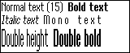
|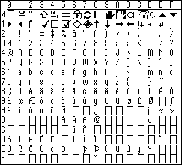

|`WS_FONT_BASE+1` -- small proportional.
Also the system font on the MC200.

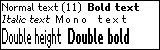
|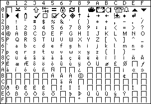

|`WS_FONT_BASE+2` -- fast monospaced (the console font).
Only used on the HC.

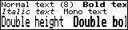
|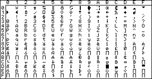

|`WS_FONT_BASE+3` -- wide monospaced.
The monospaced font on the MC.

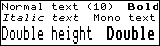
|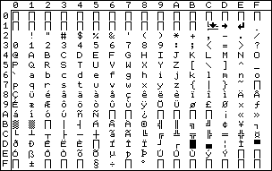

|`WS_FONT_BASE+4` -- fast proportional.
The system font on the S3.
Used to present alerts on the HC.

|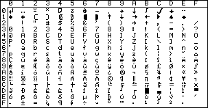

|`WS_FONT_BASE+5` -- fast bold proportional.
The bold font on the S3.

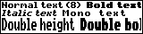
|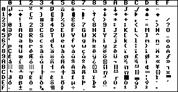
|===

The figure on the first line of each sample display gives the height of the font in pixels.
Each figure represents a 160 pixel wide bitmap (the width of the HC screen).

On HCs with ROM versions less than 1.50 (and which is not running version 3.5 of the window server), the final two fonts are absent and the console font is not "fast".

The 1st, 2nd and 4th fonts are the MC fonts.
The 5th and 6th fonts are the S3 fonts.
The character set of the console font (the 3rd font) is consistent with the MC fonts.
The S3 and MC fonts differ mainly in the characters for codes 0 to 31.

==== S3 fonts

On an S3, there are three ROM-based fonts:

[cols="1,1m,2"]
|===
|
|WS_FONT_BASE
|fast proportional (system font)

|
|WS_FONT_BASE+1
|fast bold proportional

|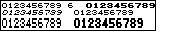
|WS_FONT_BASE+2
|numeric
|===

The figure on the first line of each sample display gives the height of the font in pixels.

On the S3, there is no monospace font as such.
The proportional fonts are designed such that a reasonable monospace font is obtained by using the monospace style attribute `G_STY_MONO`.

See the last two fonts in the list of HC fonts above for the full set of characters.

==== MC fonts

On a standard MC, there are three ROM-based fonts:

[cols="1,1m,2"]
|===
|
|WS_FONT_BASE
|proportional (MC400 system font)

|
|WS_FONT_BASE+1
|small proportional (MC200 system font)

|
|WS_FONT_BASE+2
|monospaced
|===

The figure on the first line of each sample display gives the height of the font in pixels.

See the first, second and fourth fonts in the list of HC fonts above for the full set of characters.

==== S3a and Work__about__ fonts

On the S3a and Work__about__, thirteen ROM-based fonts are defined; the first three are Series 3 fonts, examples of which are shown earlier.
Access to these fonts is summarised in `fonts.h`.

The following figures show sample displays of the fonts with font heights given in pixels.
Accompanying each of these displays is the corresponding set of character codes.

Note that the sample displays are 200 pixels wide.

[cols="1,2"]
|===
|`WS_FONT_BASE+2` -- numeric font

image:media/image31.png[media/image31,width=230,height=60]
|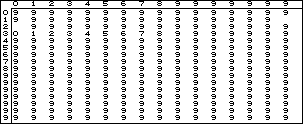

|`WS_FONT_BASE+3` -- monospaced 8 x 8

|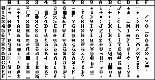

|`WS_FONT_BASE+4` - Roman 8 point

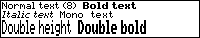
|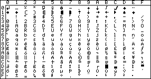

|`WS_FONT_BASE+5` - Roman 11 point

|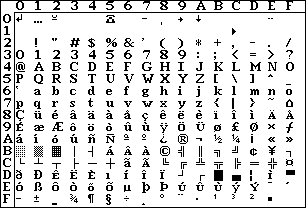

|`WS_FONT_BASE+6` - Roman 13 point

|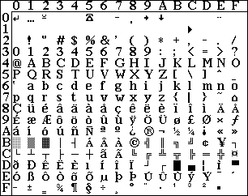

|`WS_FONT_BASE+7` - Roman 16 point

|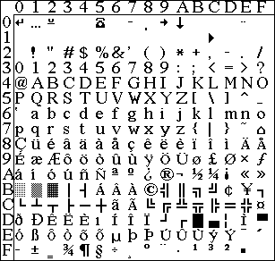

|`WS_FONT_BASE+8` - Swiss 8 point

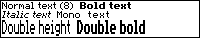
|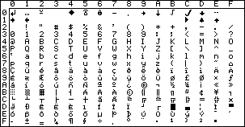

|`WS_FONT_BASE+9` - Swiss 11 point

|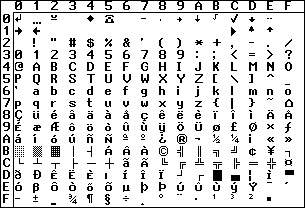

|`WS_FONT_BASE+10` - Swiss 13 point

|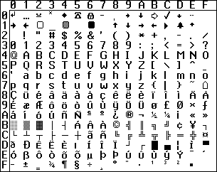

|`WS_FONT_BASE+11` - Swiss 16 point

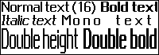
|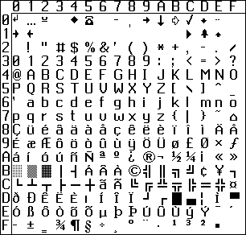

|`WS_FONT_BASE+12` - monospaced 6 x 6

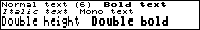
|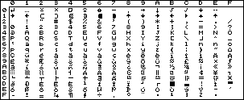
|===

==== Font files

An application can load a font from a font file by calling `gOpenFont` (which returns a font ID if it is successful).

The function `gSetOpenAddress` may be used immediately before `gOpenFont` to load the font from anywhere within the file (typically used to load a font which has been embedded into the program file).

If another process of the same or a different application loads the same font, the font is shared and not reloaded.

Font files normally have the extension `.FON`.

In version 4 of the window server, an application can load an individual font from a multiple font file by calling `gOpenFontIndex` and specifying the relative position of the font.
Like `gOpenFont`, it too returns a font ID if successful.

Multiple font files can be created by version 2.00 upwards of the font compiler and are given extensions of `.FON`, the same as for single font files.

==== Using `wsfcomp` 

The `wsfcomp.exe` program (which is placed in the `\sibosdk\sys` directory during installation of the core software) compiles a font source file (which normally has the extension `.fsc`) to a font file (`.fon`).
A font file should always be generated from a font source file by the use of `wsfcomp.exe`: developers should not attempt to generate font files directly.

To compile `mono.fsc` to produce `mono.fon` you use:

[source,console]
----
wsfcomp mono
----

The font source file contains a header section followed by the patterns which make up the font, as in the following extract from the beginning of a font source file:

[source]
----
*name System mono
*special 1
*descent 2
*height 10
*maxwid 7
*flag ascii
*flag cp850
*char 28

100000000000
100001100000
100001100000
101111111100
100111111000
110011110111
000001100000
000000000000
111111111111
100000000000

0000000
0000000
0001000
0001100
1111110
1111110
0001100
0001000
0000000
0000000

0000000
0000011
0010011
0110011
1111111
1111111
0110000
0010000
0000000
----

where the keywords are as follows:

[cols="1m,3"]
|===
|*name
|The font name (maximum length 16 characters)

|*special 1
|An optional statement to produce the 'special' fast font.
It must come before the *height statement.
The parameter is ignored currently but should be 1 to allow for future upgrades.

|*descent <n>
|The descent for the font.

|*height <n>
|The height of the font.

|*maxwid <n>
|Not the real maximum width, but the width of widest normal character.
Used as the width for `G_STY_MONO` spacing and is returned in the `G_FONT_INFO` struct.

|*flag ascii

*flag cp850

*flag bold

*flag italic

*flag serif
|Sets the flags member in the `G_FONT_INFO` struct.

|*char <n>
|Skip all characters up to the specified code.
Character codes follow sequentially until the next *char <n> statement.
The character number must always be greater than or equal to what the character would have been.
|===

In version 2.00 upwards of `wsfcomp.exe`, multiple source files can be converted into a multiple font file by specifying the `-L` flag and creating a `.flk` file containing a list of `.fsc` files to be compiled.
The output file is a `.fon` file of the same name as the `.flk` file.
A `.fh` header file is also created containing a #define for the index value of each font built and also a `#define` for the number of fonts built.

The `#define` for each index is built as follows:

[source,c]
----
#define <FLK file name>_FI_<FSC file name> index_value
----

The #define for the count is built as follows:

[source,c]
----
#define <FLK file name>_COUNT count
----

This version of the font compiler also supports the conversion of PCL bitmap fonts (as used by the HP laser jet printer) to either `.fsc` source files or directly to `.fon` files.

To use a PCL file as source, use the `-C` flag.
By default a `.fon` file is created but by using the -F flag as well, a `.fsc` file is created instead.
Note that the default extension for the PCL source file is `.sfp`.

Also in version 2.00 of `wsfcomp`, output file names can be overridden by using the `-O<__filename__>` option.

==== Font information

Given a font ID (either of a ROM-based font or of a loaded font), you can call `gFontInfo` to obtain such information about the font as:

* the name of the font and whether it corresponds to a character set
* the lowest and highest code for which there is a graphic
* the height of the font and how much of that height is above and below the base line (called the ascent and descent respectively)
* whether the font is monospaced, the width of the character 0 (ASCII code 0x30) and the width of the widest character graphic

Note that in addition to the font ID, `gFontInfo` takes as parameters the style (eg bold, double height) with which that font is to be printed because the width and height of a font can be changed by the style.

The following functions are required when laying out text (for example, to word wrap):

[cols="1h,3"]
|===
|gTextWidth
|Calculates the printed width of a text string.

|gTextCount
|Calculates the number of characters that can be displayed in a given pixel width.

|wGetWidthTable
|Gets the font width table.
|===

These functions also take the font ID and the style as parameters.

==== Text drawing

A text string may be printed to a drawable (as specified by the current graphics context) using one of the following functions:

[cols="1m,3"]
|===
|gPrintText
|to draw text from a pixel position

|gPrintClipText
|to draw text clipped to a given width

|gPrintBoxText
|to draw text in a box with left, right or centred alignment (commonly used to draw flicker-free)

|gXPrintText
|to draw text with embellishment

|gShadowText
|to draw text with a shadow effect (version 4)
|===

All the above functions are subject to the values of the text drawing fields in the current graphics context.
These specify:

* the font ID
* the font style (normal, bold, underlined, inverse, double height, monospaced or italic)
* the text transfer mode (this is not used by `gPrintBoxText`, `gXPrintText` or `gShadowText`)

The font style is either `G_STY_NORMAL` (zero) for normal style or a combination of the following:

* `G_STY_BOLD` 
* `G_STY_UNDERLINE` 
* `G_STY_INVERSE` 
* `G_STY_DOUBLE` 
* `G_STY_MONO` 
* `G_STY_ITALIC` 

Prior to version 4, the above styles are applied to a font algorithmically in the following way:

[cols="1m,3"]
|===
|G_STY_BOLD
|Generated by "bolding" character graphics -- effectively drawing it twice with a one pixel right shift on the second draw.
This does not produce as good a result as designing a bold font but it saves a having to store another font.

|G_STY_UNDERLINE
|Where each character (including space) is drawn with a horizontal line beneath its graphic.
See also `gXPrintText` for a different style of underlining.

|G_STY_INVERSE
|Where the bits in the character graphics are inverted before drawing.

|G_STY_DOUBLE
|To generate double height characters where each row of pixels in the graphic is doubled up before drawing.
As with bolding, you will get a much better result by designing a taller font.

|G_STY_MONO
|To add space around the characters of a proportional font to turn it into a monospaced font.
For this to be effective, the proportional font should be designed with monospacing in mind (as is the built in font on the Series 3).
|G_STY_ITALIC
|To generate a crude (but surprisingly effective) italic font by shifting the top half of each character across by one pixel.
|===

Fast text printing of a fast font only works with normal style or with just `G_STY_MONO`.
The use of any other style will cause text drawing to fall back to the slower algorithm.

In version 4 upwards, use can be made of font groups as described at the beginning of the section on _ROM-based fonts_; applying a style to a font group will cause the window server to select the most appropriate font from within the group and _might_ not need to use the above algorithms.

Therefore, if a font is used with a style or combination of styles, there is no easy way of knowing whether a font within a font group has been used or whether a style has been algorithmically applied to a single font or even whether styles have been applied to a font within a font group.

The text transfer mode (which affects `gPrintText` and `gPrintClipText`) is one of:

[cols="1m,3"]
|===
|G_TRMODE_SET
|where 1s in the font set bits in the destination and 0s do not change bits in the destination (used to print on to a previously cleared area).

|G_TRMODE_REPL
|where 1s and 0s in the font overwrite the destination (used to print over unprepared areas).

|G_TRMODE_CLR
|where 1s in the font clear bits in the destination and 0s do not change bits in the destination (used to print on to a previously set area).

|G_TRMODE_INV
|where 1s in the font toggle corresponding bits in the destination and 0s in the source pattern do not change bits in the destination (used to print over an existing image and may be reversed by a second application).
|===

==== The physical structure of font files

The information in this section is intended to allow applications to read data from a font file.
A font file should always be created by use of _wsfcomp.exe_.

As with bitmap files, font files start with a `P_FSIG` header:

[source,c]
----
typedef struct
{
    TEXT app_id[3]; /* application ID */
    UBYTE chk_sum;  /* application ID checksum */
    UBYTE file_vn;  /* file version number */
    UBYTE app_vn;   /* application version number */
} P_FSIG;
----

where `P_FSIG` is defined in `p_file.h`.

For a normal font file, the appropriate values for the `P_FSIG` header are:

[source,c]
----
P_FSIG sig = {"FON",'F'+'O'+'N',0x30,0x30};
----

For a fast font file, the appropriate values are:

[source,c]
----
P_FSIG sig = {"FN1",'F'+'N'+'1',0x10,0x10};
----

The window server automatically recognises the difference between normal and fast fonts.
However, window servers before version 3.5 do not recognise fast fonts and will refuse to load them.

The `P_FSIG` header is followed by the data which makes up the `WS_FONT_FILE_HEADER` (not supplied in any `\sibosdk\include` header file -- define your own if you need it):

[source,c]
----
typedef struct
{
    P_FSIG sig;
    UWORD checksum;
    UWORD size;
    G_FONT_INFO info;
    UWORD private[10];
} WS_FONT_FILE_HEADER;
----

The checksum is calculated by applying `p_crc` to the data that follows the `WS_FONT_FILE_HEADER` header (the character width array and the font bitmap).

The size is the byte size remaining in the file after the size field.

The `G_FONT_INFO` struct is as returned by `gFontInfo`:

[source,c]
----
typedef struct
{
    UWORD low_ch;        /* lowest code in font */
    UWORD high_ch;       /* highest code in font */
    UWORD height;        /* height of font */
    UWORD descent;       /* height of bottom part of character */
    UWORD ascent;        /* height of top part of character */
    UWORD numeric_width; /* Width of numeric character */
    UWORD max_width;     /* The width of the widest character in the font */
    UWORD flags;
    TEXT name[FONT_NAME_LEN];
} G_FONT_INFO;
----

The `G_FONT_INFO` struct is followed by 20 bytes of private data, written into the file by `wsfcomp.exe`.

In a normal font, the `WS_FONT_FILE_HEADER` is followed by:

* an array of `(high_ch-low_ch+2) WORD` offsets into the font bitmap
* the font bitmap, stored like the body of a bitmap in a bitmap file

The font bitmap contains the characters in the font as one long string in code order.
The window server literally bit copies the characters from this font bitmap to the drawable (the screen or a bitmap).

Each word in the array of offsets contains the doubled pixel offset within the font bitmap with the least significant bit of the word set to 1 if the character is missing from the font and left as 0 otherwise.
The offset corresponding to a missing character must be that of the next existing character.
An extra offset is stored at the end of the array containing what would have been the offset of the next character so that the width of a character may be calculated by subtracting its offset from the offset of the next character.

Fast fonts are stored in an expanded form that uses more memory but can be drawn faster.
In a fast font, the `WS_FONT_FILE_HEADER` is followed by:

* an array of 256 `BYTE` character pixel widths (each set to between zero and 8, inclusive)
* the font bitmap for all 256 characters (which is `256*height` bytes long), stored like the body of a bitmap in a bitmap file

All characters in a fast font must be less than or equal to 8 pixels wide.
The font bitmap contains all 256 characters, stored left aligned in their 8 pixel slot.
Unused bits are, by convention, set to zero.

==== Embedded font files

A font file may be built into a program file by including its name in an add-file list.
This process is more fully described in the _Building an Application_ chapter of the _General Programming_ manual.

=== Graphics output 

==== Pixel coordinates

The graphics output functions (and other functions such as window creation) operate on a drawable -- either a window or a bitmap.
In either case, you are actually drawing a two-dimensional array of pixels in which each pixel is either black or white.

Version 4 of the window server can support grey as well as black.
In this case you draw to a _pair_ of twodimensional arrays, referred to as the normal (or black) plane and the grey plane.

Arrays of pixels are represented by data structures called _bitmaps_ (whether on or off the screen) where the bits in the bitmap represent pixels.
When a bitmap is imaged on an LCD screen, a clear bit shows as white and a set bit as either black or grey.

With a mixture of black and grey, the situation is more complicated; two arrays of pixels are needed to display an image which means that two bitmaps are needed.
When the pair of bitmaps are imaged on an LCD screen, what is seen depends on the corresponding bit values of _both_ planes. This is best illustrated by the following diagram:

#REPLACE THIS WITH A PROPER DRAWING#
____
GREY bit setting

0 1
____

[cols="100%",options="header",]
|===
a|
clear grey

black black

|===

0

NORMAL bit

setting 1

Note that a bit set in the normal plane and in the corresponding position in the grey plane is seen as black.

Internally, a bit in a bitmap is addressed by the index of the word that contains it and the position of the bit within that word.
Externally, a bit is addressed (somewhat more usefully) by its pixel coordinates.

When thinking of pixel coordinates, it is best to think in terms of discrete cells arranged in rows and columns rather than in terms of continuous Cartesian coordinate systems based on real numbersfootnote:[Although such a view may well be appropriate at higher levels.].
Pixel coordinates are based on a pair of integers (x,y) that identify a particular pixel by the column (x) and the row (y) in which it lies.

In a bitmap or window, the top-left pixel has coordinates (0,0).
The x coordinate is based on the column number (which increases to the right) and the y coordinate is based on the row number (which increases downwards).
Pixel coordinates are signed and can address pixels that are outside the bitmap.

It is often useful to address pixels that are beyond the boundaries of the bitmap.
When any drawing operation is performed, it is clipped to the extent of the bitmap.
When drawing to a window, the drawing operation may be clipped to much else besides the window's extent.

There is no graphics function that draws a single pixel since this is too inefficient to be of usefootnote:[If you really must set individual pixels, you can use `gClrRect` on a rectangle with unit sides.].
In practice, pixel coordinates are used to specify:

[cols="1h,3"]
|===
|lines
|by the coordinates of the ends of the lines

|rectangles
|by the coordinates of the top left internal pixel and the coordinates of the bottom right external pixel
|===

When drawing a horizontal line the line includes the pixel with the lower x coordinate and excludes the pixel with the higher x coordinate.

Similarly, when drawing a vertical line the line includes the pixel with the lower y coordinate and excludes the pixel with the higher y coordinate.

When drawing a line in which both coordinates change, the window server turns the coordinates of the end pixels into a rectangle with a top-left internal pixel and a bottom-right external pixel.
The line drawing algorithm then fills in those pixels that are intersected by a mathematical line between the corners of the mathematical rectangle on the boundary of those pixels that are in the rectangle.

Surprisingly, when the rectangle has unit height or width, you get a horizontal or a vertical line respectively as with a zero height or width.

There are some useful functions that operate on rectangle data structures in the _Integer Conversions and Rectangle Functions_ chapter of the _PLIB Reference_ manual.

Rectangles can also be specified by the coordinates of the top left (internal) pixel and the width and height of the rectangle in pixels.

==== Graphics structs

The structs described below (defined in ``p_graf.h``footnote:[The header `p_graf.h` is also included by including _plib.h_.]) are used extensively by the WLIB functions.

The `P_POINT` struct is used to represent a pixel coordinate or a displacement:

[source,c]
----
typedef struct
{
    WORD x;
    WORD y;
} P_POINT;
----

The `P_RECT` struct specifies a rectangular block of pixels in terms of the top-left internal pixel and the bottom-right external pixel:

[source,c]
----
typedef struct
{
    P_POINT tl; /* top left pixel (internal) */
    P_POINT br; /* bottom right pixel (external) */
} P_RECT;
----

The `P_EXTENT` struct also specifies a rectangular block of pixels -- but in terms of the top-left internal pixel width and height of the block in pixels:

[source,c]
----
typedef struct
{
    P_POINT tl; /* top left pixel */
    WORD width; /* width of extent */
    WORD height; /* height of extent */
} P_EXTENT;
----

An empty rectangle is a rectangle that has one or both of its sides zero or negative.

==== Graphics output

The following graphics output functions operate on the drawable that is referenced by the current graphics context:

[cols="1m,3"]
|===
|gDrawLine gDrawPolyLine
|to draw horizontal, vertical or angled lines

|gDrawBox
|to draw a box

|gBorderRect gBorder
|to draw a border inside a rectangle in one of a number of styles

|gBorder2Rect gBorder2
|to draw a border inside a rectangle with a shadowed effect.
Available in version 4 only.

|gDrawObject
|to draw a scaleable graphics object inside a rectangle.
Available in version 4 only.

|gClrRect
|to set, clear or invert a rectangle of pixels

|gInvObloid
|to invert all the pixels in a rectangle except for the four corner pixels

|gCopyBit
|to copy a rectangle from a bitmap (or a backed-up window) to a given position

|gDrawBit
|to copy a rectangle from an open bitmap file.
Available in version 4 only.

|gCopyRect
|to copy a rectangle to a displaced position (only really suitable for bitmaps `wScrollRect` should be used for windows)

|gFillPattern
|to fill a rectangle with repeated copies of a bitmap (or a backed-up window)

|gPrintText
|to draw text from a pixel position

|gPrintClipText
|to draw text that is clipped to a given width

|gXPrintText
|to draw text with embellishment

|gPrintBoxText
|to draw text in a box with left, right or centred alignment

|gShadowText
|to draw text with shadow effects.
Available in version 4 only.

|wDrawButton
|to draw a S3 style button (essentially a rectangle containing a text string), depressed or not.
Available in version 3.5 of the window server, but not available on any version of the MC

|wDrawButton2
|to draw a button in both the S3 and S3a styles.
Available in version 4 only.
|===

===  Graphics output other than to the current graphics context

There is a set of graphics output functions are not directed at the current graphics context.
These functions are:

[cols="1m,3"]
|===
|wScrollRect wScrollWin
|to scroll a window or a bitmap by copying a rectangle to a displaced position.

|wTextCursor wDrawTextCursor wEraseTextCursor
|to control the drawing of a flashing rectangular text cursor in a window.

|wInfoMsg wInfoMsgCorner wSetBusyMsg wCancelBusyMsg
|to display temporary text messages at the corners of the screen.
Requires version 3.5 of the window server, but is not available on any version of the MC.

|wsCreateClock wsSetClock
|to draw and update a S3 style clock (analog or digital) in a window.
Requires version 3.5 of the window server, but is not available on any version of the MC.

|wsCreateClock2
|to draw a S3a style clock (analog or digital) in a window.
Requires version 4 of the window server.

|wsEnable wsUpdate wsDisable wsEnableTemp wsDisableTemp
|to control the display of a task status window.
Intended primarily for the S3 but available also on the HC with version 3.5 of the window server.
Not available on the MC.

|wsStatusWindow wsSetList wsSelectList
|to control the state of a status window and the display of modes within that window.
Intended for the S3a running version 4 of the window server.

|wsAlertW wsAlertA wsAlertUpdate wsAlertCance
|to access `p_notify`-like services but with enhanced formatting and an asynchronous version (so that an application can continue processing while waiting for the user to respond).
Requires version 3.5 of the window server, but is not available on any version of the MC.
|===

You can also draw to a window indirectly by attaching one or more bitmaps to it (using `wSetWinBitmap`) and then draw to the bitmaps.

==== Graphics contexts

A graphics context is a window server resource at which graphics output is directed.

A graphics context contains the following:

* a drawable (a window or a bitmap) that is the ultimate recipient of the graphics output
* whether to set, clear or invert pixels when drawing lines using `gDrawLine`, `gDrawPolyLine`, `gDrawBox`, `gBorderRect`, `gBorder`, `gBorder2Rect`, `gBorder2`, `wDrawButton` or `wDrawButton2`
* the font, style and transfer mode to use when drawing text using `gPrintText`, `gPrintClipText`, `gXPrintText`, `gPrintBoxText`, `wDrawButton` or `wDrawButton2` 

The drawable is set once and for all when the graphics context is created.
The rest of the content can be set up when the graphics context is created and it can also be altered subsequently using `gSetGC`.

==== Current graphics context

Rather than make each function take the ID of a graphics context as a parameter, the graphics output functions are directed to a _current graphics context_.

Using a current graphics context makes sense because you typically need to call several text drawing or line drawing functions (all to the same graphics context) to draw something.

When you create a graphics context, it is automatically made current.
If you have created more than one permanent graphics context, you can set which one of them is current by calling:

`gSetGC` to make the specified graphics context current and to change its value `gSetGC0` just to make the specified graphics context current

==== Permanent and temporary graphics contexts*

You can draw to a _permanent_ or a _temporary_ graphics context.

When your program draws to more than one drawable, it is normally simpler to use a temporary graphics context that is created and then freed each time you draw to one of the drawables.

A client can only create one temporary graphics context at any one time.
When a temporary graphics context is created, it is automatically made current.
If a permanent graphics context was current before a temporary graphics context was created, the permanent graphics context is made current when the temporary graphics context is freed.

Creating a temporary graphics context is an efficient "blind" operation, which is stored in the client-side buffer.

==== Creating a permanent graphics context

To create a permanent graphics context for drawing to any drawable, you use:

`gCreateGC` to create a permanent graphics context with specified initial values `gCreateGC0` to create a permanent graphics context with default initial values A permanent graphics context is freed by calling `wFree`.

===  Creating a temporary graphics context

There are six functions that create a temporary graphics context: two for drawing to any drawable and four for redrawing to a window.

The two that are used for drawing to any drawable are:

`gCreateTempGC` to create a temporary graphics context with specified initial values `gCreateTempGC0` to create a temporary graphics context with default initial values

A temporary graphics context that is created with one of the above functions is freed with `gFreeTempGC`.

The four that are used for redrawing to a window are:

[cols="1m,3"]
|===
|wBeginRedrawGC
|to redraw a part of the window using a temporary graphics context that is created and initialised with specified values

|wBeginRedrawGC0
|to redraw a part of the window using a temporary graphics context that is created with default initial values

|wBeginRedrawWinGC
|to redraw the whole of the window using a temporary graphics context that is created and initialised with specified values

|wBeginRedrawWinGC0
|to redraw the whole of the window using a temporary graphics context that is created with default initial values
|===

A temporary graphics context that is created with one of the above functions is freed with `wEndRedraw`.

=== Keyboard input

==== Key press events

A client is informed of a key press by `wGetEventWait`, `wGetEvent` or `wGetEventSpecial` completing with a `WM_KEY` event type.

The `WM_KEY` event parameters are:

* a key code
* a code modifier that indicates what shift keys were pressed at the time
* a repeat count

The key code may correspond to a code page 850 character code or, if the key does not correspond to a character in code page 850, a special key code (for example, `W_KEY_LEFT` for the left arrow key).

For single key presses, the repeat count is 1.
If a key is held down, the repeat count will normally be greater than 1.
A repeat count gets to be greater than 1 when the client is unable to process keys at the rate at which the system generates repeated keys.

Counter intuitively, application programmers are best advised just to ignore the repeat count.

When a user holds down a key, there is presumably some feedback on the screen of the processing of that key.
The user will release the key when the screen image is such that enough key presses have been generated (think of, for example, deleting text with the BACKSPACE key or scrolling with a down arrow key).
When the user releases the key, he or she will expect the processing to cease as soon as the key is released.

This behaviour is exactly what you get by ignoring the repeat count.
If you process the key count, this only benefits users that can anticipate the number of repeats generated by holding the key down for a given period (and that kind of ability is arguably only required when playing a computer game).

==== Capturing keys*

Normally, the window server sends all key presses to the foreground client.

All key presses, that is, except those that the window server processes itself (which includes keys to task switch and the key that pauses the foreground client).

In much the same way as it is useful for the window server to process keys, it is sometimes useful for a special client to receive keys whether it has the foreground or not.
Such a client can capture specific key presses by calling `wCaptureKey` (and such captures can be cancelled by calling `wCancelCaptureKey`).

=== Pausing the client

If a client has called `wEnablePauseKey`, the user can pause the client's drawing when it has the foreground by pressing the pause key.

On the HC, the pause key is kbd:[PSION+LEFT-ARROW] and on the S3, S3a and MC, it is kbd:[CTRL+S].
The user resumes the client by pressing any key.
The key press that resumes the client is not delivered to the client.

The pause key may be disabled by calling `wDisablePauseKey`. The pause key is disabled by default.

==== Setting task keys

From version 3.5 onwards of the window server you can call:

[cols="1m3,"]
|===
|wSetTaskKey wCancelTaskKey
|to set and cancel a key which cycles the foreground task 

|wSetBackTaskKey wCancelBackTaskKey
|to set and cancel a key which cycles the foreground task in the opposite direction
|===

These task keys are in addition to the normal system task keys on the HC and MC.
This feature is provided for the S3 and S3a (which do not have a system task key on the keyboard).

Note that the system screen calls `wSetTaskKey` to assign kbd:[SHIFT+SYSTEM] as a task key.

=== Mouse input

This section only applies when the window server is running on a machine with a pointing device (a digitiser or a mouse).

==== Mouse icons

The window server automatically draws a corresponding mouse icon when the pointing device is over a window.

Each window is assigned a mouse icon when it is created using `wCreateWindow` and the mouse icon can subsequently be changed by calling `wSetWindow`.
By default, a window is created with the same mouse icon as its parent.
Unless otherwise specified, windows tend to have the standard built-in mouse icon with ID `W_WIN_MI_STANDARD` -- the mouse icon used by the root window.

A window can effectively have no mouse icon by giving it a built-in invisible icon with ID `W_WIN_MI_NULL`.

The window server automatically removes the mouse icon while a window it obscures is being drawn to.

The mouse icon is drawn such that its "hot spot" (which varies according to the icon) is over the pixel that is being pointed at.

Mouse icons are handled much like bitmaps and fonts:

* There are ROM-based mouse icons with IDs that are known at compile time.
* You can load a mouse icon from a file by calling `gOpenMouseIcon` (which returns an ID if successful). Such mouse icons may be freed when no longer required by calling `wFree`.

==== Mouse events

A client is informed of a mouse event (movement, press or release) by `wGetEventWait` or `wGetEvent` completing with a `WM_MOUSE` event type.

The `WM_MOUSE` event parameters are:

* the window at which the mouse event is directed and the position of the mouse relative to that window
* the type of the mouse event (movement, press or release)
* the state of the mouse button and of the shift keys

A window will not receive any mouse events at all if the `W_WIN_NO_MOUSE` attribute is set (in which case the other mouse related attributes are ignored).

By default, mouse movement events are not generated.
If the `W_WIN_MOUSE_DRAG` attribute is set, mouse movement events are reported when the mouse button is down.
If a window has the `W_WIN_MOUSE_MOVE` attribute set, mouse movements are reported when the mouse button is up.

==== Capturing the mouse

Normally, a mouse event is directed to the window that was pointed to when the event occurred.
If the mouse has been captured by a window, a mouse event that occurs in the root window or in any of the capturing client's windows is directed at the capturing window or to the relevant child window of the capturing window.
There is a mouse event parameter that indicates whether the position was inside or outside the window.

Capturing is often used to limit the mouse interaction to a window system to the exclusion of others as, for example, in the implementation of a pull-down or a pop-up menu.

A client can capture the mouse to a particular window by calling `wCaptureMouse` and release the mouse by calling `wReleaseMouse`.

==== Grabbing the mouse

The mouse can also be "grabbed" while the mouse button is pressed by setting the `W_WIN_MOUSE_GRAB` attribute on a window.
The grab is automatically released when the user releases the mouse button and a `WM_MOUSE` event of type `WM_MOUSE_RELEASE` is sent to the grabbing window.

Grabbing the mouse is not quite the same thing as capturing it.
When the mouse is grabbed, the grabbing window always gets the `WM_MOUSE_RELEASE` event -- even if it occurs over another client's window.
Also, grab is terminated with the mouse up, but capture persists until it is relinquished.

==== Input-only windows

A window that is used for mouse input but that is never drawn to should have the `W_WIN_INPUT_ONLY` attribute set.

Input-only windows are never visible on the screen (and they do not obscure other windows) although they may (and typically would) have a different mouse icon from their surroundings.

==== Inactive windows

A window tree is made inactive by setting the `W_WIN_INACTIVE` attribute of the window at the head of the tree.

If a mouse click occurs anywhere in a window with this flag set or in any of its descendants, a `WM_ACTIVE` event is sent to the window (rather than a `WM_MOUSE` event). A client would normally respond to a

`WM_ACTIVE` event by making the window tree active again by clearing the `W_WIN_INACTIVE` attribute.

==== The rubber band

The rubber band is an input mode, controlled by the window server, for allowing the user to do one of the following:

* specify a new position for a rectangle
* specify a new position and size of a rectangle

Rubber band mode is typically used to allow the user to move and/or resize a window.

Once a client has entered rubber band mode, it must be completed before proceeding with any other input (although the user might abandon it).
While in rubber band mode, the window server handles all user interaction with the rubber band.
When the user completes the rubber band, the window server generates a `WM_RUBBER` event.

A rubber band that is used just to move (but not resize) appears as an XORed box. The rubber band for resizing as well as moving appears as in the following diagram:

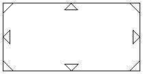

Each of the 8 triangles may be dragged with the mouse to stretch or shrink the rubber band in the direction of the triangle.
Releasing the mouse will leave the rubber band in its stretched state.
The mouse icon disappears while the rubber band is being dragged.

To move the rubber band, it should be dragged from a point inside the box but outside any of the triangles.

The arrow keys can be used to move the rubber band in the corresponding direction.
The shifted arrow keys can be used to resize the rubber band moving the bottom and right edges.
If the kbd:[CTRL] shift key is also pressed, the affect of the arrow keys (whether shifted or not) is amplified.

Pressing kbd:[RETURN] selects the current position and size of the rubber band.
The window server generates a `WM_RUBBER` event giving the position and size of the rubber band and also indicating whether the rubber band moved and/or changed its size.

Pressing kbd:[ESC] cancels the rubber band. The window server generates a `WM_RUBBER` event that indicates that the rubber band was cancelled.

Rubber band mode is entered by the client calling `wRubberBand`.
The parameters to `wRubberBand` include those that indicate:

* the initial size and position of the rubber band
* the window at which the `WM_RUBBER` event is directed
* the window in which the rubber band is drawn (and therefore clipped to)
* whether the rubber band is completed on a mouse up event
* whether the rubber band can be resized as well as moved
* optional limits on the size and movement of the rubber band
* an optional grid snap on the allowable positions and sizes of the rubber band

If a mouse down event occurs in a window that is set with the `W_WIN_RUBBER_BAND_CAPTURE` attribute, it and subsequent mouse and keyboard events are captured to the window server's rubber band processing until the rubber band mode is terminated.
This first mouse click generates a `WM_RUBBER_BAND_INIT` event to which the client must respond with a call to `wRubberBand`.

If when calling `wRubberBand` in response to a `WM_RUBBER_BAND_INIT` event you specify that the rubber band should be completed on a mouse up event, you should also set the window attribute `W_WIN_RUBBER_BAND_COMPLETE_ON_RELEASE` (this handles nasty race conditions in which the mouse up occurs before the call to `wRubberBand`).

=== System start-up

When the system starts up (for example, when you press the recessed reset button), the following happens:

* the operating system "hand crafts" `SYS$NULL` (null process), `SYS$MANG` (supervisor) and `SYS$FSRV` (file server)
* the file server creates the `SYS$WSRV` (window server) process
* the window server creates the `SYS$SHLL` (shell) process
* in some cases, the window server creates the `SYS$NTFY` (notifier) process

The window server normally loads the shell and the notifier from the ROM.
However, on the HC, S3, S3a and MC, the window server first looks for `SYS$SHLL.IMG` and `SYS$NTFY.IMG` in the root directories of the local devices in alphabetical order (for example, `LOC::A\`, `LOC::B:\` and `LOC::\M` #FIX?# on an HC).

In some cases (such as on the S3, S3a and optionally on the HC), version 3.5 and upwards of the window server handles the notifier itself and does not create a notifier process.

==== Using the window server's notifier on the HC 

By default on the HC, the window server runs `ROM::SYS$NTFY.IMG`.
If the HC is running version 3.5 of the window server, you can switch to the window server's notifier with the following benefits:

* less memory is consumed by the system
* it looks better

The HC can be switched to the window server's notifier with the following program:

[source,c]
----
#include <plib.h>
#include <wlib.h>

LOCAL_D WSERV_SPEC wSpec;

GLDEF_C INT main(VOID)
{
    INT NotifierPid;

    if ((NotifierPid=p_pidfind("SYS$NTFY.*"))>0)
    {
        wConnect(&wSpec,0,W_CONNECT_AT_BACK);
        wSystem(WSERV_FLAG_NO_NOTIFIER_REBOOT,WSERV_FLAG_NO_NOTIFIER_REBOOT);
        p_pterminate(NotifierPid,0);
        wSystem(WSERV_FLAG_HOOK_NOTIFIER,WSERV_FLAG_HOOK_NOTIFIER);
    }
    return(0);
}
----

If `SYS$NTFY` exists, the program connects to the window server and:

* stops the window server from re-booting the notifier
* kills the notifier process
* causes the window server to hook the notifier

On the HC, the font used by the notifier is determined by the Internal Font environment variable, `$WS_IF`, which should contain a `WORD` binary value of 0 for `WS_FONT_BASE`, 1 for `WS_FONT_BASE+1`, and so on.

If you change the value of `$WS_IF`, you must reset the machine by pressing the recessed reset button to effect the change.
The height of the font should not exceed 12 pixels.

The "factory" setting of `$WS_IF` is `4` (which selects the S3 font).

In version 4 of the window server, the fonts used by the notifier are determined by the `$WS_FNTS` environment variable.
This contains a number of words containing the font ids used by the window server as described at the beginning of this chapter.

In particular, the second word contains the ID of the notifier font while the seventh word contains the ID of the notifier button font.

==== The `$WS_FL` environment variable on the HC

On an HC with version 3.5 of the window server, the initial value of the internal parameter that is set by `wSystem` is loaded from the `$WS_FL` environment variable when the window server starts.

After setting `$WS_FL` to the desired `WORD` value, you must reset the HC by pressing the recessed reset button to make the new value effective.

Recall that environment variables survive a soft reset but are cleared (and loaded from a ROM initialisation file) on a hard reset (where the ON key is pressed at the same time as the reset button).

The `wSystem` flags parameter is made up by ORing a number of bit fields of the form `WSERV_FLAG_XXX` where some of the values of XXX arefootnote:[See the description of `wSystem` for the full set and also for the application of these flags to the S3, the S3a and the MC.]:

[cols="1m,3"]
|===
|NO_NOTIFIER_REBOOT
|If set, the window server does not boot or re-boot the notifier.

|HOOK_NOTIFIER
|If set, the window server attempts to hook the notifier.

|NO_PANIC_NOTIFY
|If clear and the window server has successfully hooked the notifier, the window server notifies the user of a process that terminates abnormally with a panic or with a negative reason number.
This flag is ignored unless the window server has hooked the notifier.
You would set this flag to prevent the window server from reporting abnormal terminations when `HOOK_NOTIFIER` is set.

|LOW_BATTERY_WARNINGS
|If set, the window server notifies the user of a low lithium or main battery.
Note that the window server only checks for low battery when the machine is turned on and that the window server is only informed of the machine being switched on after `p_setonevent(TRUE)` has been called.
The on-event state is `FALSE` after any reset.

|HUNG_UP
|If set, the window server presents a "hung up" status window if the foreground task is not using backed-up windows and fails to respond to redraw events.
|===

After a hard reset on an HC with version 3.5 of the window server, the `$WS_FL` environment variable does not exist (which is equivalent to it being zero).

The following example program sets the `$WS_FL` environment variable:

[source,c]
----
#include <plib.h>
#include <wlib.h>

GLDEF_C INT main(VOID)
{
    WORD flags;

    flags=WSERV_FLAG_NO_NOTIFIER_REBOOT|WSERV_FLAG_HOOK_NOTIFIER
        |WSERV_FLAG_LOW_BATTERY_WARNINGS|WSERV_FLAG_HUNG_UP_SW;
    return(p_setenviron("$WS_FL",6,&flags,2));
}
----

After running this program and resetting the HC, the window server will:

* provide the notifier service
* report low battery voltages
* present a hung-up status window if an application hangs
* report a process that terminates with a panic or with a negative reason number

==== S3a

In version 4, some HC features from the later releases of version 3.5 have been added to the S3a variant of the window server.
This includes:

* the use of the environment variable `$WS_FL` for the initial value of the window server system flags (as referenced by `wSystem`).

==== Replacing the shell on the HC

By default, the window server runs `ROM::SYS$SHLL.IMG`.
This program provides a classical commanddriven user interface to perform such commands as `COPY` and `DIR` and to run programs (for example, `LINK`) in response to the program's file name being entered.

When developing a turnkey system, it is advisable to run an alternate custom shell that provides a restricted end-user environment.
With version 3.5 of the window server, this is particularly straightforward as the window server can be persuaded to take over many of the responsibilities particularly the link paste services -- that previously had to be provided by the shell.
You simply call your main application `SYS$SHELL.IMG` and place it in the root directory of any drive.
The window server will run the shell on system start-up and it will also re-run the shell should it terminate.

Since any restarting EPOC system will pick up a `SYS$SHLL.IMG` (such as the debugger, for example), it is a good idea _not_ to call such a program SYS$SHLL but to rename it when you copy it to its intended working destination.

To revert to the ROM shell when using an SSD-based `SYS$SHLL`, first remove the SSD and then either terminate the existing shell process or reset the machine.
If you have placed a `SYS$SHLL.IMG` in `M:\`, you can revert to the ROM shell by hard resetting the machine (which clears the contents of `M:\` and resets the environment variables) or you can place an alternate `SYS$SHLL.IMG` in an SSD drive (since the drives are scanned in alphabetic order).

The following simple shell/application program terminates any `SYS$NTFY` process and sets up the window server to provide the notifier service and other services (as described above) and then presents a user interface that reports on key presses.

[source,c]
----
/*
HCSHELL.C -- Sample shell for the HC
*/

#include <plib.h>
#include <wlib.h>

GLREF_D UINT wMainGc;
GLREF_D WSERV_SPEC wSpec;

LOCAL_D INT FontHeight;
LOCAL_D INT FontAscent;

LOCAL_C VOID SetFontHeight(VOID)
{
    G_FONT_INFO info;

    gFontInfo(WS_FONT_SYSTEM,0,&info);
    FontHeight=info.height;
    FontAscent=info.ascent;
}

LOCAL_C VOID CDECL PrintLine(INT line,INT align,TEXT *fmt,...)
{
    INT len;
    P_RECT box;
    TEXT b[80];

    box.tl.x=4;
    box.br.x=wSpec.conn.info.pixels.x-4;
    box.tl.y=FontHeight*line+4;
    box.br.y=box.tl.y+FontHeight;
    len=p_atob(&b[0],fmt,&fmt+1);
    gPrintBoxText(&box,FontAscent,align,0,&b[0],len);
}

LOCAL_C VOID HandleKeyPress(WMSG_KEY *pk)
{
    PrintLine(2,G_TEXT_ALIGN_CENTRE,"code:%02x mod:%02x count:%02x",
        pk->keycode,pk->modifiers,pk->count);
}

LOCAL_C VOID MainEventLoop(VOID)
{
    WS_EV event;

    SetFontHeight();
    gBorder(W_BORD_SHADOW_D|W_BORD_SHADOW_ON);
    PrintLine(0,G_TEXT_ALIGN_LEFT,"Free memory: %dKbytes",p_sgfree()>>6);
    for (;;)
    {
        wGetEventWait(&event);
        if (event.type==WM_KEY)
        {
            HandleKeyPress(&event.p.key);
        }
    }
}

GLDEF_C INT main(VOID)
{
    INT NotifierPid;

    p_setonevent(TRUE); /* required on the HC */
    wStartup();
    wSystem(WSERV_FLAG_NO_NOTIFIER_REBOOT,0xfff);
    if ((NotifierPid=p_pidfind("SYS$NTFY.*"))>0)
    {
        p_pterminate(NotifierPid,0);
    }
}

wSystem(WSERV_FLAG_HOOK_NOTIFIER|WSERV_FLAG_LOW_BATTERY_WARNINGS|WSERV_FLAG_HUNG_UP_SW,
WSERV_FLAG_HOOK_NOTIFIER|WSERV_FLAG_LOW_BATTERY_WARNINGS|WSERV_FLAG_HUNG_UP_SW);
    MainEventLoop();
    return(0);
}
----

You may prefer to use the following shell (the source may be found in `\sibosdk\demo\lkshell.c`) when using the remote debugger on the HC:

[source,c]
----
/*
LKSHELL.C - Just starts up the link
*/

#include <plib.h>
#include <wlib.h> LOCAL_D WSERV_SPEC wSpec;

LOCAL_D UINT wMainGc;
LOCAL_D UINT wMainWid;
LOCAL_D INT FontHeight;
LOCAL_D INT FontAscent;

LOCAL_C VOID SetFontHeight(VOID)
{
    G_FONT_INFO info;
    gFontInfo(WS_FONT_SYSTEM,0,&info);
    FontHeight=info.height;
    FontAscent=info.ascent;
}

LOCAL_C VOID CDECL PrintLine(INT line,INT align,TEXT *fmt,...)
{
    INT len;
    P_RECT box;
    TEXT b[80];

    box.tl.x=4;
    box.br.x=wSpec.conn.info.pixels.x-4;
    box.tl.y=FontHeight*line+4;
    box.br.y=box.tl.y+FontHeight;
    len=p_atob(&b[0],fmt,&fmt+1);
    gPrintBoxText(&box,FontAscent,align,0,&b[0],len);
}

LOCAL_C VOID MainEventLoop(VOID)
{
    WS_EV event;
    SetFontHeight();
    for (;;)
    {
        wGetEventWait(&event);
        if (event.type==WM_REDRAW)
        {
            wValidateWin(wMainWid);
            gBorder(W_BORD_SHADOW_D|W_BORD_SHADOW_ON);
            PrintLine(0,G_TEXT_ALIGN_LEFT,"Free memory: %dKbytes",p_sgfree()>>6);
        }
        else if (event.type==WM_KEY && event.p.key.keycode==W_KEY_RETURN)
        {
            wInvalidateWin(wMainWid);
        }
    }
}

GLDEF_C VOID main(VOID)
{
    INT NotifierPid;
    WORD stat;
    p_setonevent(TRUE);

    wConnect(&wSpec,0,W_CONNECT_PRIORITY);
    wSystem(WSERV_FLAG_NO_NOTIFIER_REBOOT,WSERV_FLAG_NO_NOTIFIER_REBOOT);
    if ((NotifierPid=p_pidfind("SYS$NTFY.*"))>0)
    {
        p_logona(NotifierPid,&stat);
        p_pterminate(NotifierPid,0);
        p_waitstat(&stat);
    }
    wSystem(WSERV_FLAG_HOOK_NOTIFIER|WSERV_FLAG_LOW_BATTERY_WARNINGS|WSERV_FLAG_HUNG_UP_SW,
        WSERV_FLAG_HOOK_NOTIFIER|WSERV_FLAG_LOW_BATTERY_WARNINGS|WSERV_FLAG_HUNG_UP_SW);
    if (p_pidfind("SYS$NCP.*")<0)
    {
        p_presume(p_execc("ROM::LINK",NULL,0));
    }
    wMainWid=wCreateWindow(0,0,0,1);
    wsCreateClock(wMainWid,WS_CLOCK_WITH_DATE|WS_CLOCK_WITH_SECONDS,104,66,0);
    wInitialiseWindowTree(wMainWid);
    wMainGc=gCreateGC0(wMainWid);
    MainEventLoop();
}
----

To save memory, the program processes redraw messages rather than keep a backup bitmap.
Pressing kbd:[ENTER] causes the "Free Memory" figure to be re-evaluated.

There is further information on creating a replacement shell in the _HC Programming Guide_.

==== PC EPOC

On the PC version, the window server looks for the shell and notifier in the following directories:

* the current directory
* the directory that contains`SYS$WSRV.IMG` 
* the ROM

