== GENERAL WINDOW SERVER FUNCTIONS

=== The connection to the window server

Before you use any window server services you must connect to the window server.

How you connect to the window server depends on whether you are using the CLIB or the PLIB C startup module and what machine you are running on.
See the section _Connecting to the window server_ in the first chapter for a full discussion.

The CLIB C startup module opens the console device `CON:` before calling `main`.
On the HC, S3 and S3a, the console device open function connects to the window server.
If you try to connect a second time, your program will be panicked with panic number 100.

Provided the C startup module has not already connected the process, you may call either `wStartup` or `wConnect` to connect.
The convenience function `wStartup` calls `wConnect` and then carries on to perform additional setting up that will satisfy the requirements of many applications.
For a more sophisticated use of the window server, you would use `wConnect` directly.

==== `wStartup` Connect and initialise a window

[source,c]
----
VOID wStartup(VOID);
----

Perform the following actions:

* Connect to the window server using `wConnect`.
* Create a window to cover the whole screen and store its ID in `wMainWid`.
* Initialise `wMainWid` so that it is visible.
* Create a permanent graphics context on the window and store its ID in `wMainGc`.

On version 3 of the window server, the window is created with a backed-up bitmap (so that no redraws are required).

The code for `wStartup` is effectivelyfootnote:[The actual code in WLIB is written in 8086 assembler.]:

[source,c]
----
#include <plib.h>
#include <wlib.h>

#define NWS_HANDLE 0
#define MAIN_WIN 1

GLDEF_D WSERV_SPEC wSpec;
GLDEF_D UINT wMainGc;
GLDEF_D UINT wMainWid;

GLDEF_C VOID wStartup(VOID)
{
    UINT field_set;
    W_WINDATA windata;

    wConnect(&wSpec,NWS_HANDLE,W_CONNECT_PRIORITY);
    field_set=0;
    if ((wSpec.conn.info.version_id&WS_VERSION_MASK)!=WS_VERSION_2)
    {
        field_set=W_WIN_BACKGROUND;
        windata.background=W_WIN_BACK_BITMAP;
    }
    
    wMainWid=wCreateWindow(0,field_set,&windata,MAIN_WIN);
    wInitialiseWindowTree(wMainWid);
    wMainGc=gCreateGC0(wMainWid);
}
----

The created graphics context is the current graphics context and, after calling `wStartup`, you are in a position to draw to the window.
If necessary, you can reference `wSpec`, `wMainGc` and `wMainWid` by including the following declarations:

[source,c]
----
GLREF_D WSERV_SPEC wSpec;
GLREF_D UINT wMainGc;
GLREF_D UINT wMainWid;
----

The following example is suitable for an HC, an S3 or an S3a:

[source,c]
----
#include <plib.h>
#include <wlib.h>

GLREF_D UINT wMainGc;
GLREF_D WSERV_SPEC wSpec;

GLDEF_C INT main(VOID)
{
    WS_EV event;
    G_GC gc;
    P_RECT box;
    TEXT bb[32];

    wStartup();
    box.tl.x=box.tl.y=0;
    box.br=wSpec.conn.info.pixels;
    p_insrec(&box,8,8);

    gBorder(W_BORD_SHADOW_D|W_BORD_SHADOW_ON);
    gc.style=G_STY_BOLD|G_STY_DOUBLE;
    gSetGC(wMainGc,G_GC_MASK_STYLE,&gc);
    for (;;)
    {
        wGetEventWait(&event);
        if (event.type==WM_KEY)
        {
            p_atos(&bb[0],"Key code: %d",event.p.key.keycode);
            gPrintBoxText(&box,box.br.y>>1,G_TEXT_ALIGN_CENTRE,0, &bb[0],p_slen(&bb[0]));
            if (event.p.key.keycode==W_KEY_RETURN)
            {
                break;
            }
        }
    }
    return(0);
}
----

==== `wConnect` Connect to the window server

[source,c]
----
VOID wConnect(.i.WSERV_SPEC *pwserv_spec, VOID *pnws_handle, UINT flags);
----

Connect to the window server.

The parameter `flags` should contain a combination of the following bit masks:

[cols="1m,3"]
|===
|W_CONNECT_AT_BACK
|Connect as a background application (the default is foreground).

|W_CONNECT_USER_FLAG
|The value of this flag is returned by a `wClientInfo` call.

|W_CONNECT_SYSTEM_MODAL
|Makes the client system modal.

|W_CONNECT_PRIORITY
|Enables the window server's process priority handling for the client.
In version 4 of the window server, process priority handling can be both enabled and disabled by a suitable call to `wSetPriorityControl`.

|W_CONNECT_DISABLE_LEAVES
|If set, the window server will return negative error numbers rather than call `p_leave`.
Equivalent to calling `wDisableLeaves(TRUE)` except that it also affects whether `wConnect` itself leaves or returns an error.
|===

The parameter `pnws_handle` is a handle that the window server will use in events sent to the client that are not directed at a window (for example, key events).

The parameter `pwserv_spec` is the address of a `WSERV_SPEC` struct that must be maintained for the duration of the connection (it holds information used by WLIB functions).
The `WSERV_SPEC` struct is typically implemented as a static variable or as allocated memory.

The `WSERV_SPEC` struct is defined as:

[source,c]
----
typedef struct
{
    UWORD handle_check; /* used internally */
    CONNECT_INFO conn;
    ... /* used internally */
} WSERV_SPEC;

typedef struct
{
    UWORD client_handle; /* used internally */
    W_SERVER_INFO info;
} CONNECT_INFO;
----

where `wConnect` writes information useful to the client in the `CONNECT_INFO` sub-struct conn (the only part of `WSERV_SPEC` that should be accessed by the client).

The `W_SERVER_INFO` struct is defined as:

[source,c]
----
typedef struct
{
    P_POINT pixels;              /* display size */
    UWORD width_1000_pixels_mm;  /* width of 1000 pixels in mm */
    UWORD height_1000_pixels_mm;
    UBYTE set_is_dark;           /* TRUE if set pixels are dark */
    UBYTE version_id;            /* machine type and window server version */
    UWORD system_font_handle     /* ID of default font */
    .... /* extra space for future expansion */
} W_SERVER_INFO;
----

where:

[cols="1m,3"]
|===
|pixels
|the size of the screen in pixels (pixels.x wide by pixels.y high).

|width_1000_pixels_mm height_1000_pixels_mm
|the width and height (in millimetres) of 1000 screen pixels for applications that wish to draw objects of a certain physical size or to correct for the pixel aspect ratio.
Note that, for the Series 3 (but not for other machines, including the Series 3a) these two values are not reliable.

|set_is_dark
|`TRUE` if a set bit appears dark on the display (as on an LCD display) and FALSE otherwise (as for a CRT display).
An application can invert drawings according to this flag so that they appear the same on both types of display.
(Not reliable on a PC version of the window server.)

|version_id
|the machine type and window server version number.
`version_id\|WS_TYPE_MASK` is one of `WS_TYPE_MC`, `WS_TYPE_HC`, `WS_TYPE_S3`, `WS_TYPE_S3A` or `WS_TYPE_S3C` depending on whether the machine is an MC, HC, S3, S3a or Work__about__.
The value of `version_id\|WS_VERSION_MASK` is `WS_VERSION_2`, `WS_VERSION_3` or `WS_VERSION_4` depending on whether a connection was made to version 2, version 3 or version 4 of the window server.
In this context, version 3.5 is grouped with version 3.

|system_font_id
|the ID of the default font that you get when you create a graphics context.
(Alternatively, you can use `WS_FONT_SYSTEM` to specify the system font.)
|===

Note that any application running on the S3a in S3 compatibility mode will find that the version_id is set to `WS_TYPE_S3A|WS_VERSION_4`.
In a similar situation, an application running on the Workabout will have `version_id` set to `WS_TYPE_S3C|WS_VERSION_4`.
Therefore, the window server is not providing a completely identical interface to such applications.

Whether `wConnect` was called directly or indirectly, the address of the `WSERV_SPEC` variable which was passed is recorded in the reserved static `wserv_channel`.
This can be used in general purpose code to obtain the above information.
For example:

[source,c]
----
GLREF_D WSERV_SPEC *wserv_channel;
LOCAL_D P_POINT ScreenSize;

ScreenSize=wserv_channel->conn.info.pixels;
----

The following example program (which requires the PLIB C startup module) illustrates the use of `wConnect` to connect to the window server.

[source,c]
----
#include <plib.h>
#include <wlib.h>
#define WBORDER 8

GLDEF_D WSERV_SPEC wspec;
GLDEF_D UINT wid;
GLDEF_D WMSG_KEY key;

GLDEF_C VOID CreateWindow(VOID)
{
    UINT border;
    W_WINDATA windata;

    windata.flags=W_WIN_NO_REDRAW;
    windata.background=W_WIN_BACK_SET;

    border=wCreateWindow(0,W_WIN_NO_REDRAW|W_WIN_BACKGROUND,&windata,2);
    windata.extent.tl.x=WBORDER;
    windata.extent.tl.y=WBORDER;
    windata.extent.width=wspec.conn.info.pixels.x-(2*WBORDER);
    windata.extent.height=wspec.conn.info.pixels.y-(2*WBORDER);
    windata.background=W_WIN_BACK_NONE;
    wid=wCreateWindow(border,W_WIN_EXTENT|W_WIN_BACKGROUND,&windata,1);
    wInitialiseWindowTree(border);
}

GLDEF_C INT main(VOID)
{
    WS_EV event;
    G_GC gc;
    P_RECT box;
    TEXT bb[32];

    wConnect(&wspec,0,W_CONNECT_PRIORITY);
    CreateWindow();
    box.tl.x=box.tl.y=0;
    box.br.x=wspec.conn.info.pixels.x-(2*WBORDER);
    box.br.y=wspec.conn.info.pixels.y-(2*WBORDER);
    for (;;)
    {
        wGetEventWait(&event);
        if (event.type==WM_REDRAW)
        {
            gc.style=G_STY_BOLD|G_STY_DOUBLE;
            wBeginRedrawWinGC(wid,G_GC_MASK_STYLE,&gc);
            p_atos(&bb[0],"Key code: %d",key.keycode);

            gPrintBoxText(&box,box.br.y>>1,G_TEXT_ALIGN_CENTRE,0,&bb[0],p_slen(&bb[0]));
            wEndRedraw();
        }
        if (event.type==WM_KEY)
        {
            key=event.p.key;
            if (key.keycode==W_KEY_RETURN)
            {
                break;
            }
            wInvalidateWin(wid);
        }
    }
    return(0);
}
----

The function `CreateWindow` sets up a two-window parent-child system where the parent implements a thick border and all drawing is done to the child window.
The main function contains an event loop that handles redraw events and key events to display the code of the last key pressed.
Note the use of `wInvalidateWin` to update the screen on receipt of a key event by forcing a redraw.

The true screen and pixel dimensions of the various LCD screens are as follows:

[cols="1h,1,1,1,1,1",options="header",]
|===
|Machine type |Screen (pixels) |Pixel pitch (mm) |Pixel size (mm) |Screen size (cm) |Screen size (in)

|HC |160x80 |0.34x0.43 |0.31x0.40 |5.44x3.44 |2.14x1.35

|S3 |240x80 |0.385x0.43 |0.355x0.40 |9.24x3.44 |3.64x1.35

|Work__about__ |240x100 |0.26x0.30 |0.23x0.27 |6.24x3.00 |2.45x1.18

|S3a |480x160 |0.259x0.259 |0.20x0.20 |12.477x4.156 |4.915x1.637

|MC200 |640x200 |0.33x0.33 |0.30x0.30 | 21.12x6.60 | 8.31x2.60

|MC400 |640x400 |0.33x0.33 |0.30x0.30 | 21.12x13.20 |8.31x5.20
|===

In the above table, the horizontal measure is shown before the vertical measure.
The pixel pitch measures the horizontal and vertical distance between the same points on adjacent pixels.
The difference between the pixel size and the pixel pitch gives the gap between pixels.

==== `wDisconnect` Disconnect from the window server

[source,c]
----
VOID wDisconnect(VOID);
----

Disconnect from the window server and free resources within the client process and within the window server.

A client is automatically disconnected if it terminates.

==== `wFlush` Flush buffered commands

[source,c]
----
VOID wFlush(VOID);
----

Flush any contents of the client-side buffer.
This will ensure that the window server has received and executed all previous functions.

Note that `wFlush` does not report any errors that occur in the processing of the client-side buffer.
The function `wCheckPoint` (described below) flushes the buffer and reports errors.

The client-side buffer is automatically flushed when:

* the buffer is about to overflow
* the client calls a function that returns a value that requires the window server process to run (for example `wCreateWindow` returns the ID of the window it creates).
The functions `gTextWidth`, `gTextCount`, `gFontInfo` and `wCheckBitmapid` do not flush the client-side buffer because they are implemented by code that runs in the client's process.
* the client calls `wGetEventWait`, `wGetEvent` or `wGetEventSpecial`

Most applications don't need to call `wFlush` and calling `wFlush` unnecessarily will degrade performance.

Programs that perform animation or that respond to an event source other than the window server (such as a serial I/O device) may need to use `wFlush`.
For example, the following code, intended to produce some animation:

[source,c]
----
gClrRect(prect,G_TRMODE_INV); /* invert a rectangle */
p_sleep(5L);                  /* pause for half a second */
gClrRect(prect,G_TRMODE_INV); /* invert it back again */
----

does not have the intended effect.
The code should be as follows:

[source,c]
----
gClrRect(prect, G_TRMODE_INV);
wFlush();
p_sleep(5L);
gClrRect(prect, G_TRMODE_INV);
----

When debugging a program, it can be useful to insert calls to `wFlush` (which are removed subsequently) to force the screen to be updated.

=== Series 3 compatibility modes

Both the Series 3a and the Work__about__ can be set to operate in Series 3 compatibility mode.
The motivation for this is to be able to emulate Series 3 graphics, so that unmodified Series 3 applications can run on either machine.
Naturally, grey is not available to any application running in Series 3 compatibility mode.

On the Series 3a, the compatibility mode is implemented by allowing all Window Server graphics commands to draw with double size pixels.
Because the Series 3a's screen has 480 x 160 pixels, compared to the Series 3's 240 x 80 pixels, doubling up the pixels on the Series 3a screen gives the 'look' and 'feel' of the Series 3 screen for Series 3 applications running on the Series 3a.

On the Work__about__, with its 240 x 100 screen, full Series 3 compatibility is implemented by restricting drawing to a 240 x 80 region, centred on the screen, leaving ten rows of pixels unused at both the top and bottom of the screen.

The Work__about__ has a second compatibility mode that, while not allowing the use of grey, allows an application to draw to the full 240 x 100 extent of the screen.
This mode can only be used with a Series 3 application that is written in such a way that it can adjust the sizes of its windows according to the screen dimensions of the machine on which it is running.
It is recommended that this mode be used only if the appearance of a Series 3 application running in full Series 3 compatibility mode on the Work__about__ is truly unacceptable.

Drawing with double size pixels is a feature that is available in version 4 of the window server.
As well as being used for compatibility mode on the Series 3a, it can be set for individual windows; see the _Windows_ chapter for further information.

The following two functions relate to compatibility mode.

==== `wCompatibilityMode` Set or cancel compatibility mode

[source,c]
----
VOID wCompatibilityMode(UINT flags,.i.WSERV_SPEC *pwspec);
----

On the S3a and Work__about__, full S3 compatibility mode is turned on by setting flags to `W_CTBY_S3`.

On the Workabout, the S3 compatibility mode that allows use of the full 240 x 100 extent of the screen is turned on by setting flags to `W_CTBY_S3_SCR`.

On both machines, Series 3 compatibility is turned off by setting flags to zero.

The pwspec parameter _must_ point to the same `WSERV_SPEC` structure that was passed to the `wConnect` function (see earlier in this chapter).
`wCompatibiltyMode` modifies information such as the screen dimensions, held in this structure.

==== `wInquireCompatibility` Inquire state of compatibility flags

[source,c]
----
UINT wInquireCompatibility(VOID);
----

The function returns the current state of the compatibility flags of the calling client.
The flags are the same as set by the function `wCompatibilityMode`.

=== Error handling

==== `wCleanUp` Return to defined state

[source,c]
----
VOID wCleanUP(VOID);
----

Put the window server back into a defined state by:

* freeing the temporary Graphics Context if it exists
* ending the redraw if one was in progress

If there is a current graphics context that is attached to a window, `wCleanUp` also invalidates that window so that it is not left in a partly drawn state.

The function `wCleanUp` is typically called in response to a `p_leave`.

==== `wCheckPoint` Check for an error

[source,c]
----
INT wCheckPoint(VOID);
----

Flush the client-side buffer (as for `wFlush`) and return zero if there was no error.

If there is an uncleared error or if an error occurred in the processing of the buffer, call `p_leave(err)` or return `err`, depending on whether `wDisableLeaves` has been called, where `err` is the negative error number.

==== `wDisableLeaves` Disable/enable leaves

[source,c]
----
UINT wDisableLeaves(UINT flag);
----

If flag is `TRUE`, the window server functions will (for the calling client) return an error code rather than call `p_leave` when they encounter an error.
If flag is `FALSE`, enable `p_leaves`.

Returns the previous value of flag (not before version 3.5).

By default, the window server functions that can fail call `p_leave` when an error occurs.

Not available in version 2 of the window server.

=== Priority changing

The window server will not change a client's process priority unless the client has priority control enabled.

Priority control is enabled if the client sets the `W_CONNECT_PRIORITY` flag when it connects to the window server or, if running version 4 of the window server, the client calls `wSetPriorityControl(TRUE)`.

Priorities are set as follows:

* when a client loses the foreground or calls `wStartCompute`, its priority is set to `E_PRIORITY_BACK` 
* when a client gains the foreground and is not in compute mode, its priority is set to the higher priority `E_PRIORITY_FORE` 

A client with priority control enabled should not change its own priority.

==== `wSetPriorityControl` Set process priority handling on or off

[source,c]
----
INT wSetPriorityControl(UINT state);
----

Introduced in version 4 of the window server, this function enables and disables process priority handling for a client.
Setting state to `TRUE` enables it, while setting state to `FALSE` disables it.

The function always returns 0.

==== `wStartCompute` Enter compute mode

[source,c]
----
VOID wStartCompute(VOID);
----

Mark the client as being in compute mode, setting the caller's process priority to `E_PRIORITY_BACK` regardless of whether it has the foreground or not.

Should be called before performing a computationally intensive task.

Has no effect unless the client has priority control enabled.

==== `wEndCompute` Leave compute mode

[source,c]
----
VOID wEndCompute(VOID);
----

The caller is marked as not being in compute mode.

Its priority will be set to `E_PRIORITY_FORE` whenever it is foreground.

Has no effect unless the client has priority control enabled.

=== General client functions

==== `wClientInfo` Get information about a client

[source,c]
----
INT wClientInfo(UINT pid);
----

Return a word mask giving information about the window server client with process ID `pid`.

If `pid` is a client of the window server, the function returns a bit mask that contains the following bit fields:

[cols="1m,3"]
|===
|W_CONNECT_CONNECTED
|this is set

|W_CONNECT_USER_FLAG
|if set, the `W_CONNECT_USER_FLAG` was specified at connect time

|W_CONNECT_SYSTEM_MODAL
|if set, the `W_CONNECT_SYSTEM_MODAL` flag was specified at connect time or the client is in a system modal state as a result of calling `wSystemModal` 

|W_CONNECT_PRIORITY
|if set, priority control is enabled.
|===

If `pid` is not a client of the window server, the function calls `p_leave(E_FILE_NXIST)` or returns `E_FILE_NXIST`, depending on whether `wDisableLeaves` has been called.

On version 2 of the window server, the function returns zero if `pid` is not a client of the window server.

==== `wClientPosition` Position client in task order

[source,c]
----
VOID wClientPosition(UINT pos, UINT pid);
----

Position client `pid` to position `pos` in the task order, zero being at the front and any value greater than the number of connected tasks being at the back.

The constant `WS_LAST_CLIENT_POSITION` is provided to position a client at the back.

Passing a `pid` of zero is equivalent to passing the pid of the caller.

On a large screen version of the window server such as the MC, if the client `pid` is marked as iconised and it is positioned to the front by a call to `wClientPosition`, it will be sent a `WM_DEICONISE` event.

==== `wClientIconised` Mark client as iconised

[source,c]
----
VOID wClientIconised(UINT state);
----

Mark the caller as iconised if state is `TRUE`, otherwise mark it as deiconised.

This function only applies to large screen version of the window server such as the MC (and is not available on hand-held machines such as the HC, S3, S3a and Work__about__).

On an MC, if the user holds down the CONTROL key while pressing the kbd:[TASK] key, iconised task are skipped and only non-iconised tasks are selected.

If a client is marked as iconised, the window server generates a `WM_DEICONISE` event to client pid if `wClientPosition(pid,0)` is called (normally by another client) to make client `pid` the foreground client.
The `WM_DEICONISE` event would normally prompt the client to deiconise itself.

On the MC, the window server recognises the shell (with process name `sys$shll`) and sends it a `WM_DEICONISE` event when the kbd:[PSION+TASK] key is pressed while the shell is iconised.

==== `wSystemModal` Make client system modal

[source,c]
----
VOID wSystemModal(UINT pos);
----

Make the caller system modal and place it at position `pos` in the task list.

The window server limits task switching to only those processes that have a lower client position than the frontmost system modal task.
If there are no clients with a lower client position, the system modal task is locked into the foreground.

When `wSystemModal` is used, `pos` is commonly zero -- to lock the client to the foreground.

Not available in version 2 of the window server.

It is important to note that calling this function does not prevent a task from being made foreground.
For example, a user pressing kbd:[ENTER] on a task in the system screen will cause that task to be made foreground.

To handle an attempt to bring an application into foreground, it must test for a `WM_FOREGROUND` event.
In response to this event, the application can call `wCLientPosition` to return itself to background.

==== `wCancelSystemModal` Cancel system modal state

[source,c]
----
VOID wCancelSystemModal(UINT pos);
----

Cancel the caller's system modal state and place it at position `pos` in the task list.

Not available in version 2 of the window server.

==== `wEnablePauseKey` Enable pause key

[source,c]
----
VOID wEnablePauseKey(VOID)
----

Allow the user to pause the calling client's graphics output when it has the foreground.

Useful, for example, to stop information scrolling off the top of a display.

On the HC, the pause key is kbd:[PSION+LEFT-ARROW] and on the S3, S3a, Work__about__ and MC, it is kbd:[CTRL+S].
The user resumes the client by pressing any key.
The key press that resumes the client is not delivered to the client.

The pause key may be disabled by calling `wDisablePauseKey`.

The pause key is disabled by default, except in Console applications, where it is enabled by default.

When the user presses the pause key, the client will be stalled within a window server function and can not therefore process any events that occur in the meantime.
Applications that redraw their windows or that respond to events other than the window server (such as the receipt of data from the serial port) should not enable the pause key.

Not available in version 2 of the window server.

==== `wDisablePauseKey` Disable pause key

[source,c]
----
VOID wDisablePauseKey(VOID);
----

Disable pause key processing for the calling client.

The pause key is enabled by calling `wEnablePauseKey`.

Not available in version 2 of the window server.

==== `wGetProcessList` Get client list

[source,c]
----
VOID wGetProcessList(UWORD *pbuf);
----

Write the process IDs of the clients of the window server as a zero terminated list in front to back order to `pbuf`.

There should be at least `WS_MAX_CLIENTS+1` words of memory at `pbuf`.

Not available in versions prior to version 3.5 of the window server.

=== Screen-based output

When using the window server, graphics output can be directed at:

* a graphics context (as described in the _Graphics Output_ chapter)
* a particular window (as described in the _Windows_ chapter)
* the screen as a whole (as described next)

On the HC, the font used for output that is not graphics context directed is determined by the `$WS_IF` ("Internal Font") environment variable.

This should contain a `WORD` binary value of `0` for `WS_FONT_BASE` and `1` for `WS_FONT_BASE+1` and so on.
If you change the value of `$WS_IF`, you must reset the machine by pressing the recessed reset button to effect the change.

The "factory" setting of `$WS_IF` is `4` (which selects the S3 font).

In version 4 of the window server, the environment variable `$WS_FNTS` is used to contain the indices of the fonts to be used by the window server for notifies, clocks and so on.

In order, they are:

* System font
* Notifier/Alert font
* Status Window font
* Symbols font used for the status window diamond symbol
* Medium 2 digital clock font
* Medium 2 date font
* Notifier/alert button font
* Small status window clock font

==== `wInfoMsgCorner` Present an information message

[source,c]
----
INT wInfoMsgCorner(TEXT *pmsg,UINT corner);
----

Displays the zero terminated string pmsg for 2 to 2.5 seconds or until cancelled.

The message is displayed in one of the four corners of the screen depending on corner, which should be one of:

[cols="1m,3"]
|===
|W_CORNER_TOP_LEFT
|to display pmsg in the top left corner

|W_CORNER_TOP_RIGHT
|to display pmsg in the top right corner

|W_CORNER_BOTTOM_LEFT
|to display pmsg in the bottom left corner

|W_CORNER_BOTTOM_RIGHT
|to display pmsg in the bottom right corner
|===

The length of pmsg (excluding its zero terminator) should be less than or equal to `W_INFO_MSG_MAX_LEN` (64) bytes.
A longer pmsg is truncated.

The message display is cancelled when:

* the calling client loses the foreground (the message is never displayed if the caller is a background client)
* `wInfoMsgCorner` or `wInfoMsg` is called again
* the message is explicitly cancelled by calling `wInfoMsg(NULL)` or `wInfoMsg("")` 

The function behaves as for `wCheckPoint` in that it flushes the client-side buffer and reports any uncleared error -- either by calling `p_leave` or by returning the error number.

==== `wInfoMsg` Present an information message

[source,c]
----
INT wInfoMsg(TEXT *pmsg);
----

Displays the zero terminated string pmsg in the bottom right hand corner of the screen for 2 to 2.5 seconds or until cancelled.

Behaves as for `wInfoMsgCorner(&msg,W_CORNER_BOTTOM_RIGHT)`.

==== `wSetBusyMsg` Present a flashing busy message

[source,c]
----
INT wSetBusyMsg(TEXT *pmsg,UINT corner_delay);
----

Displays the zero terminated string pmsg as a flashing "busy" message in the specified corner of the screen.

The message continues to display whenever the caller has the foreground.

The message is cancelled by calling `wCancelBusyMsg`, `wSetBusyMsg(NULL)` or `wSetBusyMsg("")`.

The parameter `corner_delay` specifies both the corner of the screen in which the message will appear and a delay to stop the message from appearing instantly.
The delay is used to stop the message from appearing at all when there is the possibility that the task can be completed in a short time.

The time delay should be ORed in with the corner mask, which should be one of:

[cols="1h,3"]
|===
|W_CORNER_TOP_LEFT
|to display pmsg in the top left corner

|W_CORNER_TOP_RIGHT
|to display pmsg in the top right corner

|W_CORNER_BOTTOM_LEFT
|to display pmsg in the bottom left corner

|W_CORNER_BOTTOM_RIGHT
|to display pmsg in the bottom right corner
|===

The delay is specified in half seconds. For example:

[source,c]
----
wSetBusyMsg("Saving",W_CORNER_TOP_LEFT|6);
----

will display the message in the top left corner after 3 seconds if it has not been cancelled before the time is up.

The delay can range from 0 to 63 half seconds, inclusive.

The length of pmsg (excluding its zero terminator) should be less than or equal to `W_BUSY_MSG_MAX_LEN` (20) bytes.
A longer pmsg is truncated.

The function behaves as for `wCheckPoint` in that it flushes the client-side buffer and reports any uncleared error -- either by calling `p_leave` or by returning the error number.

While the window server is loading a large bitmap or font (`gOpenBit` or `gOpenFont`) or saving a large bitmap (gSaveBit), it doesn't maintain the busy message.
In these cases, the busy message will not flash and it might not even appear.

==== `wCancelBusyMsg` Cancel a flashing busy message

[source,c]
----
INT wCancelBusyMsg(VOID);
----

Cancel a busy message.

Entirely equivalent to `wSetBusyMsg(NULL)`.

=== Alerts

The functions that support alerts are available on S3, S3a and Work__about__ machines -- and on HC machines that are running version 3.5 or later of the window server.

Alerts present a `p_notify`-like display where the user is presented with a message and prompted to respond by pressing a button.
Unless you are already familiar with the notifier services, you may find it useful to read the _Notifier Services_ section of the _Error Handling_ chapter in the _PLIB Reference_ manual.

Alerts extend the specification of `p_notify` as follows:

* the maximum number of message lines is increased from 2 to 3.
In version 4 of the window server, the maximum number is increased to 4 (provided the screen is large enough to display four lines of text in an alert)
* message lines may be centred or placed at a specified horizontal position
* rather than specify the address of a text string, it is possible to specify built in text strings by number (the same text strings that are obtained using `p_gettext`)
* an asynchronous function is also provided so that the calling program can perform other tasks while waiting for the user to respond

The alert functions are:

[cols="1m,3"]
|===
|wsAlertW
|presents the user with a message and waits for a response.
This function is similar in effect to `p_notify`.

|wsAlertA
|is the asynchronous form of `wsAlertW`.
Using this, the program can perform other tasks while waiting for the user to respond.
There is no asynchronous form of `p_notify`.

|wsAlertUpdate`
|is used to update a pending alert (which was launched using `wsAlertA`).
|===

For example, the program:

[source,c]
----
#include <plib.h>
#include <wlib.h>

LOCAL_D WSERV_SPEC wSpec;

GLDEF_C INT main(VOID)
{
    wConnect(&wSpec,0,W_CONNECT_PRIORITY);
    wsAlertW(WS_ALERT_CLIENT,"Hello World",NULL,NULL);
    return(0);
}
----

when compiled and linked to produce a program with the name `sample.img`, presents the following display on the HC.

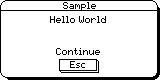

From top to bottom, the display consists of 3 parts:

[cols="1h,3"]
|===
|Title |Displays the program name.
If the reserved static `DatStatusNamePtr` contains other than `NULL`, it is assumed to point to a zero terminated string which is taken as the program name (of up to 8 characters in length and stopping when a '.' is reached).
If `DatStatusNamePtr` is `NULL` (which it will be if not explicitly set), the process name is used.
The process name is normally the name of the executable and, for a single source file program, the name of the executable is normally the name of the source file so you can deduce that the above example had the file name `sample.c`.
On the S3, the title area also contains the date and time.

|Message
|The message area contains up to 3 lines of text.

|Buttons
|The button area contains one, two or three buttons.
|===

On the S3a, running version 4 of the window server, the display is slightly different.
Using the above code results in the following:

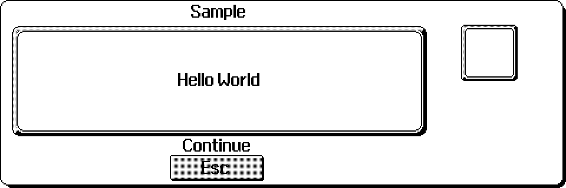

On the Work__about__, the appearance is as follows:

If there is a single button, it is activated by kbd:[ESC].
With two buttons, the left button is activated by kbd:[ESC] and the right button is activated by kbd:[ENTER].
With three buttons, the buttons are activated by, from left to right, kbd:[ESC], kbd:[SPACE] and kbd:[ENTER].

Version 3.5 of the window server added the ability to provide the notifier services (accessed via `p_notify` and `p_notifyerr`).
In EPOC terminology, the window server is said to "hook the notifier".

On the S3, S3a and Work__about__, the window server _always_ hooks the notifier.

On an HC, version 3.5 the window server does not by default hook the notifier (for backward compatibility with version 3 of the window server).
However, an HC may be configured such that the window server does hook the notifier -- as described in the section _System start-up_ in the first chapter.

If you remove the first parameter from `wsAlertW` or the first two parameters from `wsAlertA`, the remaining parameters correspond to the 5 parameters to `p_notify`.

If the window server has hooked the notifier, the program:

[source,c]
----
#include <plib.h>

GLDEF_C INT main(VOID)
{
    p_notify("Hello World",NULL,NULL,NULL,NULL);
    return(0);
}
----

produces the same result as the above example using `wsAlertW` -- visually at least (and assuming that the program is still called `sample.img`).

However, there are differences between `wsAlertW` and `p_notify`:

* The alert presented by `p_notify` is system modal -- the user can't task away from it.
In contrast, `wsAlertW` is not system modal.
For example, if a program reports a "No system memory" error using `wsAlertW`, it can reasonably include a "Retry" option because it is possible to task to another process and release memory (say by exiting a task) before returning to the alert and selecting the Retry button.
* The caller of `p_notify` need not be a client of the window server.
* When `p_notify` is called, the alert is presented regardless of whether the calling client is foreground or not (although calling `p_notify` does not displace the foreground client).
If a background client calls `wsAlertW`, the alert is not drawn until that task is made foreground.
In some circumstances, it may be desirable to call `wClientPosition(0,0)` and then `wFlush` to make the caller foreground before calling `wsAlertW`.
* As well as having an extra leading parameter, `wsAlertW` has a stack-based calling convention which is prototyped in such a way that unnecessary trailing NULLs may be omitted whereas `p_notify` uses a register calling convention that requires all 5 parameters to be present.

The similarities between `p_notify` and `wsAlertW` are:

* In terms of setting up the display, all the features of `wsAlertW` are also available via `p_notify` and vice versa.
(Unfortunately, this means that the additional parameters associated with the increased functionality have been squeezed into the existing `p_notify` compatible parameters in a somewhat inelegant way.)
* They are both designed not to fail when there is no free system memory.
Both are ideal for reliably reporting errors -- including a "No System Memory" error.

The extra parameters are provided by passing data structures that are differentiated from a zero terminated string by a leading zero.
It follows that zero length strings should not be used as parameters to any of the alert-based functions (they should be converted to ``NULLs``).

Calling an alert-based function does _not_ flush the client-side buffer.

On the HC, the font used to present alerts is determined by the `$WS_IF` environment variable -- as described earlier.

==== `wsAlertW` Present and wait for an alert

[source,c]
----
INT wsAlertW(INT mode,TEXT *pT1, TEXT *pT2, TEXT *pO1, TEXT *pO2, TEXT *pO3);
----

Present a `p_notify`-like display where the user is presented with a message and prompted to respond by pressing a button.
As with `p_notify`, the function waits for the user to respond and returns the index (in the range 0 to 2) of the button pressed.

When called from a regular application, the mode parameter should be `WS_ALERT_CLIENT`.
Other values can only be used by a special "alarm server" client.
(The alarm server is a system component on the S3 and S3a.)

Except for the additional mode parameter and except for the behavioural differences noted above, this function provides the same services as `p_notify` -- as described in the _PLIB Reference_ manual.

The following describes only the extensions to the functionality normally provided by `p_notify`.

Note that `wsAlertW` is actually prototyped as:

[source,c]
----
INT CDECL wsAlertW(INT,TEXT *,TEXT *,TEXT *,...);
----

so that you can leave out trailing NULLs when it is appropriate to do so.
The compiler will complain if you leave out trailing NULLs in a call to `p_notify` (because `p_notify` uses a register calling convention which does not permit a variable number of parameters).

===== Access to built in text

You can access operating system text (such as an error message) by passing a 3 byte array in place of a text string to any of the 5 text parameters.
The contents of the array should contain:

[cols="1h,3"]
|===
|byte 0
|zero

|byte 1
|`0xfe` (`0376` in octal)

|byte 2
|the signed index of the operating system text as passed to `p_gettext`.
|===

For example, the following program, again compiled and linked as `sample.img`:

[source,c]
----
#include <plib.h>
#include <wlib.h>

LOCAL_D WSERV_SPEC wSpec;
LOCAL_C VOID AlertErr(INT err, TEXT *msg)

{
    TEXT bb[3];

    bb[0]=0;
    bb[1]=0xfe;
    bb[2]=err;
    wsAlertW(WS_ALERT_CLIENT, msg, &bb[0], NULL);
}

GLDEF_C INT main(VOID)
{
    wConnect(&wSpec, 0, W_CONNECT_PRIORITY);
    AlertErr(E_GEN_NOMEMORY, "Failed to save");
    return(0);
}
----

when run on the HC, displays:

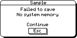

when run on the S3a under version 4 of the window server, displays:

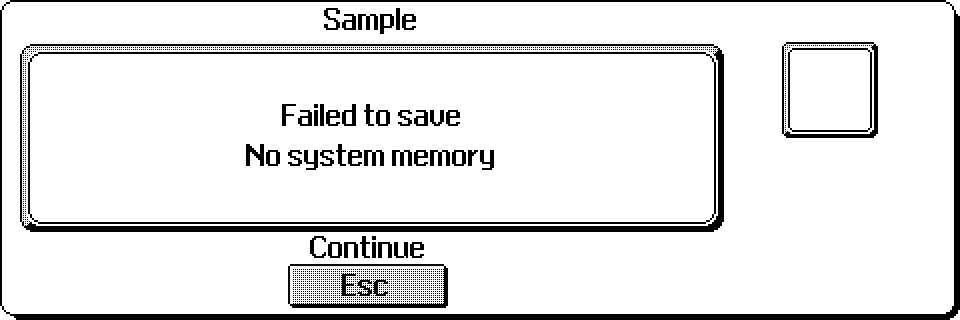

and when run on the Work__about__ displays:

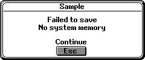

===== Formatted text with 3 message lines

If the first two bytes at `pT1` are zero, `pT2` is ignored and `wsAlertW` assumes that the two zero bytes are immediately followed by:

* an array of three `DESC` structs
* immediately followed by a character buffer of maximum length `W_ALERT_TEXT_MAX_LEN` (80) that contains the text for the three lines

The struct `DESC` is defined in `wlib.h` as:

[source,c]
----
typedef struct
{
    UBYTE hposition;
    UBYTE length;
    UWORD offset;
} DESC;
----

where

[cols="1m,3"]
|===
|hposition
|is either `0xff` for centred text or any other value to specify the pixel position from the left of the alert

|length
|is the length of the text for the line, to be taken from the buffer

|offset
|is the offset of the start of the text relative to pt1
|===

Such a data structure would normally be built up by a function as in, for example:

[source,c]
----
LOCAL_C VOID CDECL Alert3(TEXT *m1,TEXT *m2,TEXT *m3)
{
    TEXT *pt;
    TEXT **pps;
    DESC *pd,*pdend;

    struct
    {
        WORD zero;
        DESC line[3];
        TEXT buf[W_ALERT_TEXT_MAX_LEN];
    } al;

    al.zero=0;
    pt=&al.buf[0];
    pps=&m1;
    for (pd=&al.line[0],pdend=pd+3;pd<pdend;pd++)
    {
        pd->hposition=0xff;
        pd->length=p_slen(*pps);
        pd->offset=pt-(TEXT *)&al;
        pt=(TEXT *)p_bcpy(pt,*pps++,pd->length);
    }

    wsAlertW(WS_ALERT_CLIENT,(TEXT *)&al,NULL,NULL);
}
----

where the following line:

[source,c]
----
Alert3("Line 1","Line 2","Line 3");
----

when executed on an HC, displays:

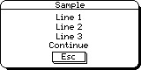

when executed on the S3a under version 4 of the window server, displays:

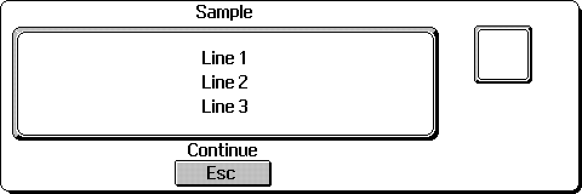

and when executed on the Work__about__, displays:

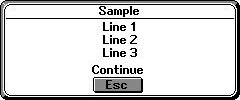

===== Text with 4 message lines

This is possible in version 4 of the window server and is achieved by ORing the `WS_ALERT_B` attribute into the mode parameter.
The interpretation of the parameters `pT1` and `pT2` is changed.

The text referenced by the parameter `pT1` is used as the title and is placed above the main box.
This contrasts with the normal practice of `wsAlertW` in using the program name as the title.

The text referenced by the parameter `pT2` is a single string but can include up to three carriage return characters (`0x13` or `'\r'` in C programs).
Each carriage return character causes the remaining text to be wrapped to a new line and each line is centred within the main display box.

Note that this text need not contain carriage return characters.
If the text is too long to fit onto one line, carriage returns will be inserted at appropriate points.
Whole words, however, will not be split.

The sample code fragment below illustrates how this can be done. Note also the use of three buttons in this example:

[source,c]
----
    ...
TEXT *ptxt,text[108];
    ...
ptxt = p_scpy(&text[0],"This is an example \r to demo");
ptxt = p_scpy(ptxt,"nstrate the use \r");
ptxt = p_scpy(ptxt,"of four\r");
ptxt = p_scpy(ptxt," message lines in the alert box");
    ...
wsAlertW(WS_ALERT_CLIENT|WS_ALERT_B,"Title Line",&text[0],"A","B","C");
----

This results in the following alert when run on a Series 3a machine under version 4 of the window server:

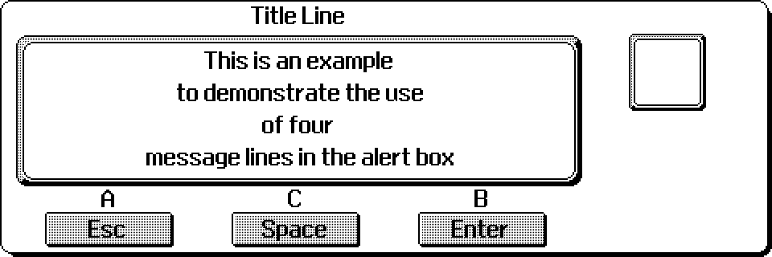

Although the Work__about__ uses version 4, its screen is not large enough to display four lines of text in an alert.
If the above code is run on Work__about__, the fourth line is not displayed and the appearance of the alert is as follows:

image:media/image88.jpg[media/image88,width=253,height=133]

Note that the techniques used to access built in text and formatted text with three message lines as described earlier, _cannot_ be used with the attribute `WS_ALERT_B` set.

If any illegal parameters are passed, the function will raise a `W_PANIC_ALERT` panic.

==== `wsAlertA` Present an alert

[source,c]
----
VOID wsAlertA(INT mode,WORD *pstat,TEXT *pt1,TEXT *pt2,TEXT *pb1,...);
----

This function is not suitable for general use in applications.
It is intended to be used only by the process designated to be the alarm server; any application, however, may use `wsAlertW`.

Presents a `p_notify`-like display where the user is presented with a message and prompted to respond by pressing a button.

Functionally identical to `wsAlertW` except that it returns immediately without waiting for the user to respond. It is the asynchronous form of `wsAlertW`.

Asynchronous requests are described in the chapter _Asynchronous Requests and Semaphores_ in the _PLIB Reference_ manual.

When the user does respond, the calling process I/O semaphore is signalled and the index of the button pressed (0, 1 or 2) is written to `*pstat`.

Once launched, there is no way of cancelling an asynchronous alert -- it can only be completed by the user.

If any illegal parameters are passed, the function will raise a `W_PANIC_ALERT` panic.

==== `wsAlertUpdate` Update a pending alert

[source,c]
----
INT wsAlertUpdate(TEXT *pt1,TEXT *pt2,TEXT *pb1,...);
----

This function is not suitable for general use in applications.
It is intended to be used only by the process designated to be the alarm server; any application, however, may use `wsAlertW`.

Update an asynchronous alert where the parameters `pt1`, etc are as for `wsAlertA`.

Does nothing if the user has already responded to the alert.

If any illegal parameters are passed, the function will raise a `W_PANIC_ALERT` panic.

=== Status windows

Status windows are part of the S3, S3a and Work__about__ user interfaces.

In principle, status windows are also supported on an HC that is running version 3.5 of the window server.
However, their use requires the cooperation of a client which has declared itself as the application key handler by calling `wAppKeyHandler` (the application key handler is the shell on the S3, S3a and Work__about__).
In practice, it would be difficult for an external developer to set up status windows on the HC.

The window server supports two kinds of status window:

[cols="1h,3"]
|===
|temporary
|If temporary status windows are enabled, the window server displays a pop-up transient status window in front of the foreground client's existing windows when kbd:[PSION+MENU] is pressed. The status window remains for 2 to 2.5 seconds.

|permanent
|While enabled, the window server maintains a permanent status window to the right of the screen and behind existing windows.
If an application supports a permanent status window, it is meant to "tile" its main top-level window with the status window.
On the S3 and S3a, higher level software toggles the presentation of a permanent status window in response to a kbd:[CTRL+MENU] press.
|===

The following shows the S3 World application's display with a temporary status window to the right of the screen using a version prior to version 4 of the window server:

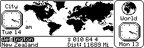

There is no difference between the appearance of a permanent and a temporary status window.

The status window gives the user a view of (from top to bottom):

[cols="1h,3"]
|===
|a program icon
|A client's icon is determined by a structure pointed to by the application key handler.

|a program name
|If the reserved static `DatStatusNamePtr` contains other than `NULL`, it is assumed to point to a zero terminated string that gives the program name (of up to 8 characters, terminated by any '.').
If `DatStatusNamePtr` is `NULL`, the process name is used.

|time and date
|The time and data is presented following the information in the `E_CONFIG` struct as obtained by calling `p_getctd`.
|===

The following shows the S3a World application's display with a temporary status window to the right of the screen using version 4 of the window server:

image:media/image90.jpg[media/image90,width=482,height=157]

Note that the S3a has a larger and finer grained screen (480 x 160) pixels).

In version 4 of the window server, the status window has been modified.
The program name and the program icon have changed places and four new features can be displayed (although not all are shown in the above example):

* Low battery indicator
* SSD pack indicators
* Remote link indicator
* Caps lock indicator

Each of these features can be _disabled_ by setting the appropriate flags when configuring the window server using `wSystem`.

The following illustration shows the S3a Database application display with a permanent status window to the right of the screen.
The application's main window has been neatly tiled with it:

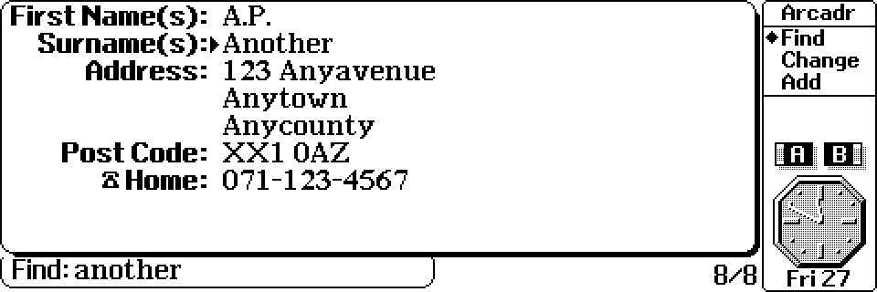

On the Work__about__, an equivalent display of the Database application appears as shown below:

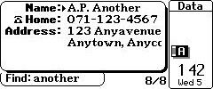

Applications can have different 'modes' of operation, the precise definition being dependent on the application.
As well as using menu options and 'hot' keys to switch between the different modes, an S3a application can set the diamond key to cycle around some or all of them.

By using the `wsSetList` function, introduced in version 4, the program icon in the status window can be replaced by a list of modes.
In the S3a display shown above, all three modes of the Database application are shown with the diamond symbol pointing to the current mode.

Note that the Work__about__ status window does not display either the application's icon or a list of modes.

==== Compatibility mode status window

In version 4, applications on the S3a and Work__about__ can run in S3 compatibility mode.
This allows an application to have the 'look' and 'feel' of the same application running on an S3.
On the S3a, this is achieved by doubling up the pixels.
For example, a line which is 10 x 1 pixels on the S3 will be drawn 20 x 2 pixels on the S3a and should 'look' the same.
On the Work__about__, applications running in compatibility mode will normally exactly match the S3 appearance.

If an application is running in compatibility mode on the S3a or Work__about__, then a call to `wsEnable` creates a compatibility mode status window which looks and behaves like an S3 status window.

Alternatively, the version 4 function `wStatusWindow` can be used to create a compatibility status window.

==== `wsEnable` Enable the permanent status window

[source,c]
----
VOID wsEnable(VOID);
----

Create and maintain a permanent status window, behind existing windows.
Does nothing if a permanent status window already exists.

Beforefootnote:[The resize may fail with out of memory -- so it is best to delay `wsEnable` until after the resize is successful.] calling `wsEnable`, the calling application should resize its main window such that it is tiled with the status window.

Under version 4, the required window extent should be determined by calling `wInquireStatusWindow` to get the size of the status window and then performing a simple calculation.
Under earlier versions of the window server, use `wsScreenExt`.

In version 4, if running in compatibility mode on the S3a or Work__about__, the status window will have the appearance of the S3 status window.

==== `wStatusWindow` Set the state of the status window

[source,c]
----
VOID wStatusWindow(INT state);
----

Available in version 4 only, this sets the permanent status window into one of a number of mutually exclusive states by setting the parameter state to one of the following:

[cols="1m,3"]
|===
|W_STATUS_WINDOW_OFF
|no status window is visible

|W_STATUS_WINDOW_SMALL
|display the small version of the status window

|W_STATUS_WINDOW_BIG
|display the full size version of the status window

|W_STATUS_WINDOW_CTBY
|display the S3 compatibility status window
|===

Calling this function with the parameter value `W_STATUS_WINDOW_OFF` is equivalent to calling `wsDisable()`; calling this function with the parameter value `W_STATUS_WINDOW_BIG` (or `W_STATUS_WINDOW_CTBY` if in S3 compatibility mode) is equivalent to calling `wsEnable()`.

See the description of `wInquireStatusWindow` (or, for versions of the window server earlier than version 4, `wsScreenExt`) for a means of determining the size and position of a status window.

==== `wsScreenExt` Get screen extent for tile with status window

[source,c]
----
VOID wsScreenExt(P_EXTENT *pext);
----

This function should only be used when running versions of the window server earlier than version 4.
It is available in version 4 for _compatibility only_.

_It is strongly recommended that the function_ `wInquireStatusWindow` _be used instead of_ `wsScreenExt` _in version 4 of the window server_.

The function writes the extent of the screen remaining to the data structure pointed to by pext when there is a permanent status window.

The `P_EXTENT` struct is defined as:

[source,c]
----
typedef struct {
    WORD x;
    WORD y;
} P_POINT;

typedef struct {
    P_POINT tl;
    WORD width;
    WORD height;
} P_EXTENT;
----

Series 3 applications that support permanent status windows running under older versions of the window server (i.e. earlier than version 4) can use `wsScreenExt` to determine the extent of the window to use while a permanent status window is enabled.

Recall that the size of the entire screen (used in the absence of a permanent status window) may be obtained from the `WSERV_SPEC` struct filled in by `wConnect`.
For example:

[source,c]
----
GLREF_D WSERV_SPEC *wserv_channel;
LOCAL_D P_POINT ScreenSize;
ScreenSize=wserv_channel->conn.info.pixels;
----

==== `wsUpdate` Update the permanent status window

[source,c]
----
VOID wsUpdate(INT flags);
----

Update the displayed permanent status window.

The parameter flags can be one of:

[cols="1h,3"]
|===
|WS_UPDATE_NAME
|to change the displayed permanent status window name (for example, after changing `DatStatusNamePtr`).

|WS_UPDATE_CLOCK
|to update any displayed clocks (for example, after changing settings such as 12/24 hour, analog/digital, the time separator and so on).
|===

==== `wsDisable` Disable the permanent status window

[source,c]
----
VOID wsDisable(VOID);
----

Destroy the permanent status window (if one exists).

Before calling `wsDisable`, the calling application should resize its main window to take up the whole screen.
As with `wsEnable`, the required window extent may be determined by calling `wInquireStatusWindow` and doing a simple calculation.

==== `wsEnableTemp` Enable temporary status windows

[source,c]
----
VOID wsEnableTemp(VOID);
----

Enable the window server's processing of kbd:[PSION+MENU] to present a temporary status window.

Unlike `wsEnable`, the effect of this call is system wide.
On the S3 and S3a, `wsEnableTemp` is called by the shell as part of its initialisation.

==== `wsDisableTemp` Disable temporary status windows

[source,c]
----
VOID wsDisableTemp(VOID);
----

Disable the processing of kbd:[PSION+MENU] to present a temporary status window.

The effect of this call is system wide.
Calling `wsDisableTemp` on the S3 and S3a will disable temporary status windows for all applications.

==== `wsSetList` Set list of modes to display in status window

[source,c]
----
INT wsSetList(UINT count,TEXT **plist,UINT pos);
----

Available in version 4 only, this function sets up the text for the list of modes to be displayed in the status window.

The `count` parameter is the number of text items in the list; the `plist` parameter is a pointer to an array of string pointers (one string per mode) and `pos` is the position within the list where the diamond symbol is to be placed.
The first position is given a value of 0.

If the diamond symbol is not to be shown, `pos` should be set to `W_STATUS_WIN_NO_DIAMOND`.

To replace the list of modes with the application icon, count should be set to `W_STATUS_WINDOW_ICON`.

With count set to this value, the other two parameters are ignored. Typically, a call would look like this:

[source,c]
----
 wsSetList(W_STATUS_WINDOW_ICON,NULL,0);
----

The function returns 0 if successful or `E_GEN_NOMEMORY` if it fails to allocate space for the new list.

Note that calling `wsSetList` on the Work__about__ has no visible effect, since its status window does not display a list of modes.

==== `wsSelectList` Set select position in status window mode list

[source,c]
----
VOID wsSelectList(INT pos);
----

Available in version 4 only, this function allows the diamond symbol in the list of modes in the status window to be (re-)positioned.

The position is specified by giving a value to the parameter pos.
The first position is given a value of 0.
If the diamond symbol is not currently shown, setting a position will cause it to reappear.
Giving `pos` a value of `W_STATUS_WIN_NO_DIAMOND` causes the diamond symbol to be removed from the status window.

Note that calling `wsSelectList` on the Work__about__ has no visible effect, since its status window does not display a list of modes.

==== `wInquireStatusWindow` Inquire state and extent of status window

[source,c]
----
INT wInquireStatusWindow(INT state,P_EXTENT *pextent);
----

Available in version 4 only, this function does two things:

* it returns the current state of the status window as set by `wStatusWindow`. It returns one of the values `W_STATUS_WINDOW_OFF`, `W_STATUS_WINDOW_SMALL`, `W_STATUS_WINDOW_BIG` and `W_STATUS_WINDOW_CTBY`.
* it fills in the pextent of the status window corresponding to state. In other words, by setting state to one of the values `W_STATUS_WINDOW_OFF`, `W_STATUS_WINDOW_SMALL`, `W_STATUS_WINDOW_BIG` or `W_STATUS_WINDOW_CTBY`, it supplies the position, width and height of a status window of that type.
Further, if state is given a value of -1, the extent of the _current_ status window is supplied.

It is interesting to note that if the status window is off, the extent information describes a status window located at the right hand edge of the screen with zero width and full height.

For a description of the `P_EXTENT` structure, see `wsScreenExt`.

=== Configuring the window server

The functions which have a system wide effect on the window server (as opposed to just affecting the calling client) are:

* `wSystem` which is described next
* `wsEnableTemp` to enable/disable permanent status windows (as described above)`wsDisableTemp` 

These functions should only be used when an application takes over the whole machine. This is more likely on an HC than say an S3, S3a or Work__about__.

==== `wSystem` Configure the window server

[source,c]
----
INT wSystem(UINT new_flags,UINT flag_mask);
----

Set an internal set of flags to modify the system-wide behaviour of the window server where:

[cols="1m,3"]
|===
|new_flags
|is a bit mask containing the values of the bit flags to be modified

|flag_mask
|is a bit mask indicating (by those bits that are set) the bit flags that are to be modified
|===

The function returns the old value of the flags.

The flags are of the form `WSERV_FLAG_XXX` where `XXX` is one of:

[cols="1m,3"]
|===
|NO_SHELL_REBOOT
|Stops the window server from restarting the shell (that is, `sys$shll.img`) whenever it terminates.
Clearing this flag when there is no shell running causes the window server to restart the shell.
Available on all machines.

|NO_NOTIFIER_REBOOT
|The same as above except it applies to the notifier process (`sys$ntfy.img`).
Available on the HC and MC.

Prior to version 4, the window server on the S3 always provides the notifier itself and never starts a `sys$ntfy.img`.

Under version 4, this flag can be set for the S3a and Work__about__ because the possibility of building a separate notifier process exists.

|HOOK_NOTIFIER
|If set, the window server attempts to hook the notifier, as explained in the earlier _Alerts_ section of this chapter.
All MC versions are unable to hook the notifier.

Prior to version 4, this flag applies to the HC only; the S3 effectively assumes that it is permanently set.

Under version 4, this flag can be set for the S3a and Work__about__.

|NO_PANIC_NOTIFY
|Disables the window server from reporting processes which terminate with a panic or a negative reason code.
Available on the HC, S3, S3a and Work__about__ but not the MC.
This flag is ignored unless the window server has hooked the notifier.
On machines other than the MC, you would set this flag to prevent the window server from reporting abnormal terminations when `HOOK_NOTIFIER` is set.

|UPDATE_MSGS
|Enables the window server to send `WM_TASK_UPDATE` events to the shell to inform it of the termination of any process (not just clients of the window server).
The MC version does not support `WM_TASK_UPDATE` events.

Prior to version 4, this flag applies to the HC only; the S3 effectively assumes that it is permanently set.

Under version 4, this flag can be set for the S3a and Work__about__.

|LOW_BATTERY_WARNINGS
|If set, the window server notifies the user of a low lithium or main battery.
Note that the window server only checks for low battery when the machine is turned on.
On the HC, the window server is only informed of the machine being switched on after `p_setonevent(TRUE)` has been called.
The MC version of the window server does not support low battery warnings.

Prior to version 4, this flag only applies to the HC; on the S3, the window server always reports low battery warnings.

Under version 4, this flag can be set for the S3a and Work__about__.

|HUNG_UP_SW
|If set, the window server presents a "hung up" status window if the foreground task is not using backed-up windows and fails to respond to redraw events.
The MC version of the window server does not support status windows.

Prior to version 4, this flag only applies to the HC; the S3 effectively assumes that it is permanently set.

Under version 4, this flag can be set for the S3a and Work__about__.
|===

The following flags are introduced in version 4 and apply only to S3a and Work__about__ machines.

[cols="1m,3"]
|===
|SW_NO_LOW_BATTERY
|If set, it disables the low battery indicator in the status window.

|SW_NO_PACKS
|If set, it disables the two pack indicators in the status window.

|SW_NO_LINK
|If set, it disables the link indicator in the status window.

|SW_NO_CAPS
|If set, it disables the caps lock indicator in the status window.
|===

Prior to version 4, when the window server starts, the internal flags are all clear although, on the HC, this can be altered by setting the `$WS_FL` environment variable.

Under version 4 of the window server the internal flags on the S3a and Work__about__ can be altered, like on the HC, by setting the `$WS_FL` environment variable.

In practice, `wSystem` is more likely to be used on the HC rather than the S3, S3a, Work__about__ or MC.
See the section _System start-up_ in the _Introduction_ chapter for further discussion (including further details on $WS_FL) and examples of the use of `wSystem`.

=== Attached Clients

This section only applies to large screen versions of the window server, such as the MC.

Clients can attach to and detach from each other by use of the `wAttachToClient`, `wAttachToForegroundClient` and `wDetachClient` calls.

The client that calls the attach function is attached in front of the client it is attaching to.

When clients are attached they move round in the task order together -- when one of the attached tasks moves, it pulls the other task (or tasks) with it.
When they become foreground, all attached tasks are sent a `WM_FOREGROUND` event.

Two examples of the use of attached clients on the MC are:

* The system notifier `sys$ntfy` uses `wAttachToForegroundClient` to attach itself to the foreground client to display its message.
* The voice server uses `wAttachToClient` to attach itself to _its_ client (where both are clients of the window server) to implement a dialog box as a separate process.

In both cases, the attaching client is behaving as if it were part of the client it is attached to.
The notifier could have been implemented using `wClientPosition` to make itself visible but the holder of the foreground would then inappropriately go into background (and get a `WM_BACKGROUND` event).

When a client attaches to another, the window server sends a `WM_ATTACHED` event to the client being attached to.
When the attaching client detaches, it sends a `WM_DETACHED` event to the client being detached from.

A detaching client is positioned to the back of all clients.

==== `wAttachToClient` Attach to client

[source,c]
----
INT wAttachToClient(UINT pid);
----

Attach the caller to client pid.

If client pid does not exist, the function leaves or returns `E_FILE_NXIST`.

==== `wAttachToForegroundClient` Attach to foreground client

[source,c]
----
VOID wAttachToForegroundClient(VOID);
----

Attach the caller to the foreground client.

Does nothing if the caller has the foreground.

==== `wDetachClient` Detach from client

[source,c]
----
VOID wDetachClient(VOID);
----

Detach from a client and position to the back of all clients.

If the caller is no longer attached to another client (say because that client has terminated), the caller is just positioned to the back.

=== Miscellaneous

A number of general functions which do not fit under any of the previously discussed topics are described here. Unless otherwise stated, they are all introduced in version 4 of the window server.

==== `wSupportInfo` Get information on supported features

[source,c]
----
VOID wsSupportInfo(.i.W_SUPPORT_INFO *pinfo);
----

The function fills the `W_SUPPORT_INFO` type structure with information on the currently supported features.
The supplied parameter pinfo must point to a structure of type `W_SUPPORT_INFO`.

It can set the following values in the flags member:

[cols="1m,3"]
|===
|W_SUPPORT_GREY
|if set, the window server supports the current scheme for drawing grey graphics

|W_SUPPORT_CTBY_S3
|if set, the window server supports a Series 3 compatibility mode (there is no distinction between different Series 3 compatibility modes, such the two that are available on the Work__about__)
|===

Currently, no other information is returned.
The rest of the `W_SUPPORT_INFO` structure is set to zeros.
The function is well placed for expansion in future versions and releases of the window server.

The `W_SUPPORT_INFO` structure is defined as follows:

[source,c]
----
typedef struct {
    UINT flags;
    UINT fillers[15]; /* will be filled with 0's */
} W_SUPPORT_INFO;
----

==== `wDisableKeyClick` Set or cancel key click disable state

[source,c]
----
VOID wDisableKeyClick(INT state);
----

If state is set to `TRUE`, the behaviour of the key click for an application is changed:

* The key click is disabled while the application is in foreground.
* The key click state is reset when the application goes to background.

Setting state to FALSE cancels this state for an application.
