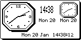
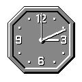
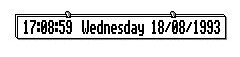

== WINDOWS

=== Creating and initialising a window

==== Window attributes

The functions:

[cols="1h3"]
|===
|`wCreateWindow`
|to create a window and set its attributes

|`wSetWindow`
|to set a window's attributes

|`wInquireWindow`
|to sense a window's attributes
|===

take the address of a `W_WINDATA` struct as a parameter to hold the window attributes where the `W_WINDATA` struct is defined as:

[source,c]
----
typedef struct {
    WORD x;
    WORD y;
} P_POINT;

typedef struct {
    P_POINT tl;
    WORD width;
    WORD height;
} P_EXTENT;

typedef struct {
    UWORD flags;
    P_EXTENT extent;
    WORD mouse_icon;
    UBYTE background;
    UBYTE filler;
} W_WINDATA;
----

where:

[cols="1m,3"]
|===
|flags
|is a set of binary attributes, described below. In the root window, the flags field is zero (so all the binary attributes are clear).

|extent
|is the position and size of the window relative to its parent in pixel coordinates.
In the root window the extent coincides with the whole screen.

|mouse_icon
|is the ID of the window mouse icon (only used when the machine has a pointing device such as on the MC)

|background
|specifies whether the window is backed-up by a bitmap (or bitmaps) and, if not, how the window should be prepared when it is validated
|===

==== `background` (up to version 3.5)

In versions of the window server up to and including 3.5 the background field of the `W_WINDATA` struct should be one of:

[cols="1m,3"]
|===
|W_WIN_BACK_BITMAP
|all drawing to the window is duplicated to an off-screen bitmap.
Redraws are automatically done from this bitmap, so no `WM_REDRAW` events are ever generated.
When the background has this value, it may not be altered by calling `wSetWindow`.
Not available on version 2 of the window server.

|W_WIN_BACK_CLR
|clear the pixels in the window on validation (the root window has this value).
This is the default value.

|W_WIN_BACK_SET
|set the pixels in the window on validation.

|W_WIN_BACK_NONE
|do nothing on validation (on the assumption that the drawing covers every pixel).
Best for flicker-free graphics.
|===

==== `background` (version 4)

In version 4 of the window server, there are changes in meaning and values caused by the introduction of grey.
To control drawing to the normal (black) plane, one of the following must be set:

[cols="1m,3"]
|===
|W_WIN_BACK_BITMAP
|all drawing to the normal (black) plane of the window is duplicated to an off-screen bitmap.
Redraws are automatically done from this bitmap, so no `WM_REDRAW` events are ever generated.
When the background has this value, it may not be altered by calling `wSetWindow`.

|W_WIN_BACK_CLR
|clear the pixels in the normal (black) plane of the window on validation (the root window has this value).
This is the default value.

|W_WIN_BACK_SET
|set the pixels in the normal (black) plane of the window on validation.

|W_WIN_BACK_NONE
|do nothing to the normal (black) plane of the window on validation (on the assumption that the drawing covers every pixel). Best for flicker-free graphics.

|W_WIN_BACK_CLR_NO_REDRAW |to clear the pixels in the normal (black) plane of the window but prevent any drawing or redrawing to this specific plane.

|W_WIN_BACK_SET_NO_REDRAW
|to set the pixels in the normal (black) plane of the window but prevent any drawing or redrawing to this specific plane.

|W_WIN_BACK_NONE_NO_REDRAW
|do nothing to the normal (black) plane of the window on validation but also prevent any drawing or redrawing to this specific plane.
|===

To control drawing to the grey plane, one of the following must be ORed into the `background` field with one of the above normal plane values:

[cols="1m,3"]
|===
|W_WIN_BACK_GREY_BITMAP
|all drawing to the grey plane of the window is duplicated to an off-screen bitmap.
Redraws are automatically done from this bitmap, so no `WM_REDRAW` events are ever generated.
When the background has this value, it may not be altered by calling `wSetWindow`.

|W_WIN_BACK_GREY_CLR
|clear the pixels in the grey plane of the window on validation (the root window has this value).

|W_WIN_BACK_GREY_SET
|set the pixels in the grey plane of the window on validation.

|W_WIN_BACK_GREY_NONE
|do nothing to the grey plane on validation (on the assumption that the drawing covers every pixel). Best for flicker-free graphics.

|W_WIN_BACK_GREY_CLR_NO_REDRAW
|to clear the pixels in the grey plane of the window but prevent any drawing or redrawing to this specific plane.
This is the default value.

|W_WIN_BACK_GREY_SET_NO_REDRAW
|to set the pixels in the grey plane of the window but prevent any drawing or redrawing to this specific plane.

|W_WIN_BACK_GREY_NONE_NO_REDRAW
|do nothing to the grey plane of the window on validation but also prevent any drawing or redrawing to this specific plane.
|===

If drawing is enabled to both the normal (black) and the grey planes, then both planes will be moved when scrolling or moving a window.

If no drawing is intended for one of the planes in a window, then overheads can be cut by disabling the unused plane.
For example, if no drawing is to be done to the grey plane, disable this plane by _NOT_ setting any of `W_WIN_BACK_GREY_CLR`, `W_WIN_BACK_GREY_SET`, `W_WIN_BACK_GREY_NONE` or `W_WIN_BACK_GREY_BITMAP`.

Note that if both `W_WIN_BACK_BITMAP` and `W_WIN_BACK_GREY_BITMAP` are set, then the window will be backed up to two bitmaps, one for the normal plane and one for the grey plane.

Also note that setting one of:

[source,c]
----
W_WIN_BACK_CLR_NO_REDRAW

W_WIN_BACK_SET_NO_REDRAW

W_WIN_BACK_NONE_NO_REDRAW
----

and setting one of:

[source,c]
----
W_WIN_BACK_GREY_CLR_NO_REDRAW

W_WIN_BACK_GREY_SET_NO_REDRAW

W_WIN_BACK_GREY_NONE_NO_REDRAW
----

is equivalent to setting the `W_WIN_NO_REDRAW` bit (as a parameter to `wCreateWindow`).

==== `flags` (all versions)

The following bits of flags apply to all versions of the window server on all machines:

[cols="1m,3"]
|===
|W_WIN_NO_REDRAW
|windows with this flag set never receive redraw events.
This flag may not be altered by a `wSetWindow` command.
|W_WIN_PRIORITY
|redraw events for windows with this flag set have priority over redraw events for windows with this flag clear.
|===

==== `flags` (version 4)

The following bit of flags applies to version 4 of the window server:

[cols="1m,3"]
|===
|W_WIN_DOUBLE_PIXEL
|when set, causes all graphics in this window to work in double pixel mode.
|===

=== Large screen flags

The following bit of flags applies only to large screen versions of the window server such as the MC:

[cols="1m,3"]
|===
|W_WIN_FOREGROUND_ONLY
|if set, the window is only visible while the client is foreground.
Note that a descendant window of a `FOREGROUND_ONLY` window is necessarily also `FOREGROUND_ONLY` regardless of the value of this flag.
This flag may not be altered by a `wSetWindow` command.
|===

=== Mouse-related flags

The following bit of flags apply only when the machine has a pointing device, such as on the MC:

[cols="1m,3"]
|===
|W_WIN_NO_MOUSE
|a window with this flag set will not receive any mouse events (however, the mouse cursor is still displayed).
All other mouse-related flags have no affect when this flag is set.

|W_WIN_INACTIVE
|if a mouse click occurs anywhere in a window with this flag set or in any of its descendants, a `WM_ACTIVE` event is sent to the window.

|W_WIN_INPUT_ONLY
|if set, the window is input-only.
Input-only windows are invisible and exist solely for the purpose of detecting mouse events.
This flag may not be altered by a `wSetWindow` command.

|W_WIN_MOUSE_MOVE
|if set, mouse movement events are generated when the mouse button is up.

|W_WIN_MOUSE_DRAG
|if set, mouse movement events are generated when the mouse button is down.

|W_WIN_MOUSE_GRAB
|if set, the mouse is automatically grabbed when the mouse button is pressed.
The grab is automatically released when the mouse button is released and a `WM_MOUSE` event of type `WM_MOUSE_RELEASE` is sent to the grabbing window, even if the release occurs outside the window.
If `W_WIN_MOUSE_DRAG` is also set, any intermediate `WM_MOUSE_MOVE` events are also delivered to the grabbing window.

|W_WIN_RUBBER_BAND_CAPTURE
|If a mouse down event occurs in a window with this bit set, it and subsequent mouse and keyboard events are captured to the window server's rubber band processing until the rubber band mode is terminated.
This first mouse click generates a `WM_RUBBER_BAND_INIT` event to which the client must respond with a call to `wRubberBand`.
This flag may not be altered by a `wSetWindow` command.

|W_WIN_RUBBER_BAND_COMPLETE_ON_RELEASE
|If when calling `wRubberBand` in response to a `WM_RUBBER_BAND_INIT` event you specify that the rubber band should be completed on a mouse up event, you should also set this bit.
This flag may not be altered by a `wSetWindow` command.
|===

==== `wCreateWindow` Create a window

[source,c]
----
INT wCreateWindow(UINT parent_id, UINT field_set, .i.W_WINDATA *pwindata, UWORD handle);
----

Create a window and, if successful, return the positive ID of the window where:

[cols="1m,3"]
|===
|parent_id
|is the window ID of the parent window. To create a top-level window, where the parent is the root window (ie the whole screen), pass parent_id as zero.

|handle
|is the client's own identifier for the window (which must be non-zero) to be embedded in events which are directed at the window (for example, redraw and mouse events). In medium to large applications, handle is commonly the address of a control block which contains the window ID.

|field_set
|is a set of bit flags which specify (by being set) which fields in the `pwindata` struct are to be used to set the window attributes.
In most cases, an attribute which is not set from `pwindata` is inherited from `parent_id` (as detailed below). If `field_set` is zero, `pwindata` is ignored.

|pwindata
|is the address of a `W_WINDATA` struct as described above.
If `field_set` is zero, `pwindata` is ignored.
|===

The bits in `field_set` are made up of the same bit masks as for `pwindata->flags` to indicate that the corresponding bit in `pwindata->flags` should be used.
And, in addition, `field_set` may contain:

[cols="1m,3"]
|===
|W_WIN_EXTENT
|to use `pwindata->extent` 

|W_WIN_MOUSE_ICON
|to use `pwindata->mouse_icon`

|W_WIN_BACKGROUND
|to use `pwindata->background` 
|===

If a `field_set` bit is clear, the corresponding attribute is inherited from the parent window `parent_id`, except for:

[source,c]
----
W_WIN_RUBBER_BAND_CAPTURE

W_WIN_INACTIVE

W_WIN_NO_REDRAW

W_WIN_PRIORITY

W_WIN_FOREGROUND_ONLY
----

These five attributes are never inherited from any parent window.
If they are not set explicitly, by setting the appropriate bit in `field_set` and the corresponding data value in the `W_WINDATA` struct pointed to by `pwindata`, they are set to zero.

If `parent_id` has one or more child windows, the new window is created in front of its siblings.

After a successful return from `wCreateWindow`, the window is just a dormant data structure in the window server's data segment with no visibility on the screen.
You can't draw to the window and you won't get any redraw events (or any mouse events if there is a pointing device) until the window is initialised by calling `wInitialiseWindowTree`, described below.

If the function fails because there is insufficient memory, it calls `p_leave(E_GEN_NOMEMORY)` or returns `E_GEN_NOMEMORY`, depending on whether `wDisableLeaves` has been called.

See the description of `wConnect` for an example.

==== `wSetWindow` Set window attributes

[source,c]
----
VOID wSetWindow(UINT wid, UINT field_set, .i.W_WINDATA *pwindata);
----

Set one or more window attributes of the window with ID `wid` where `field_set` and `pwindata` are as for `wCreateWindow`, described above.

The function `wSetWindow` ignores the following bits in `field_set` which correspond to window attributes which are not modifiable:

[source,c]
----
W_WIN_NO_REDRAW

W_WIN_INPUT_ONLY

W_WIN_FOREGROUND_ONLY

W_WIN_RUBBER_BAND_COMPLETE_ON_RELEASE
----

You cannot modify any of the attributes of the root window.

In practice, `wSetWindow` is commonly use to move and/or resize a window.

If the size of a backed-up window is increased, the backup bitmap(s) will also be increased and the additional area (to the right and below) is filled with zeros.

In this situation, the call can fail with an out-of-memory condition; it should be noted that such a failure might not be reported immediately because of the buffering of window server requests (see the _Clients and the window server_ section in the _Introduction_ chapter).

Any areas of the window that are exposed as a result of making the call to `wSetWindow` (because the effect has been to expand or move the window) are invalidated.
Areas that are covered, moved offscreen, or lost because the window has become smaller are marked as valid, thus preventing any redraws that might have been pending for these areas.
The validity of any other areas is not affected by the call.

==== `wInquireWindow` Get window attributes

[source,c]
----
INT wInquireWindow(UINT wid, .i.W_WINDATA *pwindata);
----

Write a copy of window `wid`'s extent and flags to `*pwindata` (`pwindata->mouse_icon` and `pwindata->background` are left undefined).

==== `wInitialiseWindowTree` Initialise window tree

[source,c]
----
VOID wInitialiseWindowTree(UINT wid);
----

Initialise window `wid` and all its descendants.

None of these windows may be initialised again.

Provided that the window is not made invisible between creation and initialisation, the following occurs:

[cols="1h,3"]
|===
|backed-up windowfootnote:[Where the window attribute background is `W_WIN_BACK_BITMAP` (and/or `W_WIN_BACK_GREY_BITMAP` in version 4 of the window server).]
|The backup bitmap (which is initialised with zeros when the window is created) is copied to any visible parts of the window, clearing it.
In version 4 of the window server there may be two backup bitmaps which are copied to the visible parts of the window's normal and grey plane respectively.

|no-redraw windowfootnote:[Where the `W_WIN_NO_REDRAW` window attribute is set.]
|Any visible pixels are cleared if the background attribute is `W_WIN_BACK_CLR` or set if the background attribute is `W_WIN_BACK_SET`. In version 4 of the window server, these attributes clear or set the visible pixels in the window's normal plane while `W_WIN_BACK_GREY_CLR` and `W_WIN_BACK_GREY_SET` clear or set the visible pixels in the window's grey plane.

|non-backed-up redraw window
|Any visible parts are added to the update region (which will subsequently cause redraw events to be generated).
|===

==== `wCloseWindowTree` Destroy a window and its descendants

[source,c]
----
VOID wCloseWindowTree(UINT wid);
----

Destroy window `wid` and all its descendants, freeing any associated window server resources (such as an attached graphics context).

When destroying a window system, it is sometimes difficult to destroy windows bottom-up with respect to the window parentage tree.
To make life easier, the window server allows windows to be destroyed more than once as long as other window server objects, such as graphics contexts, bitmaps, fonts, icons or windows are not created in the mean time.

If you are using `wGetEvent` or `wGetEventSpecial` rather than `wGetEventWait`, you should be very careful about destroying windows while a request made by calling `wGetEvent` or `wGetEventSpecial` is pending.
Bearing in mind the multi-tasking nature of the system and the fact that the window server runs at a higher priority than its clients, it is quite possible for an event to be delivered before the window is destroyed in which case there is the possibility that the next event will relate to a window which has already been destroyed (a redraw event, say).

The solution to this problem normally involves calling `wCancelGetEvent`, as described in the first chapter.

==== `wInquireWindowOffset` Get window to window offset

[source,c]
----
INT wInquireWindowOffset(UINT from_wid, UINT to_wid, .i.P_POINT *poffset);
----

Write the offset of to_wid relative to from_wid to poffset and return zero.

The `P_POINT` struct is:

[source,c]
----
typedef struct {
    WORD x;
    WORD y;
} P_POINT;
----

Useful when positioning windows relative to each other.
To find the absolute position of a window on the screen set from_wid to zero (the root window ID).

If the window server has a pending error with error number err, the function calls `p_leave(err)` or returns err, depending on whether `wDisableLeaves` has been called.

==== `wReassignRootWindow` Reassign the root window

[source,c]
----
VOID wReassignRootWindow(UINT wid);
----

Reassign the window ID of zero to mean the window `wid` rather than the root window which covers the whole screen.

The assignation applies only to the calling client.

Passing a `wid` of zero resets the window ID of zero to mean the whole screen.

Used for creating development environments on a large screen version of the window server which simulate a small screen environment.

Not available in version 2 of the window server.

=== Visible and invisible windows

==== `wMakeInvisible` Make window invisible

[source,c]
----
VOID wMakeInvisible(UINT wid);
----

Mark window `wid` as invisible.

When a window is marked as invisible it and all its descendants are made invisible.

The window server treats windows which are invisible as follows:

* if the window is backed-up, any drawing to it is drawn only to the backup bitmap(s)
* invalidating a window using `wInvalidateRect` or `wInvalidateWin` has no effect
* windows behave as if they do not exist with respect to mouse input (this only applies when there is a pointing device)

==== `wMakeVisible` Make window visible

[source,c]
----
VOID wMakeVisible(UINT wid);
----

Mark window `wid` as visible.

The window will actually become visible only if it is initialised and all its ascendants are visible.

Unless `wMakeInvisible` has been applied to a descendant, calling `wMakeVisible` makes all descendants visible.

=== Sibling positions

==== `wWindowPosition` Change position in sibling list

[source,c]
----
VOID wWindowPosition(UINT wid, UINT pos);
----

Move window `wid` to the position `pos` in its sibling list.

If `pos` is greater than the number of siblings then window `wid` will go to the back of the sibling list, if `pos` is zero then it will go to the front of the sibling list.

==== `wGetWindowPosition` Get position in sibling list

[source,c]
----
INT wGetWindowPosition(UINT wid);
----

Return the position of window `wid` in its sibling list.

The function behaves as for `wCheckPoint` in that it flushes the client-side buffer and reports any uncleared error -- either by calling `p_leave` or by returning the error number.

Not available in version 2 of the window server.

=== Scrolling

==== `wScrollRect` Copy a rectangle

[source,c]
----
VOID wScrollRect(UINT wid, .i.P_RECT *prect, P_POINT *poffset);
----

Copy the pixels in rectangle `prect` in window `wid` to the same sized rectangle, displaced by `poffset`.

The structs` P_POINT` and `P_RECT` are defined as:

[source,c]
----
typedef struct {
    WORD x;
    WORD y;
} P_POINT;

typedef struct
{
    P_POINT tl; /* top left pixel (internal) */
    P_POINT br; /* bottom right pixel (external) */
} P_RECT;
----

The copy excludes the following from `prect`:

* those parts which are in the update region (that is, those parts which are invalid)
* those parts which are obscured or clipped by other windows
* those parts which are beyond the boundaries of the window

Although these parts are not copied, their existence causes the corresponding region of the displaced rectangle to be invalidated.

In version 4 of the window server, if drawing is enabled to both the normal and the grey planes, then the copying activity described above is done to both planes.

If the window is a backed-up window, the copy is also applied to the backup bitmap(s).
For a backed-up window: the update region is always null; those parts which are obscured or clipped can be recovered from the backup bitmap(s); those parts which are beyond the boundaries of the window are cleared.

Note that `wScrollRect` may also be applied to a bitmap where `wid` is a bitmap ID (but not in version 2 of the window server).

==== `wScrollWin` Scroll a window

[source,c]
----
VOID wScrollWin(UINT wid, .i.P_POINT *poffset);
----

Scroll the whole of window `wid` by displacement poffset.

Entirely equivalent to `wScrollRect` with `prect` set to a rectangle covering the whole window.

Note that `wScrollWin` may also be used to scroll a whole bitmap where `wid` is a bitmap ID (but not in version 2 of the window server).

=== Redrawing

There are six variants of `wBeginRedraw` which vary according to whether a temporary graphics context is created (and, if so, whether it is to be altered from its default settings) and whether a part or the whole of the window is being redrawn, as follows:

[cols="1m,3"]
|===
|wBeginRedraw
|to redraw a part of the window using an independently created temporary or permanent graphics context

|wBeginRedrawWin
|to redraw the whole of the window using an independently created temporary or permanent graphics context

|wBeginRedrawGC
|to redraw a part of the window using a temporary graphics context which is created and initialised with specified values

|wBeginRedrawGC0
|to redraw a part of the window using a temporary graphics context which is created with default initial values

|wBeginRedrawWinGC
|to redraw the whole of the window using a temporary graphics context which is created and initialised with specified values

|wBeginRedrawWinGC0
|to redraw the whole of the window using a temporary graphics context which is created with default initial values
|===

Note that the last character in both `wBeginRedrawGC0` and `wBeginRedrawWinGC0` is the digit zero (and not the letter 'O').

When a begin redraw function is used to simultaneously create a temporary graphics context, the corresponding call to `wEndRedraw` automatically frees it.

All variants validate at least a part of a window and cause subsequent drawing to use the update region rather than the normal drawing region.
If the background attribute of the window is `W_WIN_BACK_CLR`, validated pixels in the update region are cleared and if the background attribute is `W_WIN_BACK_SET`, the same pixels are set.

In version 4 of the window server, the above two background attributes apply to validated pixels in the normal (black) plane in the update region.
In addition, if the background attribute of the window is `W_WIN_BACK_GREY_CLR` or `W_WIN_BACK_GREY_SET`, validated pixels in the grey plane in the update region are cleared or set respectively.

A way of ensuring flicker-free redrawing, is to set the background attribute to `W_WIN_BACK_NONE` and cover every pixel in the redraw.

In version 4 of the window server, `W_WIN_BACK_NONE` applies only to the normal (black) plane.
To achieve the same effect when drawing to the grey plane, the corresponding attribute `W_WIN_BACK_GREY_NONE` should also be set.

==== `wBeginRedraw` Start a partial redraw

[source,c]
----
VOID wBeginRedraw(UINT wid, .i.P_RECT *prect);
----

Validate the rectangle `prect` in window `wid` and clip subsequent drawing to the intersection of `prect` and the window's update region (as it was before the validate).
The normal drawing region is restored when `wEndRedraw` is called.

The struct `P_RECT` is defined as:

[source,c]
----
typedef struct {
    WORD x;
    WORD y;
} P_POINT;

typedef struct
{
    P_POINT tl; /* top left pixel (internal) */
    P_POINT br; /* bottom right pixel (external) */
} P_RECT;
----

==== `wBeginRedrawWin` Start a full redraw

[source,c]
----
VOID wBeginRedrawWin(UINT wid);
----

Validate the whole of window `wid` and clip subsequent drawing to the window's update region (as it was before the validate).
The normal drawing region is restored when `wEndRedraw` is called.

Equivalent to calling `wBeginRedraw` with a rectangle covering all of window `wid`.

==== `wBeginRedrawGC` Start a partial redraw (GC)

[source,c]
----
VOID wBeginRedrawGC(UINT wid, .i.P_RECT *prect, UINT field_set, G_GC *pgc);
----

Validate the rectangle `prect` in window `wid` and clip subsequent drawing to the window's update region (as it was before the validate).

In addition, create a temporary graphics context which is initialised with those fields from pgc which have their corresponding bit fields set in `field_set`.

The `G_GC` struct is defined in _wlib.h_ as:

[source,c]
----
typedef struct
{
    UBYTE gmode; /* G_TRMODE_SET, _CLR, _INV (line) */
    UBYTE textmode; /* G_TRMODE_SET, _CLR, _INV, _REPL (text) */
    UBYTE style; /* G_STY_NORMAL, _BOLD, _UNDERLINE, _INVERSE, _DOUBLE, _MONO, _ITALIC */
    UBYTE flags; /* controls use of grey & double pixel mode */
    WORD font; /* ID of font to use */
} G_GC;
----

where the bit fields for `field_set` are:

[cols="1m,3"]
|===
|G_GC_MASK_GMODE
|corresponding to the `gmode` member

|G_GC_MASK_TEXTMODE
|corresponding to the `textmode` member

|G_GC_MASK_STYLE
|corresponding to the `style` member

|G_GC_MASK_FONT
|corresponding to the `font` member

|G_GC_MASK_GREY
|corresponding to the `flags` member (version 4 only)

|G_GC_MASK_DOUBLE
|corresponding to the `flags` member (version 4 only)
|===

The `flags` member is introduced in version 4 of the window server.
Prior to version 4, the space occupied by this member was unused.

See the _Graphics Output_ chapter for a complete description of the fields in a `G_GC` struct.

The graphics context is freed (and the normal drawing region is restored) when `wEndRedraw` is called.

==== `wBeginRedrawGC0` Start a partial redraw (GC0)

[source,c]
----
VOID wBeginRedrawGC0(UINT wid, .i.P_RECT *prect);
----

Validate the rectangle `prect` in window `wid` and clip subsequent drawing to the window's update region (as it was before the validate).

In addition, create a temporary graphics context with default initial values.

The graphics context is freed (and the normal drawing region is restored) when `wEndRedraw` is called.

==== `wBeginRedrawWinGC` Start a full redraw (GC)

[source,c]
----
VOID wBeginRedrawWinGC(UINT wid, UINT field_set, .i.G_GC *pgc);
----

Validate the whole window `wid` and clip subsequent drawing to the window's update region (as it was before the validate).

In addition, create a temporary graphics context which is initialised with those fields from pgc which have their corresponding bit fields set in `field_set`.

The graphics context is freed (and the normal drawing region is restored) when `wEndRedraw` is called.

The `G_GC` struct is defined in `wlib.h` as:

[source,c]
----
typedef struct
{
    UBYTE gmode; /* G_TRMODE_SET, _CLR, _INV (line) */
    UBYTE textmode; /* G_TRMODE_SET, _CLR, _INV, _REPL (text) */
    UBYTE style; /* G_STY_NORMAL, _BOLD, _UNDERLINE, _INVERSE, _DOUBLE, _MONO, _ITALIC */
    UBYTE flags; /* controls use of grey & double pixel mode */
    WORD font; /* ID of font to use */
} G_GC;
----

where the bit fields for `field_set` are:

[cols="1h,3"]
|===
|G_GC_MASK_GMODE
|corresponding to the `gmode` member

|G_GC_MASK_TEXTMODE
|corresponding to the `textmode` member

|G_GC_MASK_STYLE
|corresponding to the `style` member

|G_GC_MASK_FONT
|corresponding to the `font` member

|G_GC_MASK_GREY
|corresponding to the `flags` member (version 4 only)

|G_GC_MASK_DOUBLE
|corresponding to the `flags` member (version 4 only)
|===

The flags member is introduced in version 4 of the window server.
Prior to version 4, the space occupied by this member was unused.

See the _Graphics Output_ chapter for a complete description of the fields in a `G_GC` struct.

===== Example

[source,c]
----
LOCAL_C VOID BeginRedraw(INT wid,INT fid,INT style)
{
    G_GC gc;
    gc.font=fid;
    gc.style=style;
    wBeginRedrawWinGC(wid,G_GC_MASK_FONT|G_GC_MASK_STYLE,&gc);
}
----

==== `wBeginRedrawWinGC0` Start a full redraw (GC0)

[source,c]
----
VOID wBeginRedrawWinGC0(UINT wid);
----

Validate the whole of window `wid` and clip subsequent drawing to the window's update region (as it was before the validate).

In addition, create a temporary graphics context with default initial values.

The graphics context is freed (and the normal drawing region is restored) when `wEndRedraw` is called.

==== `wEndRedraw` End a redraw

[source,c]
----
VOID wEndRedraw(VOID);
----

End a redraw.

Drawing is set back to use the normal drawing region (which clips to the visible region of a window).

If a temporary graphics context was created by calling `wBeginRedrawGC`, `wBeginRedrawWinGC`, `wBeginRedrawGC0` or `wBeginRedrawWinGC0`, the temporary graphics context is freed.

=== Validating

Validating a rectangle in a window removes that rectangle from the window's update region (if the window has an update region).
Validating the whole window deletes the window's update region.

When responding to the receipt of a `WM_REDRAW` event (see the _Events_ chapter) it is essential to perform a validation: until a window's update region has been entirely validated, `WM_REDRAW` events will continue to be received.

The normal response to a `WM_REDRAW` event is to perform a validation and to draw all or part of the window (drawing will be clipped to the intersection with the window's update region).
The rectangle that is validated should correspond exactly to the rectangle that is drawn, rather than to the rectangle specified by the `WM_REDRAW` event.

Depending on the window's background attribute, validation may also set, clear or leave unchanged all the pixels in the rectangle.
You should set the background attribute to select the action that is most appropriate for the particular situation.

If the background attribute of the window is `W_WIN_BACK_CLR`, validated pixels in the drawing region are cleared and if the background attribute is `W_WIN_BACK_SET`, the same pixels are set.

In version 4 of the window server, these attributes refer to validated pixels in the normal (black) plane of the update region.
In addition, if the background attribute `W_WIN_BACK_GREY_CLR` is set, validated pixels in the grey plane of the drawing region are cleared and if the background attribute `W_WIN_BACK_GREY_SET` is set, the same pixels are set.

A way of ensuring flicker-free redrawing of a window is to set the background attribute to `W_WIN_BACK_NONE` and cover every pixel in the draw.

In version 4 of the window server, the `W_WIN_BACK_NONE` attribute refers to the normal (black) plane.
If you are also drawing to the grey plane, then the same result can be achieved in this plane by setting the `W_WIN_BACK_GREY_NONE` attribute.

==== `wValidateRect` Validate a rectangle of a window

[source,c]
----
VOID wValidateRect(UINT wid, .i.P_RECT *prect);
----

Validate the rectangle `prect` in window `wid`.

The struct `P_RECT` is defined as:

[source,c]
----
typedef struct {
    WORD x;
    WORD y;
} P_POINT;

typedef struct
{
    P_POINT tl; /* top left pixel (internal) */
    P_POINT br; /* bottom right pixel (external) */
} P_RECT;
----

==== `wValidateWin` Validate a whole window

[source,c]
----
VOID wValidateWin(UINT wid);
----

Validate the whole of window `wid`.

Equivalent to calling `wValidateRect` with a rectangle covering window `wid`.

=== Invalidating

Invalidating a rectangle in a window adds that rectangle to the window's update region.
Invalidating the whole window sets the window's update region to cover the whole window.

When a client wishes to draw an area in one of its windows, there are two approaches:

* to draw directly to the area (normally after calling `wValidateRect` or `wValidateWin`)
* to invalidate a rectangle and make use of the code which redraws its window in response to a `WM_REDRAW` event

The advantages of invalidating are:

* It makes use of the code which must in any case be provided to redraw the window.
* An application can effectively use the window server's update region to accumulate disjoint invalid areas without having to worry about whether those areas overlap (since overlapping areas will generate a single redraw).
* Because the areas invalidated are clipped to the visible areas of the window, responding to the `WM_REDRAW` events can require less work than drawing the whole window (since the whole window may be partially or totally obscured or it may be invisible).

The main disadvantage of invalidating is the loss of performance resulting from the extra context switching from the client to the window server to process the invalidate command and then back to the client to process the redraw.

==== `wInvalidateRect` Invalidate a rectangle

[source,c]
----
VOID wInvalidateRect(UINT wid, .i.P_RECT *prect);
----

Invalidate the rectangle `prect` in window `wid`.

The struct `P_RECT` is defined as:

[source,c]
----
typedef struct
{
    WORD x;
    WORD y;
} P_POINT;

typedef struct
{
    P_POINT tl; /* top left pixel (internal) */
    P_POINT br; /* bottom right pixel (external) */
} P_RECT;
----

==== `wInvalidateWin` Invalidate a window

[source,c]
----
VOID wInvalidateWin(UINT wid);
----

Invalidate the whole of window `wid`.

Equivalent to calling `wInvalidateRect` with a rectangle covering the whole of window `wid`.

=== Text cursor

==== `wTextCursor` Draw a text cursor

[source,c]
----
VOID wTextCursor(UINT wid, .i.W_CURSOR *pcursor);
----

Present a text cursor (which is optionally flashing) in window `wid`.

There is only one text cursor per client.
If a text cursor already exists, it is removed before the new cursor is positioned (you do not have to call `wEraseTextCursor` if you are moving the cursor to another position in the same or a different window).

Version 4 of the window server allows the text cursor to appear grey. This is achieved by setting `W_CURSOR_GREY` in the flags member of the `W_CURSOR` structure.

The `W_CURSOR` struct is defined in _wlib.h_ as:

[source,c]
----
typedef struct
{
    WORD x;
    WORD y;
} P_POINT;

typedef struct
{
    P_POINT pos; /* text cursor position */
    UBYTE height; /* text cursor height */
    BYTE ascent; /* text cursor ascent */
    UBYTE width; /* text cursor width */
    UBYTE flags; /* for obloid cursor and to disable flashing */
} W_CURSOR;
----

The height, ascent and width members specify the height, ascent and width of the text cursor.
The flags member may be zero or it may contain any combination of the following bit flags:

[cols="1m,3"]
|===
|W_CURSOR_OBLOID
|to round off the corners of the cursor

|W_CURSOR_NO_FLASH
|to disable the flashing of the cursor

|W_CURSOR_GREY
|to make the text cursor appear grey
|===

The position of the cursor is consistent with positioning conventions for text where the top left of the cursor is ascent above the position passed to `wTextCursor`.
In fact, the x,y position for `wTextCursor` should be the same as for drawing a text string.
See the description of `gPrintText` in the _Graphics Output_ chapter.

Applications which use a vertical line cursor to indicate a position between two characters should (by convention) place the cursor in the leftmost position of the character cell which is to the right of the cursor.
In this case, width is set to 1 (or 2), and ascent and height are set according to the font currently in use.

A block or underline cursor is sometimes appropriate when using a monospaced font where width should be set to the width of a characters in the font.

For an underline cursor, height should be set to 1.
To draw the underline along the baseline of the font, ascent should be set to zero.
To draw it along the bottom line of the characters, ascent should be set to `(font.ascent-font.height+1)`.

The window server controls the flashing of the cursor and makes sure that it does not interfere with any drawing.

On large screen versions of the window server such as the MC, the window server automatically ensures that only the foreground text cursor is visible.

==== `wDrawTextCursor` Draw a text cursor

[source,c]
----
VOID wDrawTextCursor(UINT wid, .i.W_CURSOR *pcursor);
----

A now defunct function to support older applications which leave pcursor->flags undefined (before version 3.5 of the window server, pcursor->flags was a filler for word alignment).

This function is the same as `wTextCursor` except that it ignores `pcursor->flags` and consequently does not support `W_CURSOR_OBLOID`, `W_CURSOR_NO_FLASH` or `W_CURSOR_GREY`.

New applications should use `wTextCursor`.

==== `wEraseTextCursor` Erase a text cursor

[source,c]
----
VOID wEraseTextCursor(VOID);
----

Remove the caller's text cursor.

In programming terms, calling this function when there is no cursor is harmless.
However, be aware that _careless_ use of this function can cause problems.

Only one cursor is ever visible on the screen at any one time and `wEraseTextCursor` erases the text cursor _regardless of the window in which it appears_.
An application, therefore, must ensure that a text cursor is erased at the appropriate time.

An inappropriately timed call to `wEraseTextCursor` can "steal" the cursor from the currently emphasised window.

=== Bitmap sequences

The window server has the ability to attach an animated sequence of bitmaps to a window.
This sequence specifies the bitmap, position, bitmap source rectangle, blit mode and time to wait before advancing the sequence.
The sequence is set up by the `wSetWinBitmap` call, modified by the `wChangeWinBitmap` call and freed with `wFree`.

A bitmap is displayed as part of the window background, and a client can draw on top of the bitmap.
Because of this the client will normally be sent a `WM_REDRAW` event telling it to redraw the window containing the bitmap every time the sequence advances.
If you do not require to draw on top of the bitmap you should set the `W_WIN_NO_REDRAW` flag for the window so that your application is not slowed down by unnecessary `WM_REDRAW` events.

==== `wSetWinBitmap` Attach bitmap sequence to window

[source,c]
----
INT `wSetWinBitmap`(UINT wid, UINT count, .i.WS_WIN_BITMAP *pdata);
----

Attach a sequence of one to twelve bitmaps to window `wid` where `pdata` is the address of an array of `count` bitmap sequence records.

The structure of a bitmap sequence record is described by the `WS_WIN_BITMAP` struct which is defined as:

[source,c]
----
typedef struct
{
    WORD x;
    WORD y;
} P_POINT;

typedef struct
{
    P_POINT tl; /* top left pixel (internal) */
    P_POINT br; /* bottom right pixel (external) */
} P_RECT;

typedef struct
{
    WORD bitmap; /* Bitmap ID */
    P_POINT pos; /* position of bitmap */
    P_RECT rect; /* Source rectangle in bitmap */
    UWORD mode; /* Blit mode */
    ULONG time; /* Time till next bitmap in sequence */
} WS_WIN_BITMAP;
----

where:

[cols="1m,3"]
|===
|bitmap
|is the bitmap ID.
If any of the bitmaps in the sequence is freed before the bitmap sequence is freed, the window server will panic the calling client when it tries to display the freed bitmap.

|pos
|is the target position in the window `wid` of the top left of the bitmap

|rect
|is the rectangle within the bitmap to copy from

|mode
|is the graphics mode to use when copying the bitmap (one of `G_TRMODE_REPL`, `G_TRMODE_SET` or `G_TRMODE_CLR` or `G_TRMODE_INV`).
In version 4 of the window server, a member of a bitmap sequence can be made to appear grey.
This is achieved by OR'ing the flag `WS_WIN_BITMAP_GREY` into this member.

|time
|is the interval in tenths of a second after which the window server advances to the next bitmap (in a circular fashion).
If this time is too short, the window server will hog the processor animating the bitmaps and the performance of the rest of the machine will be degraded.
|===

Returns the ID of the bitmap sequence.

==== `wChangeWinBitmap` Change a bitmap

[source,c]
----
VOID wChangeWinBitmap(UINT bsid, UINT index, .i.WS_WIN_BITMAP *pdata);
----

Replace bitmap sequence record index in the bitmap sequence with ID `bsid` with the contents of `pdata`.

The whole of `pdata` must be set up even if only one of the elements of the structure is being changed.

==== `wFree` Free a bitmap sequence

[source,c]
----
VOID wFree(UINT bsid);
----

Free bitmap sequence bsid.

A bitmap sequence is automatically freed if the window it is attached to is destroyed.

=== Sprites

In version 4 of the window server, an animated sequence of bitmaps known as a 'sprite' can be created.

While a sprite is 'connected' to a particular window, it differs from an animated bitmap sequence in that it is not displayed as part of the window background.
The window server takes care of saving and restoring the contents of the underlying window display.
This can give the impression of the sprite 'floating' above the underlying display.

Each application (or client, in general) can have only one sprite at a time and each sprite consists of a sequence of up to thirteen bitmap sets.
Each bitmap set consists of up to six bitmaps, three for the normal plane and three for the grey plane.

==== `wCreateSprite` Create a sprite

[source,c]
----
INT `wCreateSprite`(INT wid,P_POINT *pos,INT flags,INT count,.i.W_SPRITE *psprite);
----

Available in version 4 of the window server, this function creates a sprite connected to the window with ID `wid` based at the position specified by the `P_POINT` struct pointed to by pos.

The value of flags controls clipping of the sprite.
If it contains the flag `W_SPRITE_CLIP_CHILDREN`, the sprite will be clipped by any child windows of the window to which the sprite is connected.
If this flag is not set, the sprite can only be clipped by other windows or by the limits of its own window.

The use of the `W_SPRITE_CLIP_CHILDREN` flag needs some care.
If this flag is set, the sprite should not be connected to the root window.
The application's top level window is always a child window of the root which would clip or overlay a sprite.

Menus and dialog boxes are not child windows of any of the application's windows; therefore a sprite will always be clipped by menus and dialog boxes regardless of the setting of `W_SPRITE_CLIP_CHILDREN`.

The count parameter specifies how many bitmap sets the sprite has.

The `psprite` parameter points to an array of `W_SPRITE` structures, one for each bitmap set.
Note, therefore, that there are count elements in the array.

The structure of `W_SPRITE` is defined as follows:

[source,c]
----
typedef struct
{
    WORD bit_set; /*(normal plane) bitmap for pixels to be set */
    WORD bit_clr; /*(normal plane) bitmap for pixels to be cleared */
    WORD bit_inv; /*(normal plane) bitmap for pixels to be inverted*/
    WORD bit_gr_set; /*(grey plane) bitmap for pixels to be set */
    WORD bit_gr_clr; /*(grey plane) bitmap for pixels to be set */
    WORD bit_gr_inv; /*(grey plane) bitmap for pixels to be set */
    P_POINT offset;
    UWORD time;
} W_SPRITE;
----

The `time` parameter indicates the length of time in units of 1/10th of a second that the bitmap set is to be displayed.
However, this field is ignored if the sprite consists of only one bitmap set (i.e. `count` is set to one).

The members `bit_set`, `bit_clr`, and `bit_inv` contain the bitmap IDs to be displayed in the normal plane using the modes `G_TRMODE_SET`, `G_TRMODE_CLR` and `G_TRMODE_INV` respectively (see the section on _Graphics contexts_ in the chapter _Graphics Output_).

Similarly, `bit_gr_set`, `bit_gr_clr` and `bit_gr_inv` contain the bitmap ids to be displayed in the grey plane.

Note that setting a bitmap field to zero means that no bitmap will be used for the relevant plane and mode.

The bitmap fields can be set in any combination as appropriate.
Setting all of them to zero results in the sprite being left blank for the specified time.

The offset parameter indicates the (x,y) offset of the top left-hand position of the bitmaps relative to the specified sprite position.

All bitmaps within a bitmap set must be the same size or else `E_GEN_ARG` will be returned.

If successful, the function returns the sprite id.

If the application (or client, in general) already has a sprite, the function panics with panic `W_PANIC_SPRITE_EXISTS`.

==== `wSetSprite` Change a sprite's bitmaps and position

[source,c]
----
INT wSetSprite(INT id,P_POINT *pos,INT index,.i.W_SPRITE *psprite);
----

Available in version 4 of the window server, this function allows the position and individual bitmap sets of an existing sprite to be changed.

The parameter `id` must be a valid sprite handle as returned from a call to `wCreateSprite`, otherwise the function panics with a `W_PANIC_SPRITE`.

If the parameter `pos` is not `NULL`, it is assumed to point to a `P_POINT` structure specifying the new position for the sprite.
If the parameter is `NULL`, it is ignored and the sprite's position will be left unchanged.

If the parameter `psprite` is not `NULL`, it is assumed to point to a `W_SPRITE` type structure specifying a new bitmap set.
The index parameter indicates which of the original bitmap sets is to be replaced; a zero value refers to the first.
If the `psprite` parameter is `NULL`, then both it and the index parameters are ignored and the sequence of the bitmap sets will be left unchanged.

If the sprite is being enlarged, then this call can fail with an `E_GEN_MEMORY`. Changing the position of the sprite cannot fail.

==== `wFree` Free a sprite

[source,c]
----
VOID wFree(UINT id);
----

This function frees the sprite identified by the parameter `id`.

=== Clocks

On the Series 3, the Series 3a and an HC that is running version 3.5 and upwards of the window server, the window server can maintain a date and time clock in a window.

The various clock displays are influenced by the date and time related members of the `E_CONFIG` struct (see the description of `p_getctd` in the _Time, Timers and Dates_ chapter of the _PLIB Reference_ manual).
On the S3 and S3a, the `E_CONFIG` struct is used to store system-wide user preferences.

On the S3, the textual components of the clock displays use the S3 system font.

On the HC, the font used for clock displays is determined by the `$WS_IF` ("Internal Font") environment variable (as with all output that is not directed at a graphics context).
The "factory" setting of this environment variable selects the same font as is used on the S3.

On the S3a, the clock displays depend on the function used to draw the clock.
The description and discussion of the function `wsCreateClock` (see below) applies equally to the S3 and the S3a.
However, `wsCreateClock` was designed for the S3 with its 240 x 80 pixel screen.
On the S3a with its 480 x 160 pixel screen, a clock drawn using `wsCreateClock` will 'work' but will appear clumsy and ungainly.

The enhanced version 4 function `wsCreateClock2` is to be preferred for applications running on the S3a.

==== `wsCreateClock` Create a clock

[source,c]
----
INT wsCreateClock(UINT wid, UINT flags, INT xpos, INT ypos, INT offset);
----

In version 4 of the window server, this function is superseded by `wsCreateClock2` which includes ALL of its functionality.
`wsCreateClock` should only be used if running earlier versions of the window server.

Create and maintain a clock at pixel position `(xpos,ypos)` in window `wid`.
The clock displays the system time offset by offset minutes.

In all cases, `(xpos,ypos)` specifies the internal position of the top left corner of a rectangle containing the time display.

The appearance of the clock is controlled by the flags parameter which should be one of:

[cols="1m,3"]
|===
|WS_CLOCK_SMALL_DIGITAL
|To present a small digital clock.
Displayed in the system font on the S3.
Displayed in the S3 system font on the S3a (in native and compatibility mode).
Displayed in the 'internal' font on the HC (as used by `wInfoMsg` and `wSetBusyMsg`).
The coordinates (xpos,ypos) specify the top left corner of the rectangle containing the first character of the time display.

|WS_CLOCK_MEDIUM
|To display a medium sized clock in either digital (using double height characters) or analogue (using a 36x32 bitmap) form.
Unless overridden by the flags described below, the selection between analogue and digital is controlled by the `clockType` member of the `E_CONFIG` struct (which should contain either `E_ANALOGUE_CLOCK` or `E_DIGITAL_CLOCK`).
Whether digital or analogue, the coordinates `(xpos,ypos)` specify the top left corner of a 36 pixel wide by 32 pixel high rectangle containing the time display.

|WS_CLOCK_LARGE_ANALOG
|To display a large analogue clock using a 66x60 bitmap.
The coordinates `(xpos,ypos)` specify the top left corner of the 66 pixel wide by 60 pixel high clock bitmap.
|===

The above values may be qualified by ORing in combinations of the following flags:

[cols="1m,3"]
|===
|WS_CLOCK_WITH_DATE
|To also display the date.
With `WS_CLOCK_SMALL_DIGITAL`, the date is displayed to the left of the time.
With `WS_CLOCK_MEDIUM`, the date is displayed under the time.
Not available with `WS_CLOCK_LARGE_ANALOG`.

|WS_CLOCK_WITH_SECONDS
|To also display seconds.
With `WS_CLOCK_SMALL_DIGITAL`, the seconds field is added to the end of the display.
With `WS_CLOCK_LARGE_ANALOG`, a second hand is added.
Not available with `WS_CLOCK_MEDIUM`.

|WS_CLOCK_FORCE_ANALOG
|Valid only with `WS_CLOCK_MEDIUM` to display an analogue clock regardless of the value of the `clockType` member of the `E_CONFIG` struct.

|WS_CLOCK_FORCE_DIGITAL
|Valid only with `WS_CLOCK_MEDIUM` to display a digital clock regardless of the value of the `clockType` member of the `E_CONFIG` struct.

|WS_CLOCK_AM_PM
|To also display an am/pm indicator when the `timeType` member of the `E_CONFIG` struct is `E_TIME_12` (although the relative positions may still be altered when timeType is `E_TIME_24`).
With `WS_CLOCK_SMALL_DIGITAL`, the am/pm indicator is displayed at the end of the time string. With a `WS_CLOCK_MEDIUM` analogue clock, the am/pm indicator is displayed to the right of the base of the clock face.
With a `WS_CLOCK_MEDIUM` digital clock, the time digits are moved up and the am/pm indicator is displayed between the time digits and the position of the date.
Ignored if `WS_CLOCK_LARGE_ANALOG` is set.

|WS_CLOCK_CENTERED
|Only applies to `WS_CLOCK_SMALL_DIGITAL` with `WS_CLOCK_AM_PM` set.
Causes the time string to be centred in the wider space that allows for the am/pm indicator when the `timeType` member of the `E_CONFIG` struct is `E_TIME_24`.
|===

If successful, the function returns the ID to use when calling `wsSetClock` and `wFree`.
Otherwise, the function can leave or return `E_GEN_NOMEMORY`.

The following sample program:

[source,c]
----
#include <plib.h>
#include <wlib.h>

LOCAL_D WSERV_SPEC wSpec;
LOCAL_D UINT wid;
LOCAL_C VOID MainEventLoop(VOID)
{
    WS_EV event;
    for (;;)
    {
        wGetEventWait(&event);
        if (event.type==WM_REDRAW)
        {
            wBeginRedrawWinGC0(wid);
            gBorder(W_BORD_SHADOW_D|W_BORD_SHADOW_ON);
            wEndRedraw();
        }
    }
}

GLDEF_C VOID main(VOID)
{
    wConnect(&wSpec,0,W_CONNECT_PRIORITY);
    wid=wCreateWindow(0,0,0,1);
    wsCreateClock(wid,WS_CLOCK_LARGE_ANALOG|WS_CLOCK_WITH_SECONDS,4,4,0);
    wsCreateClock(wid,WS_CLOCK_MEDIUM|WS_CLOCK_FORCE_DIGITAL|WS_CLOCK_WITH_DATE,4+66+6,4,0);
    wsCreateClock(wid,WS_CLOCK_MEDIUM|WS_CLOCK_FORCE_ANALOG|WS_CLOCK_WITH_DATE,4+66+6+36+6,4,0);
    wsCreateClock(wid,WS_CLOCK_SMALL_DIGITAL|WS_CLOCK_WITH_DATE|WS_CLOCK_WITH_SECONDS,104, 66,0);
    wInitialiseWindowTree(wid);
    MainEventLoop();
}
----

when run on an HC, produces:

Note that the seconds field of the small digital clock is badly drawn because it changed from 11 to 12 while the screen was being captured.

The screen was in fact captured using the _scapt_ program described in the _Bitmaps_ section of the first chapter.
It is left as an exercise for the reader to convert _pcxsave.c_ (which is used by _scapt_) to take true snapshots of a changing screenfootnote:[One strategy is to save the screen as a bitmap to a temporary local file using `gSaveBit` and then to convert the file.].

==== `wsCreateClock2` Create a clock -- Enhanced version

[source,c]
----
INT wsCreateClock2(.i.WS_CREATE_CLOCK *pclock,TEXT *pfmt);
----

This function is introduced in version 4 of the window server and is an enhanced version of the `wsCreateClock` function.
It is much preferred and should be used for applications designed to run on the Series 3a.

Note that this function includes the functionality of `wsCreateClock`.

The clock it creates is based on the values in the `WS_CREATE_CLOCK` structure pointed to by the parameter pclock and the value in the second parameter pfmt.

The structure `WS_CREATE_CLOCK` can be found in _wlib.h_ but is defined as follows:

[source,c]
----
typedef struct
{
    UINT id; /* window ID */
    UINT type; /* clock type */
    P_POINT pos; /* position */
    INT offset; /*time offset */
    INT flags; /*clock flags */
    INT font;
    INT style;
} `WS_CREATE_CLOCK`;
----

The function creates a clock in window `id` at position `pos` of the specified type.
The clock displays the system time offset by the number of minutes specified in the offset member.

The possible values for type and flags include those values which can be specified in the flags parameter in the old `wsCreateClock` function.
However, in `wsCreateClock2`, some values apply to type while the others apply to flags.

The second parameter pfmt and the `WS_CREATE_CLOCK` members font and style are only relevant when the type of clock being created is `WS_CLOCK_FORMATTED`.
For all other types of clock `pfmt` _must_ be set to `NULL`.

To summarise, type should be one of the following:

[cols="1m,3"]
|===
|WS_CLOCK_SMALL_DIGITAL
|To present a small digital clock.
This clock has the appearance as described in `wsCreateClock` and is designed for the Series 3 screen.
On the Series 3a in non-compatibility mode it will appear small and is not recommended.

|WS_CLOCK_MEDIUM
|To present a medium sized clock.
This clock has the appearance as described in `wsCreateClock` and is designed for the Series 3 screen.
On the Series 3a in non-compatibility mode it will appear small and is not recommended.

|WS_CLOCK_MEDIUM2
|To display a medium sized clock that is larger than the old medium sized clock.
It behaves in a similar way to the old medium clock in that, unless overridden by the flags described below, the selection between analogue and digital is controlled by the `clockType` member of the `E_CONFIG` struct.

This clock is drawn using black/white and grey.
The analog clock uses a 58x51 bitmap.

|WS_CLOCK_LARGE_ANALOG
|To display a large analog clock.
This clock has the appearance as described in `wsCreateClock` and is designed for the Series 3 screen.
On the Series 3a in non-compatibility mode it will appear small and is not recommended.

|WS_CLOCK_XL_ANALOG
|To display an extra-large analog clock as used in alerts.

This clock is drawn using black/white and grey.
It uses a 99x99 bitmap.

|WS_CLOCK_FORMATTED
|To display a formatted digital clock/date.
The display is controlled by the format string whose address is passed in the second parameter `pfmt`.
The meaning of the format string is the same as for the PLIB function `p_dt2str`.
See the _PLIB Reference_ manual for more detail on the syntax and meaning of this string.
The font and style are specified by the font and style parameters in the `WS_CREATE_CLOCK` structure.
|===

The clock types described above can be modified by setting combinations of the following flags in the flags member of the `WS_CREATE_CLOCK` structure:

[cols="1m,3"]
|===
|WS_CLOCK_WITH_DATE
|To also display the date.
With `WS_CLOCK_SMALL_DIGITAL`, the date is displayed to the left of the time.
With `WS_CLOCK_MEDIUM` and `WS_CLOCK_MEDIUM2`, the date is displayed under the time.
Not available with `WS_CLOCK_LARGE_ANALOG` or `WS_CLOCK_XL_ANALOG`.
Not applicable to `WS_CLOCK_FORMATTED`.

|WS_CLOCK_WITH_SECONDS
|To also display seconds.
With `WS_CLOCK_SMALL_DIGITAL`, the seconds field is added to the end of the display.
With `WS_CLOCK_LARGE_ANALOG`, `WS_CLOCK_XL_ANALOG` and the analog version of `WS_CLOCK_MEDIUM2`, a second hand is added.
Not available with `WS_CLOCK_MEDIUM` or the digital version of `WS_CLOCK_MEDIUM2`.
Not applicable to `WS_CLOCK_FORMATTED`.

|WS_CLOCK_FORCE_ANALOG
|Valid only with `WS_CLOCK_MEDIUM` and `WS_CLOCK_MEDIUM2` to display an analogue clock regardless of the value of the clockType member of the `E_CONFIG` struct.
Not applicable to `WS_CLOCK_FORMATTED`.

|WS_CLOCK_FORCE_DIGITAL
|Valid only with `WS_CLOCK_MEDIUM` and `WS_CLOCK_MEDIUM2` to display a digital clock regardless of the value of the `clockType` member of the `E_CONFIG` struct.
Not applicable to `WS_CLOCK_FORMATTED`.
|WS_CLOCK_AM_PM
|Valid as for `wsCreateClock`.
In addition, this is not available for `WS_CLOCK_MEDIUM2` and is not applicable to `WS_CLOCK_FORMATTED`.

|WS_CLOCK_CENTERED
|Only applies to `WS_CLOCK_SMALL_DIGITAL` with `WS_CLOCK_AM_PM` set.
Causes the time string to be centred in the wider space that allows for the am/pm indicator when the `timeType` member of the `E_CONFIG` struct is `E_TIME_24`.

Not applicable to `WS_CLOCK_FORMATTED`.

|WS_CLOCK_BOX
|Only applies to `WS_CLOCK_FORMATTED`.
Causes graphics to be drawn enclosing the formatted clock as shown in one of the examples.

|WS_CLOCK_GREY
|If set, it causes those clocks which are normally drawn in black & white only, to be drawn in grey.

It has no effect on those clocks which are drawn in both black/white and grey.
|===

If successful, the function returns the ID to use when calling other 'clock' functions such as `wsSetClock` and `wFree`.

For example, when run on the S3a, the code:

[source,c]
----
#include <plib.h>
#include <wlib.h>

GLREF_D WSERV_SPEC wSpec;
GLREF_D UINT wMainWid;

LOCAL_C VOID MainEventLoop(VOID)
{
    WS_EVENT event;
    for (;;)
    {
        wGetEventWait(&event);
        if (event.type==WM_KEY)
        {
            if (event.p.key.keycode==W_KEY_RETURN)
            {
                break;
            }
        }
    }
}

GLDEF_C INT main(void)
{
    WS_CREATE_CLOCK clock;

    wConnect(&wSpec,0,W_CONNECT_PRIORITY);
    wCompatibilityMode(0,&wSpec);
    wMainWid = `wCreateWindow`(0,0,0,1);
    wInitialiseWindowTree(wMainWid);
    
    clock.id = wMainWid;
    clock.type = WS_CLOCK_XL_ANALOG;
    clock.pos.x = 200;
    clock.pos.y = 40;
    clock.offset = 0;
    clock.flags = WS_CLOCK_WITH_SECONDS;
    
    wsCreateClock2(&clock,NULL);
    MainEventLoop();
    return(0);
}
----

displays the extra large analog clock with a seconds hand as shown opposite.

An example of a formatted clock is given next.
The digital clock/date is displayed in bold, with double height and surrounded by a neat box.
The code used to display the clock is as follows:

[source,c]
----
#include <plib.h>
#include <wlib.h>
#include <fonts.h>

GLREF_D WSERV_SPEC wSpec;
GLREF_D UINT wMainWid;

LOCAL_C VOID MainEventLoop(VOID)
{
    WS_EVENT event;
    for (;;) {
        wGetEventWait(&event);
        if (event.type==WM_KEY)
        {
            if (event.p.key.keycode==W_KEY_RETURN)
            {
                break;
            }
        }
    }
}

GLDEF_C INT main(void)
{
    WS_CREATE_CLOCK clock;

    wConnect(&wSpec,0,W_CONNECT_PRIORITY);
    wCompatibilityMode(0,&wSpec);
    wMainWid = wCreateWindow(0,0,0,1);
    wInitialiseWindowTree(wMainWid);

    clock.id = wMainWid;
    clock.type = WS_CLOCK_FORMATTED;
    clock.pos.x = 150;
    clock.pos.y = 70;
    clock.offset = 0;
    clock.flags = WS_CLOCK_BOX;
    clock.font = FONT_ID_SWISS_8;
    clock.style = G_STY_DOUBLE|G_STY_BOLD;

    wsCreateClock2(&clock,"%h%:%m%:%s   %e   %d%/%m%/%y");
    MainEventLoop();
    return(0);
}
----

Take particular note of the text string forming the second parameter to `wsCreateClock2`.
The format and structure of this text string governs the display of this clock.

==== `wsSetClock` Set the clock offset

[source,c]
----
VOID wsSetClock(INT clock_id, INT offset);
----

Change the time offset (in minutes from the system time) of clock `clock_id` (where `clock_id` was returned from a call to `wsCreateClock`).

==== `wFree` Free a clock

[source,c]
----
VOID wFree(INT clock_id);
----

Free the clock `clock_id` (where `clock_id` was returned from a call to `wsCreateClock`).

A clock is automatically freed if the window it contains is closed as a result of a call to `wCloseWindowTree`.
If a clock is freed by `wCloseWindowTree`, it must not be freed a second time by a call to `wFree`.

=== Mouse icons

On the large screen version of the window server (such as that on the MC), each window has an associated mouse icon -- as specified by the mouse icon ID in the `mouse_icon` window attribute.
The `mouse_icon` window attribute is set when you create the window by calling `wCreateWindow` and it may subsequently be changed by calling `wSetWindow` 

Mouse icons can be selected from one of three categories:

* The two built-in icons, the default icon `W_WIN_MI_STANDARD` and the invisible mouse icon `W_WIN_MI_NULL`.
* ROM-based icons which are automatically loaded by the window server when it boots up.
* External mouse icons which are loaded from a file by calling `gOpenMouseIcon` (which returns the mouse icon ID).

On MC machines, the following mouse icons are built into the ROM:

[cols="1m,3"]
|===
|W_WIN_MI_STANDARD
|standard mouse icon.

|W_WIN_MI_NULL
|invisible mouse icon.

|W_WIN_MI_PUSHER
|hollow standard mouse icon.

|W_WIN_MI_TEXT
|text window mouse icon.

|W_WIN_MI_CROSS
|cross.

|W_WIN_MI_MARGIN
|text window margin icon.

|W_WIN_MI_PG_DOWN
|page down scroll bar icon.

|W_WIN_MI_PG_UP
|page up scroll bar icon.

|W_WIN_MI_VSLIDE
|scroll bar vertical slider icon.

|W_WIN_MI_HSLIDE
|scroll bar horizontal slider icon.

|W_WIN_MI_TO_BIG
|resize gadget expand window icon.

|W_WIN_MI_TO_SMALL
|resize gadget shrink window icon.

|W_WIN_MI_RESIZE
|resize gadget move-resize icon.

|W_WIN_MI_MOVE
|move window icon.

|W_WIN_MI_LEFT
|horizontal scroll bar move left icon.

|W_WIN_MI_RIGHT
|horizontal scroll bar move right icon.
|===

==== `gOpenMouseIcon` Load a mouse icon

[source,c]
----
INT gOpenMouseIcon(TEXT *filename, UINT index);
----

Load mouse icon index from file filename.

Returns the positive ID of the mouse icon to use in the `W_WINDATA` structure when calling `wSetWindow` or `wCreateWindow`.

If an error with error number err occurs while loading the mouse icon, the function calls `p_leave(err)` or returns `err`, depending on whether `wDisableLeaves` has been called.

If filename is not a full file specification, the unspecified components are taken from the window server's default path which, in practice, is always the internal drive `M:\`.

See also `gSetOpenAddress` in the next chapter for loading a mouse icon file which is embedded in another file.

==== `wFree` Free a mouse icon

[source,c]
----
VOID wFree(UINT mouse_icon_id); Free a mouse icon.
----

Any windows using the freed icon revert to using the default icon.

