== GRAPHICS OUTPUT

=== Graphics contexts

You must create a graphics context before performing any graphics output (apart from the screen and window directed graphics described in the previous two chapters).

The use of a graphics context reduces the number of parameters required when calling graphics functions.

A graphics context contains the following:

* the ID of a drawable (a window or a bitmap) that is the ultimate recipient of the graphics output
* whether to set, clear or invert pixels when drawing lines using `gDrawLine`, `gDrawPolyLine`, `gDrawBox`, `gBorderRect`, `gBorder`, `gBorder2Rect` or `gBorder2` 
* the font, style and transfer mode to use when drawing text using `gPrintText`, `gPrintClipText`, `gXPrintText`, `gPrintBoxText` or `gShadowText`.

The drawable is set once and for all when the graphics context is created (using `gCreateGC` or a variant thereof).
The rest of the content can be set up when the graphics context is created and it can also be altered subsequently (using `gSetGC`).

A graphics context is set with the aid of a `G_GC` struct, which is defined in `wlib.h` as:

[source,c]
----
typedef struct
{
    UBYTE gmode;    /* mode for line drawing */
    UBYTE textmode; /* mode for writing text */
    UBYTE style;    /* style of text: bold, underline etc. */
    UBYTE flags;    /* controls use of grey & double pixel mode */
    WORD font;      /* ID of font to use */
} G_GC;
----

Note that the `flags` member is introduced in version 4 of the window server. Prior to version 4, the space occupied by this member was unused.

Introduced in version 4, grey is available (in one shade only) on the S3a and Work__about__.
At a software level this is implemented by introducing the concept of a plane.

There are two planes to which drawing can be directed.
The normal plane can be thought of as being associated with the drawing of black while the grey plane, as its name implies, is associated with the display of grey.

Drawing is normally done to one or both planes.
However, they are not entirely independent; for example, to display grey, the normal plane should be clear and the grey plane set.
If a pixel in the normal plane is set, it is displayed black regardless of the grey plane setting.
This is best thought of as the normal plane 'overlaying' the grey plane.

Also introduced in version 4, all graphic commands can be set to perform all drawing with double sized pixels.
This feature is motivated by the need to run Series 3 applications on the Series 3a; in other words, to use the S3a in S3 compatibility mode.

==== `gmode` 

The `gmode` field is used by the line drawing functions `gDrawLine`, `gDrawPolyLine`, `gDrawBox`, `gBorderRect`, `gBorder2Rect`, `gBorder`, `gBorder2`, `wDrawButton` and `wDrawButton2` and may be one of:

[cols="1m,3"]
|===
|G_TRMODE_SET
|set pixels in the line.
This is the default.

|G_TRMODE_CLR
|clear pixels in the line.

|G_TRMODE_INV
|invert pixels in the line.
|===

==== `textmode` 

The `textmode` field controls the method of writing text in `gPrintText` and `gPrintClipText` and may be any of:

[cols="1m,3"]
|===
|G_TRMODE_SET
|where 1s in the font set bits in the destination and 0s do not change bits in the destination (used to print on to a previously cleared area). This is the default.

|G_TRMODE_REPL
|where 1s and 0s in the font overwrite the destination (used to print over unprepared areas).

|G_TRMODE_CLR
|where 1s in the font clear bits in the destination and 0s do not change bits in the destination (used to print on to a previously set area).

|G_TRMODE_INV
|where 1s in the font toggle corresponding bits in the destination and 0s in the source pattern do not change bits in the destination (used to print over an existing image and may be reversed by a second application).
|===

=== `style` 

The `style` field controls the style of text in `gPrintText`, `gPrintClipText`, `gXPrintText`, `gPrintBoxText`, `gShadowText`, `wDrawButton` and `wDrawButton2`.
The precise mechanism of applying a style depends on the version of the window server.
Prior to version 4, styles may be any combination of:

[cols="1m,3"]
|===
|G_STY_NORMAL
|text is drawn as it is in the font. This is the default.

|G_STY_BOLD
|text is drawn bolded (generally bolded characters are one pixel wider than normal characters).

|G_STY_UNDERLINE
|text is drawn underlined where each character (including space) is drawn with a horizontal line beneath its graphic.

|G_STY_INVERSE
|text is drawn in inverse video (where the bits in the font are inverted before drawing).

|G_STY_DOUBLE
|text is drawn with double height characters where each row of pixels in the character graphic is doubled up before drawing.

|G_STY_MONO
|text is drawn with additional space around the characters of a proportional font to turn it into a monospaced font.
For this to be effective, the proportional font should be designed with monospacing in mind (as is the built in font on the Series 3).

|G_STY_ITALIC
|text is drawn italicised by shifting the top half of each character across by one pixel.

|G_STY_SUPERSCRIPT
|indicates an intention to draw in superscript, not processed by the window server.

|G_STY_SUBSCRIPT
|indicates an intention to draw in subscript, not processed by the window server.
|===

Fast text printing of a fast font only works with normal style or with just `G_STY_MONO`.
The use of any other style will cause text drawing to fall back to the slower algorithm.

In version 4 of the window server and upwards, the above styles still apply. However, in version 4, font groups are available as discussed in the section on _ROM-based fonts_ in the _Introduction_ chapter of this manual and in the description of `gConfigureFonts` later in this chapter.

If the font to which the above styles (except `G_STY_SUPERSCRIPT` and `G_STY_SUBSCRIPT`) are applied is a font group, then the window server will select the most appropriate font from within that group.

Depending on how the font group is configured and the combination of styles to be applied, some further algorithmic styling, as described above, may be necessary.

In version 4 of the window server and upwards, the following two styles are also available:

[cols="1m,3"]
|===
|G_STY_SUPERSCRIPT2
|text is drawn in superscript.
This style _only_ has meaning when used in conjunction with a font group configured with a suitable superscript font.

If this style is used with a single font (ie not a font group), then the style is ignored.

|G_STY_SUBSCRIPT2
|text is drawn in subscript.
This style _only_ has meaning when used in conjunction with a font group configured with a suitable subscript font.
|===

If this style is used with a single font (ie not a font group), then the style is ignored.

Note that when configuring a font group to include fonts for the `G_STY_SUPERSCRIPT2` and `G_STY_SUBSCRIPT2` styles, the `AscentAdjust` field in the `G_FONT_CONFIG` data structure can be used to adjust the font's ascent when printing (see the `gConfigureFonts` function later in this chapter).

The bits `G_STY_SUPERSCRIPT` and `G_STY_SUBSCRIPT` are reserved for higher level software.
For example:

[source,c]
----
LOCAL_C VOID DrawTextBox(INT fid,INT style,TEXT *str,P_RECT *prect,INT ascent)

{
    G_GC gc;
    gc.font=fid;
    gc.style=style;
    gSetGC(0,G_GC_MASK_FONT|G_GC_MASK_STYLE,&gc);
    if (style&G_STY_SUPERSCRIPT)
    {
        ascent-=1;
    }
    if (style&G_STY_SUBSCRIPT)
    {
        ascent+=1;
    }
    gPrintBoxText(prect,ascent,G_TEXT_ALIGN_LEFT,0,str,p_slen(str));
}
----

==== `flags` 
Introduced in version 4 of the window server, the `flags` member is used to indicate the plane to which drawing is to be directed.
It is also used to indicate whether drawing should be done in double or single pixel mode.
Possible values are:

[cols="1m,3"]
|===
|G_GC_FLAG_GREY_PLANE
|graphics drawing is directed to the grey plane only

|G_GC_FLAG_BOTH_PLANES
|graphics drawing is directed to both the grey plane and the normal plane

|G_GC_FLAG_DOUBLE
|if set, all drawing is done in double pixel mode.
Unsetting this puts the GC back into single pixel mode; this can be used to reverse a previous call to set double pixel mode or in windows that are in this mode by default either because the application is in compatibility mode or the window has the `W_WIN_DOUBLE_PIXEL` flag set.
|===

Note that this flag should not be set if drawing is done to a backed-up window.
If the window needs to be restored from the backup, then the drawing will be displayed in single pixel mode.
In this situation, it is best to set the whole window into double pixel mode.

==== `font` 

The `font` field contains the ID of the font to be used in `gPrintText`, `gPrintClipText`, `gXPrintText`, `gPrintBoxText`, `gShadowText`, `wDrawButton` and `wDrawButton2`.

The font ID may be that of a ROM-based font or an ID of a font that was loaded from a file by calling `gOpenFont`.

The ROM-based font IDs start at `WS_FONT_BASE` and you can use `WS_FONT_BASE+1` etc for as many fonts as are built into the ROM.

By default, a graphics context is initialised with the ID of the system font (as described in the section _Text fonts_ in the first chapter).
You can reset a graphics context back to the system font by specifying `WS_FONT_SYSTEM`.

=== Creating a permanent graphics context

==== `gCreateGC` Create a permanent GC

[source,c]
----
INT gCreateGC(UINT drawable_id, UINT field_set, G_GC *pgc);
----

Create a permanent graphics context that is assigned to the drawable `drawable_id` (the ID of a previously created window or bitmap) and select the created graphics context as current.

The `G_GC` struct is defined as:

[source,c]
----
typedef struct
{
    UBYTE gmode;    /* G_TRMODE_SET, _CLR, _INV (line) */
    UBYTE textmode; /* G_TRMODE_SET, _CLR, _INV, _REPL (text) */
    UBYTE style;    /* G_STY_NORMAL, _BOLD, _UNDERLINE, _INVERSE, _DOUBLE, _MONO, _ITALIC */
    UBYTE flags;    /* G_GC_FLAG_DOUBLE, _GREY_PLANE, _BOTH_PLANES */
    WORD font;      /* ID of font to use */
} G_GC;
----

Note that the `flags` member is introduced in version 4 of the window server.
Prior to version 4, the space occupied by this member was unused.

If `field_set` is zero, `pgc` is ignored and the graphics context is created with default values (but, in this case, you should use `gCreateGC0`).

If `field_set` is non-zero it should contain a bit mask to specify which fields in `pgc` are used to set the graphics context, as follows:

[cols="1h,3"]
|===
|G_GC_MASK_GMODE
|to use `pgc->gmode` 

|G_GC_MASK_TEXTMODE
|to use `pgc->textmode` 

|G_GC_MASK_STYLE
|to use `pgc->style` 

|G_GC_MASK_FONT
|to use `pgc->font` 

|G_GC_MASK_GREY
|to use `pgc->flags` (looks at `G_GC_FLAG_GREY_PLANE` and `G_GC_FLAG_BOTH_PLANES` only) (version 4 only)

|G_GC_MASK_DOUBLE
|to use `pgc->flags` (looks at `G_GC_FLAG_DOUBLE` only) (version 4 only)
|===

Returns the ID of the graphics context if successful.

If an error (with error number `err`) occurs, the function calls `p_leave(err)` or returns `err`, depending on whether `wDisableLeaves` has been called.
Possible values for err are:

[cols="1h,3"]
|===
|E_GEN_NOMEMORY
|insufficient system memory

|E_GEN_ARG
|an invalid `gmode`, `textmode`, style or font was specified

|E_GEN_FAIL
|none of the grey background modes had been previously set for the window and an attempt was made to set `G_GC_FLAG_GREY_PLANE`.
This error can only be returned in version 4 of the window server.
|===

In version 2 of the window server, the function calls `p_panic` if an invalid `gmode`, `textmode`, style or font is specified.

In version 4 of the window server, setting the `G_GC_MASK_GREY` bit in `field_set` causes the window server to look at the two grey flags in the flags member; setting the `G_GC_MASK_DOUBLE` bit in `field_set` causes the window server to look at the double pixel flag in the flags member.

Setting `G_GC_FLAG_GREY_PLANE` directs graphics to the grey plane only, while setting `G_GC_FLAG_BOTH_PLANES` directs graphics to both the normal and the grey planes.

Setting `G_GC_FLAG_DOUBLE` causes all drawing to be done in double pixel mode.

==== `gCreateGC0` Create a permanent GC with default values

[source,c]
----
INT gCreateGC0(UINT drawable_id);
----

A code saving convenience routine, equivalent to: `gCreateGC(drawable_id,0,0)`;

==== `wFree` Free a permanent GC

[source,c]
----
VOID wFree(UINT gc_id);
----

Free the permanent graphics context with ID `gc_id`.

To free a temporary graphics context, use `gFreeTempGC` *not* `wFree(WS_TEMPORARY_GC)`.

Because graphics contexts consume memory, they should be freed when they are no longer required.

=== Creating a temporary graphics context

==== `gCreateTempGC` Create a temporary GC

[source,c]
----
VOID gCreateTempGC(UINT drawable_id, UINT field_set, G_GC *pgc);
----

Create a temporary graphics context that is initialised with those fields from pgc which have their corresponding bit fields set in `field_set`.

The `G_GC` struct is defined as:

[source,c]
----
typedef struct
{
    UBYTE gmode;    /* G_TRMODE_SET, _CLR, _INV (line) */
    UBYTE textmode; /* G_TRMODE_SET, _CLR, _INV, _REPL (text) */
    UBYTE style;    /* G_STY_NORMAL, _BOLD, _UNDERLINE, _INVERSE, _DOUBLE, _MONO, _ITALIC */
    UBYTE flags;    /* G_GC_FLAG_DOUBLE, _GREY_PLANE, _BOTH_PLANES */
    WORD font;      /* ID of font to use */
} G_GC;
----

where the bit fields for `field_set` are:

[cols="1m,3"]
|===
|G_GC_MASK_GMODE
|corresponding to `gmode` 

|G_GC_MASK_TEXTMODE
|corresponding to `textmode` 

|G_GC_MASK_STYLE
|corresponding to `style` 

|G_GC_MASK_GREY
|corresponding to `flags` (version 4 only)

|G_GC_MASK_DOUBLE
|corresponding to `flags` (version 4 only)

|G_GC_MASK_FONT
|corresponding to `font` 
|===

Note that the `flags` member is introduced in version 4 of the window server.
Prior to version 4, the space occupied by this member was unused.

The behaviour is as for `gCreateGC`, apart from the following:

* `gCreateTempGC` does not return an ID.
This improves efficiency, because the window server does not have to reply to the `gCreateTempGC`.
* `gCreateTempGC` remembers the currently selected permanent graphics context (if any), and `gFreeTempGC` reselects that same graphics context.

While a temporary graphics context exists, you may not call:

* `gCreateGC` 
* `gCreateTempGC` 
* `gSetGC0` 
* `gSetGC` to set a graphics context other than `WS_TEMPORARY_GC` 
* `wFree` (for any graphics context)
* `wBeginRedrawGC`, `wBeginRedrawGC0`, `wBeginRedrawWinGC` or `wBeginRedrawWinGC0` 

==== `gCreateTempGC0` Create a temporary GC with default values

[source,c]
----
VOID gCreateTempGC0(UINT drawable_id);
----

A code saving convenience routine, equivalent to:

[source,c]
----
gCreateTempGC(drawable_id,0,0);
----

==== `gFreeTempGC` Free a temporary GC

[source,c]
----
VOID gFreeTempGC(VOID);
----

Free the temporary graphics context created by `gCreateTempGC` or `gCreateTempGC0`.

If a permanent graphics context was current before the temporary graphics context was created, it is reselected.

=== Setting a graphics context

==== `gSetGC` Set a graphics context

[source,c]
----
VOID gSetGC(UINT gc_id, UINT field_set, G_GC *pgc);
----

Select `gc_id` as the current graphics context and alter those fields from pgc which have their corresponding bit fields set in `field_set`.

The `G_GC` struct is defined as:

[source,c]
----
typedef struct
{
    UBYTE gmode; /* G_TRMODE_SET, _CLR, _INV (line) */
    UBYTE textmode; /* G_TRMODE_SET, _CLR, _INV, _REPL (text) */
    UBYTE style; /* G_STY_NORMAL, _BOLD, _UNDERLINE, _INVERSE, _DOUBLE, _MONO, _ITALIC */
    UBYTE flags; /* G_GC_FLAG_DOUBLE, _GREY_PLANE, _BOTH_PLANES */
    WORD font; /* ID of font to use */
} G_GC;
----

where the bit fields for `field_set` are:

[cols="1m,3"]
|===
|G_GC_MASK_GMODE
|corresponding to `gmode` 

|G_GC_MASK_TEXTMODE
|corresponding to `textmode` 

|G_GC_MASK_STYLE
|corresponding to `style` 

|G_GC_MASK_GREY
|corresponding to `flags` 

|G_GC_MASK_DOUBLE
|corresponding to `flags` 

|G_GC_MASK_FONT
|corresponding to `font` 
|===

Note that the `flags` member is introduced in version 4 of the window server. Prior to version 4, the space occupied by this member was unused.

To alter a temporary graphics context with `gSetGC`, pass `gc_id` as `WS_TEMPORARY_GC`.

In version 3 and upwards of the window server, passing `gc_id` as zero will modify the current graphics context, be it temporary or permanent.
In version 2, passing a `gc_id` of zero will panic the process with panic number 85 (illegal graphics context ID).

==== `gSetGC0` Make a permanent GC current

[source,c]
----
VOID gSetGC0(UINT gc_id);
----

Make the permanent graphics context with ID gc_id current.

Equivalent to:

[source,c]
----
gSetGC(gc_id,0,0);
----

=== Line drawing

The functions in this section are all directed at the drawable associated with the current graphics context and are subject to the `gmode` field of the current graphics context.

==== `gDrawLine` Draw a line

[source,c]
----
VOID gDrawLine(INT x1, INT y1, INT x2, INT y2);
----

Draw a line between pixel `(x1,y1)` and pixel `(x2,y2)`.

When drawing a horizontal line with `y1` equal to `y2`, the line includes the pixel with the lower x coordinate and excludes the pixel with the higher x coordinate.

Similarly, when drawing a vertical line with `x1` equal to `x2` the line includes the pixel with the lower y coordinate and excludes the pixel with the higher y coordinate.

When drawing a line in which both coordinates change, the window server turns the coordinates of the end pixels into a rectangle with a top-left internal pixel and a bottom-right external pixel.
The line drawing algorithm then fills in those pixels that are intersected by a mathematical line between the corners of the mathematical rectangle on the boundary of those pixels that are in the rectangle.

==== `gDrawPolyLine` Draw a sequence of lines

[source,c]
----
VOID gDrawPolyLine(INT x, INT y, WORD *plist);
----

Draw a sequence of lines as specified in the polyline `plist`, starting at the position `(x,y)`.

A polyline is a sequence of line drawing and movement commands.
The drawing is self-relative in that each operation is relative to the end point of the last.

The polyline `list` has the following structure:

[source,c]
----
UWORD n; /* number of word-pairs following */
WORD x1, /* flag and x displacement */
WORD y1; /* y displacement */

/*
Bit 5 4 3 2 1 0 9 8 7 6 5 4 3 2 1 0

   +-----------------------------+-+
   |       X-displacement        | | Move/draw flag
   +-----------------------------+-+
   |       Y-displacement          |
   +-------------------------------+
*/

WORD x2,y2; /* 2nd flag and x, y displacement */
...
WORD xn,yn; /* nth flag and x, y displacement */
----

Each element of the polyline list consists of an x,y displacement, and a bit flag that is set to move and clear to draw.
The move/draw flag is held in bit 0 of the x displacement word where bits 1..15 contain the actual x displacementfootnote:[For example, you can get the x displacement into bits 1..15 by multiplying the required x displacement by 2 (which also clears bit zero). If you want to move rather than draw, you must then set bit zero.].
The y displacement is stored as normal.

In version 2 of the window server `plist` is limited to 61 move/draw operations.

For example, the following polyline draws a button consisting of two concentric squares of dimensions 50x50 and 30x30 as in the following diagram:

#PICTURE HERE#

[source,c]
----
static WORD button[]=
    {
        9, /* 9 operations follow */
        50*2, 0, /* draw right 50 */
        0*2, 50, /* draw down 50 */
        -50*2, 0, /* draw left 50 */
        0*2, -50, /* draw up 50 */
        (10*2)|1, 10, /* move right 10, down 10 */
        30*2, 0, /* draw right 30 */
        0*2, 30, /* draw down 30 */
        -30*2, 0, /* draw left 30 */
        0*2, -30 /* draw up 30 */
    };
    ...
gDrawPolyLine(0,0,&button[0]);
----

==== `gDrawBox` Draw a box

[source,c]
----
VOID gDrawBox(P_RECT *prect);
----

Draw a box composed of the outermost pixels in the rectangular block of pixels specified by `prect`.

The `P_RECT` struct is defined as:

[source,c]
----
typedef struct {
    WORD x;
    WORD y;
} P_POINT;

typedef struct
{
    P_POINT tl; /* top left pixel (internal) */
    P_POINT br; /* bottom right pixel (external) */
} P_RECT;
----

==== `gBorderRect` Border a rectangle

[source,c]
----
VOID gBorderRect(P_RECT *prect, UINT flags);
----

This function is not available in version 2 of the window server.

Draw a border inside the rectangular block of pixels specified by `prect`, as controlled by `flags` where `flags` should be one of:

[cols="1m,3"]
|===
|zero
|to use corner type 2

|W_BORD_CORNER_1
|to use corner type 1

|W_BORD_CORNER_4
|to use corner type 4

|W_BORD_OPEN
|a special case used for menus on the S3 and the S3a
|===

One of the three corner types may be qualified by ~OR~ing in a combination of the following bit fields:

[cols="1m,3"]
|===
|W_BORD_CUSHION
|to leave a one pixel clear cushion all around

|W_BORD_SHADOW_S
|for a single shadow area (mutually exclusive with `W_BORD_SHADOW_D`)

|W_BORD_SHADOW_D
|for a double shadow area (mutually exclusive with `W_BORD_SHADOW_S`)

|W_BORD_SHADOW_ON
|the pixels in the shadow area are set -- otherwise they are cleared (meaningless unless either the `W_BORD_SHADOW_S` or `W_BORD_SHADOW_D` flag is set)

|W_BORD_TOP_ON
|to draw an arrow in the top right corner

|W_BORD_TOP_OFF
|to clear an arrow in the top right corner

|W_BORD_BOT_ON
|to draw an arrow in the bottom right corner

|W_BORD_BOT_OFF
|to clear an arrow in the bottom right corner
|===

The meanings of the flags are illustrated by the following diagrams:

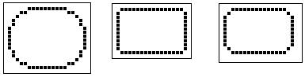

#FIX#

[cols="1m,1m,1m"]
|===
|W_BORD_CUSHION\|W_BORD_CORNER_4 | |W_BORD_CUSHION\|W_BORD_SHADOW_S
| |W_BORD_CUSHION\|W_BORD_CORNER_1 |
|===

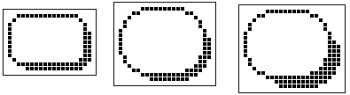

----
W_BORD_CUSHION|W_BORD_SHADOW_S|W_BORD_SHADOW_ON

W_BORD_CUSHION|W_BORD_CORNER_4|W_BORD_SHADOW_S|W_BORD_SHADOW_ON

W_BORD_CUSHION|W_BORD_CORNER_4|W_BORD_SHADOW_D|W_BORD_SHADOW_ON
----

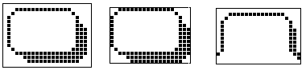

----
W_BORD_CUSHION|W_BORD_SHADOW_D|W_BORD_SHADOW_ON         W_BORD_OPEN

W_BORD_SHADOW_D|W_BORD_SHADOW_ON
----

Although some of the effects may look gross on the above diagrams, bear in mind they will typically be used on much larger windows.

Some of the flag combinations presuppose a minimum size of rectangle.

The `W_BORD_OPEN` flag is a special case that overrides all the others. The top two corners are drawn as for `W_BORD_CUSHION|W_BORD_SHADOW_S|W_BORD_SHADOW_ON`, but the bottom two are laws unto themselves.
Note also the non-appearance of lines along the bottom.
This is used for the header of a Series 3 or Series 3a pull-down menu.

Except for those combinations designed to change shadows and arrows, the borders are designed to be drawn over a clear background.
For example, those pixels at the perimeter of the rectangle that are obtained with `W_BORD_CUSHION` are not explicitly cleared.

The above assumes that `gmode` in the graphics context is set to `G_TRMODE_SET` (its default value).

===== Drawing shadows

The first line of a shadow is inset by 2 pixels at the bottom left and at the top right, and a second line (for double shadowing) is inset a further one pixel.

At the bottom right, the outside line matches the inside line, just being displaced either one or two pixels diagonally downwards and outwards.

The pixels that are set for `W_BORD_SHADOW_ON` are explicitly cleared when this flag is absent, so that the call

[source,c]
----
gBorderRect(prect, W_BORD_SHADOW_S);
----

can be used to de-emphasise a window formerly emphasised using

[source,c]
----
gBorderRect(prect, W_BORD_SHADOW_S|W_BORD_SHADOW_ON);
----

===== Arrows

The following shows the use of `W_BORD_BOT_ON` to draw an arrow in the bottom right corner on the S3 or the S3a:

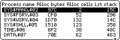

Remember, that when running version 4 of the window server on the Series 3a in Series 3 compatibility mode, the image will be drawn in double pixel mode!

==== `gBorder` Border a drawable

[source,c]
----
VOID gBorder(UINT flags);
----

Equivalent to `gBorderRect` where the rectangle covers the entire drawable (bitmap or window).

Not available in version 2 of the window server.

==== `gBorder2Rect` Draw a 'shadowed' border

[source,c]
----
VOID gBorder2Rect(INT type, P_RECT *prect,INT flags);
----

Introduced in version 4 of the window server, this function is similar to `gBorderRect` but includes the ability to draw a 3-dimensional style border.

This function can be regarded as a generalisation of `gBorderRect` as not only can it draw the 3D style borders but includes the functionality of `gBorderRect` itself.

It draws a border inside the rectangular block of pixels specified by the parameter `prect` with a style specified by the parameter type.
The flags parameter 'fine-tunes' the border display.

The type can be one of:

* `W_BORDER_TYPE_0` -- to draw a border in the old style as done by `gBorderRect` 
* `W_BORDER_TYPE_1` -- to draw a 3-dimensional grey and black border.

Note that for `W_BORDER_TYPE_1` borders, the window must be enabled for drawing grey.

The flags parameter can be used to fine-tune the border display. They are, to all intents and purposes, the same as those used in the function `gBorderRect` with some minor changes in meaning.

Flags should be one of: 

[cols="1m,3"]
|===
|W_BORD_CORNER_2
|to draw a corner type 2, the same as that drawn by `gBorderRect`.
This is the default corner and need not be explicitly coded.
This flag applies to both border types.

|W_BORD_CORNER_1
|to draw a corner type 1, the same as that drawn by `gBorderRect`.
This flag applies to both border types.

|W_BORD_CORNER_4
|to draw a corner type 4, the same as that drawn by `gBorderRect`.
This flag applies to both border types.

|W_BORD_OPEN
|to draw a special corner used for menus on the S3 and S3a and is the same as that drawn by `gBorderRect`.
This flag applies to `W_BORDER_TYPE_0` borders only.
|===

The corner types can be qualified by OR'ing a combination of the following bit fields:

[cols="1m,3"]
|===
|W_BORD_CUSHION
|to leave a 1 pixel clear cushion right around the border. This flag applies to both border types

|W_BORD_SHADOW_S
|to draw a single shadow area. This flag applies to a `W_BORDER_TYPE_0` border only.

|W_BORD_SHADOW_D
|to draw a double shadow area for a `W_BORDER_TYPE_0` border.

to set the thickness of the grey and black areas, which give the 3-D effect, to 4 pixels (compared to a default value of 2 pixels) for a `W_BORDER_TYPE_1` border.

|W_BORD_SHADOW_ON
|to set the pixels in the shadow area for a `W_BORDER_TYPE_0` border.
One of `W_BORD_SHADOW_S` or `W_BORD_SHADOW_D` must also be set.
If this flag is not set, the pixels are cleared.

to draw a rectangle with the shadowed effect in grey and black as shown in the diagrams below for a `W_BORDER_TYPE_1` border.
In drawing, it draws only the grey and black parts of the border.
It leaves the white parts untouched because it assumes a pre-cleared background.

If this flag is not set, it draws the outline of the border as shown and clears the area between the two outlines.
This allows the shadow effects to be turned off by simply calling `gBorder2Rect` again.
|===

The following diagrams show examples of the various 3-dimensional style borders introduced with this function.
All are of type `W_BORDER_TYPE_1`. The caption below each diagram shows the flag combinations used to draw it.

#FIX#

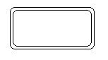image:media/image102.jpg[media/image102,width=169,height=95]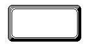

 W_BORD_CORNER_4 `W_BORD_CORNER_4`|W_BORD_SHADOW_ON `W_BORD_CORNER_4`|W_BORD_

 SHADOW_ON|W_BORD_SHADOW_D

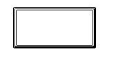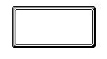

 W_BORD_CORNER_1|W_BORD_SHADOW_ON W_BORD_CORNER_2|W_BORD_SHADOW_ON

==== `gBorder2` Draw a 'shadowed' border

[source,c]
----
VOID gBorder2(INT type,INT flags);
----

Introduced in version 4 of the window server, this is equivalent to `gBorder2Rect` but the rectangle is set to be the whole drawable, either the whole window or a bitmap.

==== `gDrawObject` Draw a graphics object

[source,c]
----
VOID gDrawObject(INT type,P_RECT *prect,INT flags);
----

Introduced in version 4 of the window server, this draws the scaleable graphics object specified by `type`.
The object is scaled to fit inside the rectangle specified by the parameter `prect`.

The type of objects currently available are:

[cols="1m,3"]
|===
|G_DRAW_OBJECT_TYPE_0
|a 3-dimensional box
|===

The flags applicable to this type of object are as follows:

[cols="1m,3"]
|===
|W_BORD_CORNER_2
|to draw the box with a corner type 2, the same as that drawn by `gBorder`.
This is the default and need not be explicitly coded.

|W_BORD_CORNER_1
|to draw the box with a corner type 1, the same as that drawn by `gBorder`.

|W_BORD_CORNER_4
|to draw the box with a corner type 4, the same as that drawn by `gBorder`.

|W_BORD_SHADOW_D
|to draw the box with double the thickness of the dark and light edge effects.
|===

=== Area filling

The functions in this section act upon the drawable associated with the current graphics context.

==== `gClrRect` Change a rectangle

[source,c]
----
VOID gClrRect(P_RECT *prect, UINT mode);
----

Change all pixels within the rectangular block specified by `prect` where the change depends on mode as follows:

[cols="1m,3"]
|===
|G_TRMODE_SET
|set the pixels

|G_TRMODE_CLR
|clear the pixels

|G_TRMODE_INV
|invert the pixels (this is reversible by another invert)
|===

The `P_RECT` struct is defined as:

[source,c]
----
typedef struct
{
    WORD x;
    WORD y;
} P_POINT;

typedef struct
{
    P_POINT tl; /* top left pixel (internal) */
    P_POINT br; /* bottom right pixel (external) */
} P_RECT;
----

==== `gInvObloid` Invert an obloid

[source,c]
----
VOID gInvObloid(P_EXTENT *pext);
----

Invert all the pixels (except the four corner pixels) in the rectangular block specified by pext.

The `P_EXTENT` struct is defined as:

[source,c]
----
typedef struct {
    P_POINT tl;
    WORD width;
    WORD height;
} P_EXTENT;
----

Not available in version 2 of the window server.

==== `gFillPattern` Fill a rectangle with a bitmap

[source,c]
----
VOID gFillPattern(P_RECT *prect, UINT bitmap_id, UINT mode);
----

Repeatedly copy the bitmap with ID `bitmap_id` over the rectangular block of pixels specified by `prect` as many times as is necessary to fill the rectangle.

The parameter mode should be one of:

[cols="1m,3"]
|===
|G_TRMODE_REPL
|where bits in the source pattern replace corresponding bits in the destination.

|G_TRMODE_SET
|where 1s in the source pattern set corresponding bits in the destination (0s in the source do not change corresponding bits in the destination).

|G_TRMODE_CLR
|where 1s in the source pattern clear corresponding bits in the destination (0s in the source pattern do not change corresponding bits in the destination).

|G_TRMODE_INV
|where 1s in the source pattern toggle corresponding bits in the destination (0s in the source pattern do not change corresponding bits in the destination).
|===

A larger bitmap will give improved performance.
If the pattern is all ones or all zeros, `gFillPattern` is equivalent to `gClrRect`, but less efficient.

There is a built in grey bitmap with the handle `WS_BITMAP_GREY` and size `WS_BITMAP_GREY_SIZE_X` by `WS_BITMAP_GREY_SIZE_Y`.
This is not true grey as found on the Series 3a but is a pseudo-grey, built up from a pattern of alternate black and white pixels (ie pixels alternately set on and off in the normal plane).

The parameter bitmap_id can also be the ID of a backed-up window to refer to the backup bitmap (but not in version 2).

For example to fill the current drawable with the grey cheque board pattern:

[source,c]
----
LOCAL_C VOID GreyWin(VOID)
{
    P_RECT rect;
    rect.tl.x=0;
    rect.tl.y=0;
    rect.br.x=10000;
    rect.br.y=10000;
    gFillPattern(&rect,WS_BITMAP_GREY,G_TRMODE_REPL);
}
----

In version 4 of the window server, _when_ `bitmap_id` _refers to a backed-up window_, the function has a special way of handling grey:

* In normal mode, the black plane only is copied from the source to the destination.
* In `G_GC_FLAG_GREY_PLANE` mode, the grey plane from the source is selected and copied to the grey plane of the destination.
If the source only has one plane, then that is used as the source.
* In `G_GC_FLAG_BOTH_PLANES` mode, and with a two plane source, both planes are copied to their respective destination planes.
If only one plane exists, then it will be copied to both planes of the destination.

Note that this does _not_ apply when copying from any other form of bitmap -- in all other cases the black and grey planes must be copied by two separate calls to `gFillPattern`.

=== Text fonts

Fonts are generally described in terms of:

* ascent, descent, and vertical leading
* width and horizontal leading
* low character and high character (the range of ASCII values covered).

To clarify the meaning of some of these terms, refer to the following diagram:

The string 'Specify' has been printed at a point (x, y) which is indicated in the diagram by a pair of partially drawn lines. The horizontal of the pair of lines is known as the baseline.

The descent of a character is the number of pixels that it extends below the baseline.
Thus in the font shown, 'S' has a zero descent whereas 'p' has a descent of 1.

The ascent of a character is the number of pixels that it extends above the baseline.
In the font shown, 'S' has an ascent of 7 whereas 'p' has an ascent of 5.
The ascent quoted for a font is always the maximum ascent of all the characters in the font, and likewise for the descent.
The sum of the ascent and the descent is the height of the font.

Vertical leading is the number of additional pixels that separate adjacent lines of text, over and above the stated height of each line of text.
This is usually at least one, to prevent the highest ascent of one line ever joining up with the lowest descent of the line above.
On occasion, however, such joining up may actually be intended, for example to support box-drawing via the IBM graphics characters in the extended portion of a font.
In any case, it should be noted that, strictly speaking, vertical leading is not a characteristic of a font as such; rather, it describes how a font is used on a particular occasion.
To complicate matters, different uses of a font will in fact often have different vertical leading.

Horizontal leading is the number of pixels that separate adjacent characters in a line of text.

The term width is, unfortunately, possessed of two subtly different meanings.
The more useful of the two meanings is that the width of some text is the number of pixels from the start of that text to where a piece of text following on from the first one would start.
This is the value returned by window server inquiry functions such as `gTextWidth`.
Thus the width of the character 'S' in the above font is the number of pixels from the start of the 'S' to the start of the following character ('p'), namely 6.
With this meaning, all the characters shown in the diagram have width 6, except for 'i' (4) and 'f' (5).

The second of the two meanings of width discounts the horizontal leading, so that, by this reckoning, the width of 'S' is just 5 pixels.
This latter meaning of width is sometimes referred to as basic width.

There is an important difference between horizontal and vertical leading: horizontal leading is always supplied as part of the font; on the other hand the amount of vertical leading (if any) to be applied is up to the user of the font.
Stated otherwise, applications have no choice about horizontal leading, but do have choice over vertical leading.
For this reason, the simple term leading is commonly used to denote what is here being called vertical leading (since horizontal leading is usually just taken for granted).

The width of the widest character in a font is called the maximum width, and the width of the numeric character '0' is called the numeric width, or sometimes the column width.
(In any well designed font, all numeric characters will have the same width).

Occasionally, a font is described in terms of its body cell.
The font depicted has a basic body cell of 5 by 8 (which excludes both vertical and horizontal leading), and a corresponding expanded body cell of 6 by 9.

Not all the character codes within the range need have a representation within the font.
When drawn, these characters will be represented by the last character in the font.

An application can switch between many different fonts of varying sizes.
Each Graphics Context may have a different font.
The appearance of text can also be altered by various style options such as underline or bold (these are independent of the font).

Fonts are generally proportional, ie the characters within the font can be of differing width.
It is left to an application to determine the width of text and make decisions about layout accordingly.

nformation is provided to allow fonts of differing heights to be aligned vertically about a baseline.
When characters are drawn, the y-coordinate given corresponds to the baseline of the character.
If a line of text is drawn using characters from fonts of different height, this ensures that the text lines up vertically.

==== `gOpenFont` Open a font

[source,c]
----
INT gOpenFont(TEXT *filename);
----

Load the font from `filename` and return the font ID.

If an error (with error number `err`) occurs (for example, the file does not exist or if it is not a valid font file), the function calls `p_leave(err)` or returns `err`, depending on the `wDisableLeaves` state.

To use the font for text drawing functions, the font ID must be assigned to a graphics context (using `gSetGC`).

Note that the parameter filename is ultimately passed to `p_open` by the window server process -- not the client process.
If filename is not a full file specification, the unspecified components are taken from the window server's default path which, in practice, is always the internal drive `M:\`.
This is unlikely to meet the requirements of a finished product so filename should specify the drive and directory as well as the file name.
Typically, you might place a font file in the same location as the application file in which case you would use something like:

[source,c]
----
GLREF_D TEXT *DatCommandPtr;

LOCAL_C INT OpenFont(TEXT *name)
{
    TEXT full[P_FNAMESIZE];
    f_fparse(name,DatCommandPtr,&full[0],NULL);
    gOpenFont(&full[0]);
}
----

See also `gSetOpenAddress` for loading a font file which is embedded in another file.

==== `gSetOpenAddress` Set `pos` to open font/bitmap/mouse icon

[source,c]
----
VOID gSetOpenAddress(UINT mode, ULONG pos);
----

Set the file position for the next call to `gOpenFont`, `gOpenFontIndex`, `gInitBit`, `gOpenBit` or `gOpenMouseIcon` as a function of mode and pos.

The possible values of mode are defined by constants of the form `G_OPEN_MODE_XXX` where XXX is one of:

[cols="1m,3"]
|===
|OFFSET
|to indicate that `pos` is the file position of the data

|WORD_PTR_OFFSET
|to indicate that `pos` is the file position of a UWORD containing the file position of the data

|LONG_PTR_OFFSET
|to indicate that `pos` is the file position of a ULONG containing the file position of the data

|NORMAL
|to cancel the effect of any previous unused call to `gSetOpenAddress` (pos is ignored)
|===

The effect of the call only lasts until the next call to `gOpenFont`, `gOpenFontIndex`, `gInitBit`, `gOpenBit` or `gOpenMouseIcon` so you wouldn't normally need `G_OPEN_MODE_NORMAL` -- especially as a call to `gSetOpenAddress` would normally occur immediately before the `gOpenxxx` call it is intended to effect.

The data at the effective file position should be the entire contents of the normal font, multiple font, bitmap or mouse icon file -- including all headers.

==== `wFree` Free a font

[source,c]
----
VOID wFree(UINT font_id);
----

Free a previously loaded font.

==== `gFontInfo` Get font information

[source,c]
----
INT gFontInfo(UINT font_id, UINT style, G_FONT_INFO *pinfo);
----

Write information about the font with ID `font_id` as modified by the text style `style` to the `G_FONT_INFO` struct at pinfo where the `G_FONT_INFO` struct is defined in `wlib.h` as:

[source,c]
----
typedef struct
{
    UWORD low_ch;        /* lowest character code in font */
    UWORD high_ch;       /* highest character code in font */
    UWORD height;        /* height of font */
    UWORD descent;       /* height of bottom part of a character */
    UWORD ascent;        /* height of top part of a character */
    UWORD numeric_width; /* width of the '0' character */
    UWORD max_width;     /* width of widest character in the font */
    UWORD flags;         /* flags specifying information about the font */
    TEXT name[16];       /* Text name of the font */
} G_FONT_INFO;
----

The field `numeric_width` is actually the width of the '0' (zero) character, however any well designed font will have all its numeric characters the same width.
If a font is monospaced, all characters are of width `max_width`.

The field `max_width` is set by the font designer when the font is created.
It is not necessarily the widest character in the font, since the font designer will normally exclude any special characters that are rarely used -- `max_width` is normally the width of 'M' or 'W'.

The fields `numeric_width`, `max_width`, `height`, `descent` and `ascent` can be modified from their base values by the `style` given.

The flags field consists of the following bit fields:

[cols="1m,3"]
|===
|G_FONT_FLAG_ASCII
|the font contains the standard ASCII character set

|G_FONT_FLAG_CP850
|the font contains the IBM code page 850 character set

|G_FONT_FLAG_BOLD
|the font is designed to look bolded

|G_FONT_FLAG_ITALIC
|the font is designed to look italic

|G_FONT_FLAG_SERIF
|the font character graphics have serifs
|===

Returns zero if successful or, if font_id is invalid, it calls `p_leave(E_GEN_NOFONT)` or returns `E_GEN_NOFONT`, depending on whether `wDisableLeaves` has been called.

To get information on the system font, `font_id` may be set to `WS_FONT_SYSTEM`.

On version 2 of the window server you should not call `gFontInfo` with an invalid `font_id` (if you do, `gFontInfo` writes garbage to `pinfo`).

==== `gTextWidth` Get text width

[source,c]
----
INT gTextWidth(UINT font_id, UINT style, TEXT *pbuf, UINT len);
----

Return the width in pixels of the len characters at `pbuf` when drawn with font `font_id` and `style` style.

Any character code in `pbuf` that does not have a corresponding character graphic in the font is taken to have the width of the last character in the font.

Note that the style can affect the width returned because bolding, italicising, mono-spacing etc widens each character.

To get the text width when using the system font, font_id may be set to `WS_FONT_SYSTEM`.

If font_id is invalid, the function calls `p_leave(E_GEN_NOFONT)` or returns `E_GEN_NOFONT`, depending on whether `wDisableLeaves` has been called.

==== `gTextCount` Clip text to pixel width

[source,c]
----
INT gTextCount(UINT font_id, UINT style, TEXT *pbuf, UINT len,UINT *pwidth);
----

Return the number of characters from `pbuf` (up to `len`) that will fit in their entirety in `*pwidth` pixels when drawn with font `font_id` and style `style`.
Also overwrite `*pwidth` with the remaining width.

Any character code in `pbuf` that does not have a corresponding character graphic in the font is taken to have the width of the last character in the font.

Note that the `style` can affect the width returned because bolding, italicising, mono-spacing etc widens each character.

When using the system font, `font_id` may be set to `WS_FONT_SYSTEM`.

If `font_id` is invalid, the function calls `p_leave(E_GEN_NOFONT)` or returns `E_GEN_NOFONT`, depending on whether `wDisableLeaves` has been called.

==== `gGetWidthTable` Get a font width table

[source,c]
----
INT gGetWidthTable(UINT font_id, UINT style, UBYTE *ptab);
----

Generate a `UBYTE` array of character pixel widths in `*ptab` for font `font_id` and style `style`.

The first byte in `*ptab` is the width of the character with code `low_ch` and the length of the array written is `high_ch-low_ch+1` (where `low_ch` and `high_ch` are from the font's `G_FONT_INFO` struct).

The function is provided to speed optimise calculations based on character widths -- such as those performed by `gTextWidth` and `gTextCount`.

Any character code that does not have a corresponding character graphic in the font is taken to have the width of the last character in the font.

Note that the `style` can affect the width returned because bolding, italicising, mono-spacing etc widens each character.

When using the system font, `font_id` may be set to `WS_FONT_SYSTEM`.

Returns zero if successful or, if `font_id` is invalid, it calls `p_leave(E_GEN_NOFONT)` or returns `E_GEN_NOFONT`, depending on whether `wDisableLeaves` has been called.

==== `wSetSystemFont` Set the system and internal fonts

[source,c]
----
INT wSetSystemFont(INT mode,INT handle,UINT style);
----

Available in version 4 of the window server, this function mat be used on the Series 3a and Workabout to set up the system and internal fonts.

The `mode` parameter is used to indicate which font type is to be the target of the set up. This parameter can take one of the following values:

[cols="1m,3"]
|===
|W_SYSTEM_FONT_S3B
|sets up the native system font

|W_SYSTEM_FONT_S3
|sets up the Series 3 compatibility mode system font

|W_SYSTEM_FONT_INTERNAL_S3B
|sets up the native internal font

|W_SYSTEM_FONT_INTERNAL_S3
|sets up the Series 3 compatibility mode internal font
|===

The handle parameter references the font to be used as the source for the setup.
This can be:

* the handle returned for a loaded font
* the handle of one of the built-in fonts
* the handle of a font group created by `gConfigureFonts` 

The style parameter can be used to modify the style of text when setting up either of the two internal font types.
This parameter is ignored if setting up any of the other font types.
The style parameter adopts the same values as those applicable to the style field in the graphics context.

The function returns zero if successful, `E_GEN_NOFONT` if an invalid font handle is supplied or `E_GEN_ARG` if an invalid mode is supplied.
Alternatively, it calls `p_leave` if `wDisableLeaves` has been called.

Note that at the time of writing, there is no way of notifying applications that the system font has changed.

==== `gOpenFontIndex` Open a font from a multiple font file

[source,c]
----
INT gOpenFontIndex(TEXT *fname,UINT index)
----

Available in version 4 of the window server, this function is similar to `gOpenFont` except that it allows a font to be loaded from a file containing more than one font.

The index parameter is used to indicate which font within the file is to be loaded.
The first font in the file corresponds to an index of zero, while the second font corresponds to an index value of one and so on.

Single-font files can be opened by setting `index` to zero.

Multiple-font files are invalid to older versions of the window server.

If `index` refers to a font file beyond the final one in the file, error `E_FILE_EOF` is reported.

If an error (with error number err) occurs, the function calls `p_leave(err)` or returns `err`, depending on whether `wDisableLeaves` has been called.

Multiple-font files can be created by versions 2.00 upwards of the font compiler `WSFCOMP`.

==== `gConfigureFonts` Configure a font group

[source,c]
----
INT gConfigureFonts(INT count,G_FONT_CONFIG *pfcfg[])
----

Available in version 4, this function is used to create a font group and return its id.

A font group is a compromise solution to the problem of deciding whether to use the window server's algorithmic method of obtaining a style (see _style_ subsection of the _Graphics context_ section) or to use a font designed specifically for the purpose.
This is even more important where the situation is ambiguous.
For example, given a bold font and an italicised font, if the application wishes to print in bold _and_ italics, does it choose to apply the bold style to the italicised font or apply the italic style to the bold font?

Designing a font for every combination of style is impractical while the result of applying the window server's algorithmic method may not always give satisfactory results.

Essentially, a font group is a list of font id's and style combinations.

When an application wishes to print text, typically it will specify a (group) font ID and a combination of styles to be applied.
In response, the window server scans down each entry in the list searching for the best match.
It then uses the font in this entry for printing.

The font group is specified by the parameter `pfcfg` which points to an array of `G_FONT_CONFIG` structures.
The array has `count` elements.
Each element in the array is, in effect, an entry in the list discussed above.
The `G_FONT_CONFIG` structure is defined as follows:

[source,c]
----
typedef struct
{
    UINT FontId; /*Replacement Font */
    UINT RepStyles; /*Styles needing to be replaced*/
    UINT FontStyles; /*Styles used with this Font */
    UINT AscentAdjust; /*Adjustment to Font's ascent */
} G_FONT_CONFIG;
----

The order of the elements in the array is important because of the way the search algorithm works.
This proceeds as follows:

[arabic]
. The window server initially chooses the base font as the 'best'.
In other words, the first entry in the array.
. Initially, each entry in the array is scanned, starting with the first, until one is found where the `RepStyles` field contains styles which are a _subset_ of the styles to be printed.
. Subsequently, the scan continues, searching for entries whose `RepStyles` field contains styles which are a subset of the styles to be printed _and_ which also (as a minimum) contain the styles of the current 'best' entry.
Where such an entry is found, this becomes the 'best'.
. The process, numbered 3 above, is repeated until the array is exhausted, The window server uses the font corresponding to the `FontId` of the 'best' entry in the array.

Having found a suitable font, the window server then applies those styles which the application wants printed but which are not specified in the `RepStyles` field.
For example, suppose the application wants bold _and_ italic printed.
Suppose also that the 'best' entry in the array specifies only the bold style in the `RepStyles` field.
The window server will use the `FontId` as the font to be used and will apply the italic style to this font.

In addition, the `FontStyles` member of each entry in the array specifies styles which are also to be applied to the chosen font when it is drawn.

The `AscentAdjust` field specifies an adjustment to be made (positive or negative) to the font's ascent when printing.
This is primarily of use for superscript and subscript fonts.
See the `G_STY_SUBSCRIPT2` and `G_STY_SUPERSCRIPT2` styles at the beginning of this chapter.

==== `gReadFontHeader` Read a font header from a file

[source,c]
----
INT gReadFontHeader(TEXT *fname,INT index,UBYTE *pbuffer)
----

Available in version 4 of the window server, this function reads up to a maximum of `FONT_MAX_HEADER_LEN` bytes of font data from the font referenced by `fname` and `index` into the buffer pointed to by `pbuffer`.

`fname` references the font file while the `index` parameter indicates the actual font within the file.
For a single font file, `index` must be set to 0; for a multiple font file, an `index` value of zero refers to the first file, an `index` value of one refers to the second file and so on.

If the call is successful, the function returns the length of data actually read.

If an error (with error number `err`) occurs (for example, the file does not exist or it is not a valid font file), the function calls `p_leave(err)` or returns `err`, depending on the `wDisableLeaves` state.

==== `gReadFontGroupHeader` Read a font group header from a file

[source,c]
----
INT gReadFontGroupHeader(TEXT *fname,UBYTE *pbuffer)
----

Available in version 4 of the window server, this function reads up to a maximum of

`FONT_MAX_HEADER_LEN` bytes of font header data from the font file referenced by `fname` into the buffer pointed to by `pbuffer`.

In the first word of the buffer, the function places the number of fonts contained in the file.
This word is followed by the group header.
This means that the actual maximum length of header data that can be stored in the file is `FONT_MAX_HEADER_LEN-2` bytes.

If the call is successful, the function returns the length of data actually read.

If an error (with error number `err`) occurs (for example, the file does not exist or it is not a valid font file), the function calls `p_leave(err)` or returns `err`, depending on the `wDisableLeaves` state.

See the description of `wsfcomp` for information on how to add header data.

=== Text output functions

The functions in this section are all directed at the drawable associated with the current graphics context and are all subject to the style and font fields of the current graphics context.

The functions `gPrintText` and `gPrintClipText` are also subject to the `textmode` field.
The functions `wDrawButton`, and `wDrawButton2` are also subject to the `gmode` field.

In version 4 of the window server, the plane to which drawing is directed in the current graphics context will affect the 'colour' of the display.

==== `gPrintText` Print text

[source,c]
----
VOID gPrintText(INT x, INT y, TEXT *pbuf, UINT len);
----

Print the `len` characters at `pbuf` horizontally from pixel position `x`,`y` where `len` must not be greater than `WS_MAX_PRINT_TEXT_LEN`.

The first character graphic is positioned such that its leftmost pixel that is just above the baseline is over pixel `(x,y)` of the drawable.
(The baseline is the mathematical line between the upper ascent pixels and the lower descent pixels that make up the height of the font.)

The text is printed relative to the baseline so that the characters in a line of text that contains different fonts (with potentially different ascents and descents) line up correctly, as illustrated by the following diagram:

#FIX#

[cols="14%,16%,5%,5%,11%,13%,36%",options="header",]
|===
| | | | | | a|
____
Ascent
____

| | | | | | |
| | | | | | |
| | | |X | | |Descent
| | | | | | |
| | | | | | |
|===

____
Baseline

X is the printing position.
____

The text is printed according to the `textmode`, `style` and `font` in the current graphics context.

Any character code in `pbuf` that does not have a corresponding character graphic in the font is printed as the last character in the font.

Note that `gPrintText` performs no special processing on control characters (ie characters with a code that is less than 32) and if they are not represented in the font then they will also be printed as the last character in the font.

==== `gPrintClipText` Print clipped text

[source,c]
----
INT gPrintClipText(INT x, INT y, TEXT *pbuf, UINT len, UINT clip_width);
----

Similar to `gPrintText` except that it only draws as many characters as will fit inside `clip_width`.

Returns the number of characters actually printed.

==== `gPrintBoxText` Print text in a box

[source,c]
----
VOID gPrintBoxText(P_RECT *prect, UINT ascent, UINT align, INT margin, TEXT *pbuf, UINT len);
----

Print the `len` characters at `pbuf` with a fixed `textmode` of `G_TRMODE_REPL` within the rectangular block of pixels specified by `prect`, clearing (or setting) those pixels that are not replaced by characters from the font (len must not be greater than `WS_MAX_PRINT_BOX_TEXT_LEN`).

If necessary, the drawing is pixel-clipped to the rectangle defined by `prect`.

The `P_RECT` struct is defined as:

[source,c]
----
typedef struct
{
    WORD x;
    WORD y;
} P_POINT;

typedef struct
{
    P_POINT tl; /* top left pixel (internal) */
    P_POINT br; /* bottom right pixel (external) */
} P_RECT;
----

The characters are positioned vertically such that there are `ascent` pixels between the top of the rectangle and the base line of the characters (unless you intend to clip the top off the text, `ascent` should be greater than or equal to the current font's ascent) as illustrated by the following diagram:

#FIX#

The excess space around the text is cleared or set depending on the `inverse` bit in the `style`.

The text may be left or right aligned, or centred within `prect` depending on whether align is `G_TEXT_ALIGN_LEFT`, `G_TEXT_ALIGN_RIGHT` or `G_TEXT_ALIGN_CENTRE`.

The parameter margin is used to clear extra space to the left or right of the text where margin is interpreted as follows:

#FIX#

----
align = G_TEXT_ALIGN_RIGHT
----

[cols="17%,61%,2%,2%,16%,2%",]
|===
| | | | |MARGIN |
| a|
____
_____________right-aligned text
____

| | | |
| | | | | |
|===

For centred text, the margin can be placed either to the right or to the left of the text according to the sign of `margin`, as follows:

#FIX#

____
align = G_TEXT_ALIGN_CENTRE, margin<0
____

[cols="19%,59%,5%,15%,2%",]
|===
| | | a|
MARGIN

____
-ve
____

|
| a|
____
_______centred text_______
____

| | |
| | | | |
|===

The text is printed according to the `style` and `font` in the current graphics context (but not `textmode`).

Using `gPrintBoxText` avoids the flicker that is generated between a separate clear and print.

==== `gXPrintText` Print text with embellishment

[source,c]
----
VOID gXPrintText(INT x, INT y, TEXT *pbuf, UINT len, UINT flags);
----

Print the `len` characters at `pbuf` horizontally from pixel position `x`,`y` with highlighting in a style that depends on the value of `flags` (`len` must not be greater than `WS_MAX_PRINT_TEXT_LEN`).

The text is printed according to the `style` and `font` in the current graphics context (but not `textmode`).

Equivalent to calling `gPrintText` with a fixed `textmode` of `G_TRMODE_REPL` followed by some embellishment depending on the value of `flags`.
Possible flag values are illustrated below for the string 'Specify', in each case printed with the same value of `x` and `y`.

[cols="1m,3"]
|===
|Zero (no embellishment)

The partially drawn lines indicate the point to which the coordinates `x` and `y` apply.

|

|G_XP_INV_BLOCK
|image:media/image107.png[media/image107,width=239,height=77]

|G_XP_INV_OBLOID
|

|G_XP_INV_BLOCK|G_XP_REDUCED
|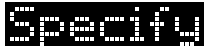

|G_XP_INV_OBLOID|G_XP_REDUCED
|

|G_XP_UND_BLOCK
|

|G_XP_UND_BLOCK|G_XP_REDUCED
|
|===

All the reduced forms are intended for use on text strings with no characters having descenders, such as numbers and upper case letters.

A zero flags is equivalent to `gPrintText` with a `textmode` of `G_TRMODE_REPL` and may be used to cancel an embellishment set up previously.

Not available in version 2 of the window server.

In version 4 of the window server, by setting the graphics context to draw to the grey plane and making sure that the window is enabled for drawing grey, all of the text and embellishments in the above examples will be drawn in grey.

==== `gShadowText` Print shadowed text

[source,c]
----
VOID gShadowText(INT posx,INT posy, G_SHADOW *pshadow,TEXT *ptxt,INT len);
----

Introduced in version 4 of the window server, this function prints the len characters at ptxt with a shadowed effect from pixel position posx, posy where len must not be greater than `WS_MAX_PRINT_TEXT_LEN`.

It uses the current `font` and `style` (ie the current graphics context) but ignores the current `textmode`.

The `pshadow` parameter must point to a structure of type `G_SHADOW` which is defined as follows:

[source,c]
----
typedef struct
{
    UBYTE BodyColour;
    UBYTE ShadowColour;
    UBYTE LightColour;
    UBYTE filler;
    UWORD Flags;
    WORD ShadowSizeX;
    WORD ShadowSizey;
    WORD LightSizeX;
    WORD LightSizeY;
    WORD Spacing;
} G_SHADOW;
----

The shadow is always placed at the bottom right of the text while the lighting effect is always placed at the top left of the text.

The size of the shadow effect is specified by `ShadowSizeX` and `ShadowSizeY`.
The size of the lighting effect is specified by `LightSizeX` and `LightSizeY`.

The 'colours' for the body, shadow and light can be one of black, grey, white or none by setting the `G_SHADOW` members `BodyColour`, `ShadowColour` and `LightColour` to one of `G_COLOUR_BLACK`, `G_COLOUR_GREY`, `G_COLOUR_WHITE` or `G_COLOUR_NONE`.

The display can consist of either a single copy of the text giving an impression of the text floating above the shadow or a solid block linking the text to the background.
By default, the floating style shadow is used.
The solid block effect is achieved by setting the `Flags` member to `G_SHADOW_SOLID`.

The gap between characters can be set by giving the Spacing member a suitable value.
This is useful if a character's shadow effects are not to overlap the following character.

The following picture shows four examples of the effect of using `gShadowText`:

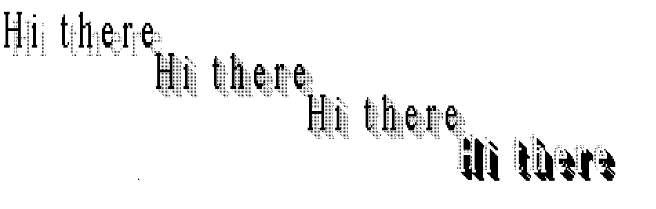

In all examples, `ShadowSizeX` was set to 6, `ShadowSizeY` was set to 6, `LightSizeX` was set to 2 and `LightSizeY` was set to 2.

`Spacing` was set to 6 to allow sufficient space between the characters so that the shadow effects could be seen.

Looking at each example from left to right, the following values were used:

1. `BodyColour` set to `G_COLOUR_BLACK` +
`ShadowColour` set to `G_COLOUR_GREY` +
`LightColour` set to `G_COLOUR_NONE`
2. `BodyColour` set to `G_COLOUR_BLACK` +
`ShadowColour` set to `G_COLOUR_GREY` +
`LightColour` set to `G_COLOUR_NONE` +
`Flags` set to `G_SHADOW_SOLID`
3. `BodyColour` set to `G_COLOUR_BLACK` +
`ShadowColour` set to `G_COLOUR_GREY` +
`LightColour` set to `G_COLOUR_WHITE` +
`Flags` set to `G_SHADOW_SOLID`
4. `BodyColour` set to `G_COLOUR_WHITE` +
`ShadowColour` set to `G_COLOUR_BLACK` +
`LightColour` set to `G_COLOUR_GREY` +
`Flags` set to `G_SHADOW_SOLID`

==== `wDrawButton` Draw a text button

[source,c]
----
VOID wDrawButton(P_RECT *prect, TEXT *pstr, UINT depressed);
----

Draw a button within rectangle `prect` containing the zero terminated string `pstr`.
If `depressed` is `TRUE`, draw the button with the text and the box displaced to give a 3D illusion of a depressed button.

The length of `pstr` must not be greater than `W_DRAW_BUTTON_MAX_LEN` (240).

The text is printed according to the style and font in the current graphics context.
Both the box lines and the text string are drawn according to the `gmode` (the value of `textmode` is ignored).

The `P_RECT` struct is defined as:

[source,c]
----
typedef struct
{
    WORD x;
    WORD y;
} P_POINT;

typedef struct
{
    P_POINT tl; /* top left pixel (internal) */
    P_POINT br; /* bottom right pixel (external) */
} P_RECT;
----

The intended use of `wDrawButton` is illustrated by the following example:

[source,c]
----
#include <plib.h>
#include <wlib.h>

LOCAL_D WSERV_SPEC wSpec;
LOCAL_D UINT wMainWid;
LOCAL_D UINT FontID;
LOCAL_D UINT FontStyle;
LOCAL_D G_FONT_INFO FontInfo;

LOCAL_C VOID SetFont(INT fid,INT style)
{
    gFontInfo(FontID=fid,FontStyle=style,&FontInfo);
}

LOCAL_C VOID SetGC(VOID)
{
    G_GC gc;
    gc.font=FontID;
    gc.style=FontStyle;
    gSetGC(0,G_GC_MASK_FONT|G_GC_MASK_STYLE,&gc);
}

LOCAL_C VOID DrawButton(INT state)
{
    P_RECT rect;

    rect.tl.x=20;
    rect.tl.y=(40-2)-FontInfo.height;
    rect.br.x=140;
    rect.br.y=(40+2)+FontInfo.height;
    wDrawButton(&rect,"Press any key",state);
}

LOCAL_C VOID MainEventLoop(VOID)
{
    WS_EV event;

    for (;;)
    {
        wGetEventWait(&event);
        if (event.type==WM_REDRAW)
        {
            wBeginRedrawWinGC0(wMainWid);
            gBorder(W_BORD_SHADOW_D|W_BORD_SHADOW_ON);

            SetGC();
            DrawButton(FALSE);
            wEndRedraw();
            continue;
        }
        if (event.type==WM_KEY)
        {
            gCreateTempGC0(wMainWid);
            SetGC();
            DrawButton(TRUE);
            wFlush();
            p_sleep(5l);
            DrawButton(FALSE);
            gFreeTempGC();
        }
    }
}

GLDEF_C VOID main(VOID)
{
    wConnect(&wSpec,0,W_CONNECT_PRIORITY);
    wMainWid=wCreateWindow(0,0,0,1);
    wInitialiseWindowTree(wMainWid);
    SetFont(WS_FONT_SYSTEM,G_STY_BOLD);

    MainEventLoop();
}
----

==== `wDrawButton2` Draw a text button

[source,c]
----
VOID wDrawButton2(INT type, P_RECT *prect, TEXT *ptext, UINT state);
----

Introduced in version 4 of the window server, this function not only draws the new style Series 3a buttons, but also the old style Series 3 types.

The parameter `prect` points to a `P_RECT` structure that specifies a rectangle that fully encloses the button in all of its states.

The `ptext` parameter specifies a zero terminated string to be drawn inside the button in the current font and style.
It is the responsibility of the caller to make sure that the text will fit inside the button; there is no clipping of text.
The maximum length of text is `W_DRAW_BUTTON_MAX_TEXT`.

The parameter type indicates which style of button is to be drawn. This can have the following values and meanings:

[cols="1m,3"]
|===
|W_BUTTON_TYPE_1
|draws the Series 3 style buttons

|W_BUTTON_TYPE_2
|draws the Series 3a style buttons
|===

The `state` parameter has different meanings for the different types.

For `W_BUTTON_TYPE_1` buttons, 0 draws a raised button while 1 draws a depressed(flat) button.

For `W_BUTTON_TYPE_2` buttons, 0 draws a raised button, 1 draws a semi-depressed button while 2 draws a fully depressed(sunken) button.

The following picture shows three examples of `W_BUTTON_TYPE_2` buttons.
From left to right, the examples show: a state 0 button (raised), a state 1 button (semi-depressed) and a state 2 button (fully depresses).

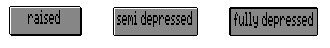

For the purpose of comparison, the following picture shows examples of `W_BUTTON_TYPE_1` buttons.
From left to right, the examples show: a `state` 0 button (raised) and a `state` 1 button (fully depressed).

image:media/image115.jpg[media/image115,width=290,height=78]

It is important to note that before calling `wDrawButton2` to draw `W_BUTTON_TYPE_2` buttons, the window must be enabled for drawing grey.

=== Bitmaps

Although directed at the drawable associated with the current graphics context, the graphics output functions in this section do not depend on any of the settable fields in the graphics context.

==== `gCreateBit` Create a bitmap

[source,c]
----
INT gCreateBit(UINT flags, W_OPEN_BIT_SEG *pbitseg);
----

Create an uninitialised bitmap where the size of the bitmap and its method of storage is controlled by flags and the `W_OPEN_BIT_SEG` struct at pbitseg.

The `W_OPEN_BIT_SEG` struct is defined as:

[source,c]
----
typedef struct {
    P_POINT size;
    TEXT seg_name[14];
} W_OPEN_BIT_SEG
----

where `pbitseg->size` specifies the dimensions of the bitmap in pixels and `pbitseg->seg_name` is written to by `gCreateBit` when requested by the bit in `flags` (as described next).

If `flags` is zero, the bitmap may be stored in the window server's data space or in a named memory segment depending on the size of the bitmap.
If the bitmap requires less than 2.5K bytes, it is stored in the window server's data space.

The storage of the bitmap is controlled by setting the following bits in flags:

[cols="1m,3"]
|===
|WS_BIT_SEG
|to store the created bitmap in its own memory segment (regardless of its size)

|WS_BIT_SEG_ACCESS
|to create the bitmap in its own memory segment and to write the name of the segment as a zero terminated string to `pbitseg->seg_name`.
The segment name can be used to access the bitmap directly using `p_sgcopyfr` and `p_sgcopyto` (described in the _Memory Allocation_ chapter of the _PLIB Reference_ manual) or otherwise.

|WS_BIT_SEG_ZERO_SIZE
|Used in conjunction with `WS_BIT_SEG_ACCESS` to create the bitmap's memory segment with zero size.
You must subsequently increase the size at a later date.
This is designed to be used in conjunction with graphics functions that are added using `wLoadDYL`.
|===

If `flags` is either zero or `WS_BIT_SEG`, `pbitseg->seg_name` is not written to and, in this case, `pbitseg` may just be the address of a `P_POINT` struct.
The prototype for `gCreateBit` actually declares pbitseg as a `VOID *` so that you can pass either a `WS_BIT_SEG *` or a `P_POINT *`.

You may use all the window server graphics functions to draw to a bitmap unless the `WS_BIT_SEG_ZERO_SIZE` flag is set, in which case the graphics functions will have no effect.

Returns the positive ID of the bitmap if successful.

If the function fails because there is insufficient memory, it calls `p_leave(E_GEN_NOMEMORY)` or returns `E_GEN_NOMEMORY`, depending on whether `wDisableLeaves` has been called.

==== `gOpenBit` Load a bitmap

[source,c]
----
INT gOpenBit(TEXT *filename, UINT index, UINT flags, W_OPEN_BIT_SEG *pbitseg);
----

Load bitmap `index` from file `filename` where `index` is used to select a bitmap from a file that contains multiple bitmaps (a zero `index` selects the first bitmap).
To load from a file containing a single bitmap, pass the `index` as zero.

The function writes to the `W_OPEN_BIT_SEG` struct at pbitseg where `W_OPEN_BIT_SEG` is defined as:

[source,c]
----
typedef struct {
    P_POINT size;
    TEXT seg_name[14];
} W_OPEN_BIT_SEG
----

If the bitmap is successfully loaded, the dimensions of the bitmap in pixels is written to `pbitseg->size` and the ID of the bitmap is returned.

If `flags` is zero, the bitmap may be stored in the window server's data space or in a named memory segment depending on the size of the bitmap.
If the bitmap requires less than 2.5K bytes, it is stored in the window server's data space.

The storage of the bitmap is controlled by setting the following bits in flags:

[cols="1m,3"]
|===
|WS_BIT_SEG
|to store the loaded bitmap in its own memory segment (regardless of its size)

|WS_BIT_SEG_ACCESS
|to store the loaded bitmap in its own memory segment and to write the name of the segment as a zero terminated string to `pbitseg->seg_name`.
The segment name can be used to access the bitmap directly using `p_sgcopyfr` and `p_sgcopyto` (described in the _Memory Allocation_ chapter of the _PLIB_ _Reference_ manual) or otherwise.

|WS_BIT_WRITE
|if set, you are given write access to the bitmap and a new bitmap is always created.
If the flag is not set, the bitmap will only be created once and if any client calls `gOpenBit` on the same bitmap, the loaded bitmap will be shared.
|===

Provided that the `WS_BIT_WRITE` flag is set, you may use all the window server graphics functions to draw to a bitmap.
If the `WS_BIT_WRITE` flag is not set, the graphics output functions will have no effect.

If `WS_BIT_SEG_ACCESS` is not set in flags, `pbitseg->seg_name` is not written to and, in this case, pbitseg may just be the address of a `P_POINT` struct.
The prototype for `gOpenBit` actually declares `pbitseg` as a `VOID *` so that you can pass either a `WS_BIT_SEG *` or a `P_POINT *`. 

If an error (with error number `err`) occurs, the function calls `p_leave(err)` or returns `err`, depending on whether `wDisableLeaves` has been called.

Note that the parameter `filename` is ultimately passed to `p_open` by the window server process -- not the client process.
If `filename` is not a full file specification, the unspecified components are taken from the window server's default path which, in practice, is always the internal drive `M:\`.
This is unlikely to meet the requirements of a finished product so `filename` should specify the drive and directory.

Typically, the bitmap file might be built into the application to create a `.app` file as described in the _Building An Application_ chapter in the _General Programming_ manual.
In this situation you might have a code fragment that looks like:

[source,c]
----
GLREF_D TEXT *DatCommandPtr;

LOCAL_C INT OpenBit(TEXT *name)
{
    W_OPEN_BIT_SEG bseg;
    TEXT full[P_FNAMESIZE];

    f_fparse(name,DatCommandPtr,&full[0],NULL);
    gOpenBit(&full[0],0,0,&bseg);
}
----

See also `gSetOpenAddress` for loading a bitmap file which is embedded in another file.

==== `wFree` Free a bitmap

[source,c]
----
VOID wFree(UINT bitmap_id);
----

Free the bitmap with ID `bitmap_id`.

Any Graphics Contexts drawing to `bitmap_id` is automatically freed.

==== `gSaveBit` Save a bitmap

[source,c]
----
INT gSaveBit(TEXT *filename, UINT bitmap_id);
----

Save the bitmap with ID `bitmap_id` to file `filename` or, if `bitmap_id` is zero, save the screen to file `filename`.

The parameter `bitmap_id` can also be the ID of a backed-up window to refer to the backup bitmap (but not in version 2).

Returns zero if successful.

If an error (with error number `err`) occurs, the function calls `p_leave(err)` or returns `err`, depending on whether `wDisableLeaves` has been called.

If filename is not a full file specification, the unspecified components are taken from the window server's default path which, in practice, is always the internal drive `M:\`.

In version 4 of the window server, the function will save a double bitmap when saving the screen or a backed-up window with a grey plane.

==== `gSaveRect` Save part of a bitmap

[source,c]
----
INT gSaveRect(TEXT *filename, UINT bitmap_id, P_RECT *prect);
----

Save the rectangular block of pixels specified by `prect` from the bitmap with ID `bitmap_id` to file `filename` or, if `bitmap_id` is zero, save the rectangular block of pixels specified by `prect` from the screen to file filename.

The `P_RECT` struct is defined as:

[source,c]
----
typedef struct
{
    WORD x;
    WORD y;
} P_POINT;

typedef struct
{
    P_POINT tl; /* top left pixel (internal) */
    P_POINT br; /* bottom right pixel (external) */
} P_RECT;
----

The parameter `bitmap_id` can also be the ID of a backed-up window to refer to the backup bitmap (but not in version 2).

Returns zero if successful.

If an error (with error number `err`) occurs, the function calls `p_leave(err)` or returns `err`, depending on whether `wDisableLeaves` has been called.

If filename is not a full file specification, the unspecified components are taken from the window server's default path which, in practice, is always the internal drive `M:\`.

Not available in version 2 of the window server.

In version 4 of the window server, the function will save a double bitmap when saving the screen or a backed-up window with a grey plane.

==== `gCopyBit` Copy a bitmap to a window

[source,c]
----
VOID gCopyBit(P_POINT *pos, UINT bitmap_id, P_RECT *prect, UINT mode);
----

Copy the rectangular block of pixels specified by `prect` in the bitmap with ID bitmap_id to position `pos` in the destination.

The parameter mode should be one of:

[cols="1m,3"]
|===
|G_TRMODE_REPL
|where bits in the source pattern replace corresponding bits in the destination.

|G_TRMODE_SET
|where 1s in the source pattern set corresponding bits in the destination (0s in the source do not change corresponding bits in the destination).

|G_TRMODE_CLR
|where 1s in the source pattern clear corresponding bits in the destination (0s in the source pattern do not change corresponding bits in the destination).

|G_TRMODE_INV
|where 1s in the source pattern toggle corresponding bits in the destination (0s in the source pattern do not change corresponding bits in the destination).
|===

The `P_POINT` and `P_RECT` structs are defined as:

[source,c]
----
typedef struct {
    WORD x;
    WORD y;
} P_POINT;

typedef struct
{
    P_POINT tl; /* top left pixel (internal) */
    P_POINT br; /* bottom right pixel (external) */
} P_RECT;
----

This function should not be used to copy from a bitmap onto itself, since it does not handle overlapping source and destination areas -- `gCopyRect` should be used instead.

The parameter bitmap_id can also be the ID of a backed-up window to refer to the backup bitmap (but not in version 2).

In version 4 of the window server, _when_ bitmap_id _refers to a backed-up window_, the function has a special way of handling grey:

* In normal mode, the black plane only is copied from the source to the destination.
* In `G_GC_FLAG_GREY_PLANE` mode, the grey plane from the source is selected and copied to the grey plane of the destination. If the source only has one plane, then that is used as the source.
* In `G_GC_FLAG_BOTH_PLANES` mode, and with a two plane source, both planes are copied to their respective destination planes. If only one plane exists, then it will be copied to both planes of the destination.

Note that this does _not_ apply when copying from any other form of bitmap -- in all other cases the black and grey planes must be copied by two separate calls to `gCopyBit`.

==== `gCopyRect` Copy a bitmap onto itself

[source,c]
----
VOID gCopyRect(P_RECT *prect, P_POINT *pos, UINT mode);
----

Copy the rectangular block of pixels specified by `prect` to position pos.

The parameter mode is as for `gCopyBit`, described above.

This function should only be used when the current graphics context is assigned to a bitmap.
It should not be used to copy parts of windows since it does not handle invalid areas or possible obscuring windows `wScrollRect` should be used instead.

==== `gPeekBit` Read a bitmap

[source,c]
----
INT gPeekBit(UINT bitmap_id, P_POINT *pstart, UINT len, UBYTE *presult);
----

Copy a horizontal slice of `len` bits starting at `(pstart->x, pstart->y)` from `bitmap_id` to presult (which must be at least `(((len+15)/8) & (~1))` bytes long).

To copy from the screen, set `bitmap_id` to zero.

If the section specified by start and len extend outside the bitmap then `gPeekBit` will call `p_panic`.

The parameter `bitmap_id` can also be the ID of a backed-up window to refer to the backup bitmap.

On version 2 of the window server, `len` must be less than (`8*MAX_WSERV_TO_CLIENT_BUFFER`) bits long.

In version 4 of the window server, if the most significant bit of the `bitmap_id` is set, then the function will 'peek' from the grey plane.
For example, the following code fragment re-directs the function to 'peek' from the grey plane:

[source,c]
----
bitmap_id |= 0x8000; gPeekBit(bitmap_id, ... );
----

==== `gCheckBitmapID` Check if a bitmap is valid

[source,c]
----
INT gCheckBitmapID(UINT bitmap_id); Check if a bitmap is valid.
----

Returns zero if it is valid. Otherwise the function calls `p_leave(E_FILE_NXIST)` or returns `E_FILE_NXIST`, depending on whether `wDisableLeaves` has been called.

Not available in version 2 of the window server.

=== Multiple bitmaps

In version 4 of the window server, a set of bitmap functions is available that allows a bitmap file to be opened so that bitmaps within the file can be loaded or drawn direct from the file.

Loading multiple bitmaps from a file with this method is considerably quicker than repeated calls to `gOpenBit` as the file does not have to be opened and closed for every bitmap loaded.

Drawing bitmaps direct from a file is advantageous when drawing part of a large bitmap; only the parts actually drawn are loaded, saving on access time and storage.

When using this method to draw the whole bitmap, there is a trade-off between memory usage and the time taken to perform the draw.
While loading the bitmap "bit by bit" as it is drawn makes it slower than loading the whole bitmap in one go and then drawing it, it needs less memory, as only that part of the bitmap to be drawn needs to be in memory at any one time.

==== `gInitBit` Open a bitmap file

[source,c]
----
INT gInitBit(TEXT *filename,INT *pcount);
----

Available in version 4 of the window server, this function opens the bitmap file filename ready for calls to `gGetBit` or `gDrawBit`.

If the open is successful, the function returns the handle of the open file and the number of bitmaps held in the file is written to *pcount.

If filename is not a full file specification, the unspecified components are taken from the window server's default path which, in practice, is always the internal drive `M:\`

If an error (with error number `err`) occurs, the function calls `p_leave(err)` or returns the (negative) error number, depending on whether `wDisableLeaves` has been called.

See also `gSetOpenAddress` for opening a bitmap file which is embedded within another file.

==== `gGetBit` Load a bitmap from an open file

[source,c]
----
INT gGetBit(UINT handle,UINT index,UINT flags, W_OPEN_BIT_SEG *pbitseg);
----

Available in version 4 of the window server, this function loads a bitmap from the bitmap file referenced by handle (as returned from a previous call to `gInitBit`).

`index` indicates the position of the bitmap within the file; zero indicates the first bitmap, one indicates the second and so on.

The behaviour of the function and the meaning of the parameters `flags` and `pbitseg` are the same as for `gOpenBit`.

Returns the ID of the bitmap if successful.

If an error (with error number `err`) occurs, the function calls `p_leave(err)` or returns the (negative) error number, depending on whether `wDisableLeaves` has been called.

==== `gDrawBit` Draw a bitmap from an open file

[source,c]
----
INT gDrawBit(P_POINT *pos,INT handle,P_RECT *prect,INT mode,INT index);
----

Available in version 4 of the window server, this effectively performs a `gGetBit`, `gCopyBit` and `wFree`.
The `pos`, `prect` and `mode` parameters are the same as for `gCopyBit` in that they specify what is drawn.
The handle and index parameters are the same as for `gGetBit` in that they reference the open bitmap file and indicate the position of the source bitmap within the file (relative to zero).

Only the relevant scan lines for the parts to be drawn are loaded; these are loaded one at a time. This means that no extra memory needs allocating.

Returns zero if successful.

If an error (with error number `err`) occurs, the function calls `p_leave(err)` or returns, depending on whether `wDisableLeaves` has been called.

==== `gQueryBit` Query the size of a bitmap

[source,c]
----
INT gQueryBit(INT handle,INT index, P_POINT *psize);
----

Available in version 4 of the window server, this function queries the size of a bitmap within a file opened by `gInitBit`.
The open file is referenced by `handle` while `index` indicates the position of the bitmap within the file (relative to zero).
The structure pointed to by psize is filled in with the size of the bitmap.

Returns zero if successful.

If an error (with error number `err`) occurs, the function calls `p_leave(err)` or returns, depending on whether `wDisableLeaves` has been called.

==== `wFree` Close an open bitmap

[source,c]
----
VOID wFree(UINT handle);
----

In version 4 of the window server, if passed the handle referencing an opened bitmap file (as returned from a call to `gInitBit`), the function closes the bitmap file but leaves loaded any bitmaps that came from that file.

==== `gInitMultiSave` Initialise a multiple bitmap file

[source,c]
----
INT gInitMultiSave(TEXT *fname,INT count);
----

Available in version 4 of the window server, this function creates a file fname prepared to receive up to `count` bitmaps.

The call returns a positive handle if the file was successfully opened and initialised.
This handle should be used in subsequent calls to `gSaveMultiBit`, `gSaveMultiRect` and `gEndMultiSave`.

Any errors generated by the filing system when creating the file will be returned (or leave called).
In this event, any file created will be deleted.

==== `gSaveMultiBit` Save a bitmap to a multi bitmap file

[source,c]
----
INT gSaveMultiBit(INT handle,INT bitmap);
----

Available in version 4 of the window server, this function attempts to save the bitmap with ID bitmap to the initialised multiple bitmap file referenced by handle.
If bitmap is zero, the screen is saved to the file.
The call returns zero if successful.

Any error generated by the filing system when writing to the file will be returned (or leave called) in the same way as for `gSaveBit`.
If an attempt is made to save more than the maximum permitted number of bitmaps (set by the parameter `count` in the call to `gInitMultiSave`) the function will return `E_GEN_TOOMANY`.

If the call fails (for whatever reason), the multiple bitmap file will be left in good condition and any bitmaps already saved will still be accessible.
However, any further attempts to save to the file will not be allowed and it must be closed by a call to `gEndMultiSave`.

==== `gSaveMultiRect` Save part of bitmap to multi bitmap file

[source,c]
----
INT gSaveMultiRect(INT handle,INT bitmap, P_RECT *prect);
----

Available in version 4 of the window server, this function behaves in the same way as `gSaveMultiBit`.
However, only that part of the bitmap specified by the rectangle defined by `prect` is saved.

The call can fail for exactly the same reasons as `gSaveMultiBit` returning the same values.

==== `gEndMultiSave` End multiple bitmap save and close file

[source,c]
----
INT gEndMultiSave(INT handle);
----

Available in version 4 of the window server, this function ends the saving of bitmaps to a multiple bitmap file referenced by `handle` and closes the file.

The call returns zero if successful.

Any error generated by the filing system when closing the file will be returned (or leave called).

==== `gInquireChecksum` Inquire screen or bitmap checksum

[source,c]
----
VOID gInquireChecksum(INT handle,UWORD *pchecksum);
----

Available in version 4 of the window server, this function calculates a checksum and places the value in a `UWORD` pointed to by `pchecksum`.

`handle` references the object of the checksum operation and can be the ID of a bitmap or a backed-up window.
If handle is zero, the object of the checksum operation is the whole screen.

=== Adding graphics output functions

The window server can be extended by building additional low-level graphics output services, that write directly to the screen memory, into a dynamic link library (DYL).
Such a DYL, when loaded using `wLoadDYL`, effectively becomes part of the window server.

_Note that the services described in this section are not suitable for loading and accessing any other type of DYL._

Producing the window server extension DYL itself is an advanced topic and is not documented in this Software Development Kit. At the time of writing, no such DYL exists.

A DYL that extends the window server must first be loaded by calling `p_loadlib` (described in the _Object Oriented Programming_ chapter in the _PLIB Reference_ manual). It must then be loaded by the window server using `wLoadDYL`. The services supplied by the DYL can then be accessed using `wCallDYL` and `wCallDYLReply`.

==== `wLoadDYL` Load a DYL

[source,c]
----
INT wLoadDYL(TEXT *name);
----

Load the loaded window server extension DYL name into the window server.

The DYL should already have already been loaded into memory by a call to `p_loadlib`.

The parameter `name` is the DYL segment name (which is the same as the DYL file name, but does not include the directory or the device).

Returns the ID of the DYL (to be used by `wCallDYL` and `wCallDYLReply`).

===== Example

[source,c]
----
GLDEF_C UINT LoadWservDYL(VOID)
{
    f_leave(p_loadlib("C:\DYL\TEST.DYL", &test_dyl_handle, TRUE));
    return(wLoadDYL("TEST.DYL"));
}
----

==== `wCallDYL` Call a DYL function

[source,c]
----
VOID wCallDYL(UINT dyl_id, UINT class, UINT size_of_data, VOID *pdata);
----

Call a graphic function within the DYL `dyl_id` where class specifies which function within the DYL to call (as specified by the builder of the DYL).

`pdata` points to the parameters to be passed to the DYL. size_of_data is the number of bytes of data at `pdata`.

==== `wCallDYLReply` Call a DYL enquiry function

[source,c]
----
INT wCallDYLReply(UINT dyl_id, UINT class, UINT size_of_data, VOID *pdata, VOID *presult);
----

Call an enquiry function within the DYL where the function called should not do any graphics output.

[cols="1m,3"]
|===
|pdata
|points to the parameters to be passed to the DYL.

|size_of_data
|is the number of bytes of data at `pdata`.
|===

Returns the value returned by the DYL function (negative return values cause `p_leave` to be called, positive values are returned normally).

The DYL function may also return a buffer of data, if it does `presult` should point to a buffer large enough to hold the returned data.

