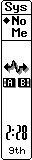
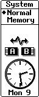
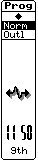
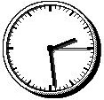

== WINDOW SERVER REFERENCE UPDATE

IMPORTANT: This document is a beta version and may be subject to change.

This chapter describes the changes and additions that have been made to the Window server as a result of the introduction of the Siena and Series 3c machines into the SIBO range.

NOTE: Siena was codenamed Vine by Psion during development, hence the naming of some of the constants given below.

=== Screen sizes

The true screen and pixel dimensions of the various LCD screens on all SIBO machines are as follows:

[cols="1h,1,1,1,1,1",options="header",]
|===
|Machine type* |Screen (pixels) |Pixel pitch (mm)| Pixel size (mm) |Screen size (cm) |Screen size (in)

|HC
|160x80
|0.34x0.43
|0.31x0.40
|5.44x3.44
|2.14x1.35

|S3
|240x80
|0.385x0.43
|0.355x0.40
|9.24x3.44
|3.64x1.35

|Work__about__
|240x100
|0.26x0.30
|0.23x0.27
|6.24x3.00
|2.45x1.18

|Siena
|240x160
|0.25x0.25
|0.23x0.23
|6.00x4.00
|2.36x1.57

|S3a
|480x160
|0.259x0.259
|0.20x0.20
|12.477x4.156
|4.915x1.637

|S3c
|480x160
|0.26x0.26
|0.20x0.20
|12.478x4.158
|4.915x1.637

|MC200
|640x200
|0.33x0.33
|0.30x0.30
|21.12x6.60
|8.31x2.60

|MC400
|640x400
|0.33x0.33
|0.30x0.30
|21.12x13.20
|8.31x5.20
|===

In the above table, the horizontal measure is shown before the vertical measure.
The pixel pitch measures the horizontal and vertical distance between the same points on adjacent pixels.
The difference between the pixel size and the pixel pitch gives the gap between pixels.

The Series 3c and the Siena screens support the use of grey in exactly the same way as for the Series 3a.

=== Keyboard

Except where stated below, the keycodes produced on the Series 3c and the Siena are identical to those produced on the Series 3a.

The following table lists the additional and/or modified key codes produced by the special keys on the Siena and the Series 3c, as listed in _wskeys.h_:

[cols="1m,3"]
|===
|`W_KEY_TAB` (0x9 or '\t')
|Produced by kbd:[TAB], with or without kbd:[SHIFT] or kbd:[CTRL]. On the HC and MC only, the kbd:[PSION] key adds `W_SPECIAL_KEY`.
On the Work__about__, the kbd:[PSION] key (but not kbd:[SHIFT+PSION]) converts the keypress to `W_KEY_TASK`.

On the Series 3c, the PSION key (including kbd:[SHIFT+PSION]) converts the keypress to `W_KEY_IR_LINK` (0x142).

|W_FUNC_MODIFIER (0x80)
|On the Siena only, an kbd:[FN] modifier key is provided that produces this additional modifier code.

Note that the same value is used for Mouse Down (W_MOUSE DOWN) on the Psion MC range of machines.

|W_KEY_APP1 to W_KEY_APP9 (0x131 to 0x139)
|On the Series 3 and Series 3a, key codes `W_KEY_APP1` to `W_KEY_APP8` are produced by the eight membrane keys (also called application keys) in order, from left to right.

The Series 3c has a ninth membrane key, on the extreme right, that produces `W_KEY_APP9`.

|W_KEY_IR_BRING (0x140)
|On the Siena only, this key code is produced by the kbd:[IR receive] key.

|W_KEY_IR_SEND (0x141)
|On the Siena only, this key code is produced by the kbd:[IR send] key.

|W_KEY_IR_LINK (0x142)
|On the S3c only, this key code is produced by the kbd:[PSION+TAB] key combination.

|W_KEY_CALC_CLEAR (0x01b)
|On the Siena only, this key code is produced by the kbd:[ON/CE] key.

|W_KEY_CALC_MEM_CLEAR (0x150)
|On the Siena only, this key code is produced by kbd:[FN] + the kbd:[3] key on the numeric keypad.

|W_KEY_CALC_MEM_RECALL (0x151)
|On the Siena only, this key code is produced by kbd:[FN] + the kbd:[2] key on the numeric keypad.

|W_KEY_CALC_MEM_MINUS (0x152)
|On the Siena only, this key code is produced by kbd:[FN] + the kbd:[-] key on the numeric keypad.

|W_KEY_CALC_MEM_PLUS (0x153)
|On the Siena only, this key code is produced by kbd:[FN] + the kbd:[+] key on the numeric keypad.

|W_KEY_CALC_CHNG_SIGN (0x154)
|On the Siena only, this key code is produced by kbd:[FN] + the kbd:[. key] on the numeric keypad.

|W_KEY_CALC_PERCENT (0x155)
|On the Siena only, this key code is produced by kbd:[FN] + the kbd:[=] key on the numeric keypad.

|W_KEY_CALC_DECIMAL (0x156)
|On the Siena only, this key code is produced by the kbd:[.] key on the numeric keypad.

|W_KEY_CALC_MEM_INPUT (0x158)
|On the Siena only, this key code is produced by kbd:[FN] + the kbd:[1] key on the numeric keypad.

|W_RUSSIAN_MODIFIER (0x1000)
|On the Russian variant Series 3a and Series 3c only, (for Psion internal use only).
|===

=== Status windows

==== Series 3c

Status windows on the Series 3c are functionally identical to those on the Series 3a.
Some minor cosmetic changes have been made, including a new analog clock design for the wide status window.

[cols="1,1"]
|===
|
|
|===

==== Siena

Only a narrow status window is available on the Siena.
A smaller font is used and the diamond list has been reorganised, compared with that of the Series 3a, to maximise the space for displaying text.
Despite these changes, only four characters of the application name and up to five characters of each diamond list item can be displayed.

Diamond list text items that contain more than five characters are automatically truncated.
Since such truncation may occur at an unsuitable point in the text, you should consider supplying truncated versions of the diamond text for use in the status window, such as the four-character abbreviations for ‘Normal’ and ‘Outline’ shown in the above illustration.

The following constants are defined in _wlib.h_:

[cols="1m,1m,3"]
|===
|WS_WIDTH_V4C
|51
|Normal status window width on Series 3c, in pixels; this is not a new constant -- it also exists on the Series 3a

|WS_WIDTH_SMALL_V4C
|32
|Narrow status window width on Series 3c, in pixels; this is not a new constant -- it also exists on the Series 3a

|WS_WIDTH_VINE
|36
|Narrow status window width on Siena, in pixels
|===

=== Clocks

The clock creation functions, for example, `wsCreateClock2`, on the Siena and Series 3c support additional clock styles.
The new styles and their appearances and dimensions are given below. The associated symbolic constants are defined in `wlib.h`.

==== Siena

The Siena supports one additional clock, of type `WS_CLOCK_VINE`:

[cols="3m,1m,3"]
|===
|WS_CLOCK_VINE
|0x06
|

|WS_BITMAP_VINE_CLOCK_SIZE_X
|70
|Width of Siena analogue clock, in pixels

|WS_BITMAP_VINE_CLOCK_SIZE_Y
|69
|Height of Siena analogue clock, in pixels
|===

==== Series 3c

The Series 3c supports two additional clock types, `WS_CLOCK_MEDIUM3` and `WS_CLOCK_XL2_ANALOG`:

[cols="3m,1m,3"]
|===
|WS_CLOCK_MEDIUM3
|0x06
|

|WS_BITMAP_MEDIUM3_CLOCK_SIZE_X
|58
|Width of Series 3c medium analogue clock, in pixels

|WS_BITMAP_MEDIUM3_CLOCK_SIZE_Y
|51
|Height of Series 3c medium analogue clock, in pixels
|===

[cols="3m,1m,3"]
|===
|WS_CLOCK_XL2_ANALOG
|0x07|

|WS_BITMAP_XL2_CLOCK_SIZE_X
|111
|Width of Series 3c extra large analogue clock, in pixels

|WS_BITMAP_XL2_CLOCK_SIZE_Y
|110
|Height of Series 3c extra large analogue clock, in pixels
|===

=== Window Server versions

The following values are contained in the version_id member of the `W_SERVER_INFO` struct. The constants and the struct are defined in `wlib.h`:

[cols="3m,1m,3"]
|===
|WS_TYPE_S3C
|0x60
|Series 3c window server

|WS_TYPE_VINE
|0x70
|Siena window server
|===
