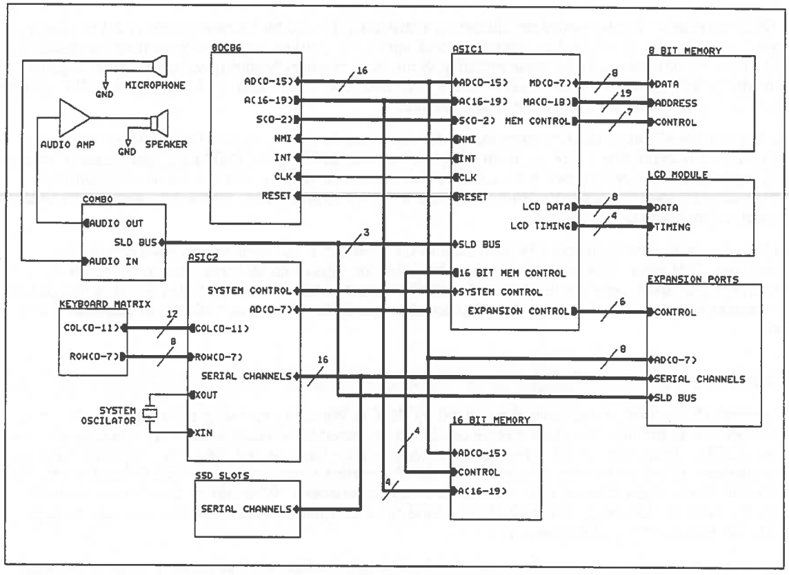

== THE PRINCIPAL CHIP SET

Current SIBO products in the MC, HC and Series 3 range are based on the same three principal chips.
These are the V30H (a 8086 compatible processor) and two Psion custom chips known as ASIC1 and ASIC2.
Later SIBO products including the Series 3a have these three devices integrated into a single Psion custom chip known as ASIC9.

The V30H is an enhanced 16 bit CMOS version of the 8088 found in the original IBM PC.
It is software compatible with the 8088.
The V30H is a fully static design, which means that all the internal storage elements i.e. its registers are made from static rather than dynamic storage elements.
This means there is no minimum clock speed required to refresh the storage elements and the system clock can be stopped at any time with no loss of internal state.
This technique is used extensively in the SIBO architecture to save power while the processor is idle i.e. waiting for an event.

ASIC1 and ASIC2 are Psion specific gate arrays based on a one micron full CMOS process.
They are described in more detail in the next sections.
Figure 1 shows a simplified block diagram of the SIBO architecture showing the principal three chips.

.Figure 1

=== ASIC1

ASIC1 contains approximately 4300 gates, implemented on a Hitachi one micron CMOS gate array in a 100 pin quad flat pack package.

ASIC1 is the main system controller for the SIBO architecture.
It connects directly to the 80C86 in maximum mode controlling all bus cycles to and from the processor.
This configuration effectively forms a micro-controller like device that executes 8086 instruction codes.
ASIC1 is made up of a number of functional blocks described below.

==== Bus controller

The bus controller converts the encoded bus cycle requests (present on S0-S2) from the processor into the appropriate memory and I/O control signals.
The bus controller is similar to the Intel 8288 device but with several enhancements, these are:

. Clock stopping on the HALT instruction.
Whenever a HALT instruction is issued by the processor the clock line to the processor is stopped and held low until either an NMI or an interrupt is asserted.
. Bus arbitration during video refresh cycles.
Bus cycles to the video RAM segment are delayed while a video refresh is in progress.
. Memory write and I/O blocking.
Memory writes outside pre-programmed segments and all I/O instructions can be blocked by the bus controller.
See following sections on address and I/O protection.

==== Bus converter

There are two distinct memory buses in the SIBO architecture, these are the 8-bit bus and the 16-bit bus.
Memory access to the 8-bit bus are converted to 16 bit accesses by the bus converter.
This means that the 80C86 can access memory on the 8-bit bus as if it were 16-bits wide.

ASIC1 can operate in two modes dependant on a strapping pin: 16 bit memory mode or 8 bit memory mode.
16 bit mode allows higher processor clock speeds for a given memory access time but requires a full 16 bit bus and hence 16 bit wide memory.
8 bit mode requires higher speed memory for a given processor clock speed but only requires an 8 bit bus and 8 bit wide memory.
In all MC’s ASIC1 operates in 16 bit mode, while the HC operates in 8 bit mode.

In 16 bit mode all the system memory except for the video RAM is connected to the 16 bit bus.
The video RAM is defined as a 32K segment of RAM between 38000 and C0000 hex.
Any memory access to this segment is converted to two 8 bit memory accesses on the 8 bit bus by the bus conversion logic.
These accesses may delay the 80C86 by stopping the clock to allow time for the two accesses or to allow a video refresh access to take place.

In 8 bit mode all system memory is connected to the 8 bit bus so all memory accesses need to be converted.
This means that memory needs to be faster for a given clock speed than in 16 bit mode, because two memory accesses need to be “squeezed” into one bus cycle.
The video RAM is just part of the system RAM and is of variable size dependent on the LCD screen size with a base address of 400 hex.

==== Timer

A general 16 bit count down timer is provided by ASIC1.
When the system is not in the standby state i.e. the processor is running, the clock source can be programmed to be either a fast (512 KHz) clock or a slow (32 Hz) clock.
Any 16 bit value can be written into the timer at any time.
This value will then be decremented on the next rising edge of the clock.
The current value in the timer can be read at any time.
When the value in the timer reaches zero an interrupt is generated.
When the system is in the standby state the timer is clocked from the 32 Hz real time clock oscillator in ASIC3 so that time can be kept while the processor is powered down.

The timer can operate in two modes controlled by a programmable bit, free running mode or prescale mode.
In free running mode, when the timer decrements to zero an interrupt is generated and the counter just wraps around to -1 (FFFF).
In prescale mode when the interrupt is generated the original value written to the timer is re-loaded automatically, this allows the interrupt to become a rate programmable pulse stream.
This pulse stream is also an output from ASIC1.

==== LCD Controller

The LCD controller provides all the necessary timing and data signals to drive any graphic LCD module of up to 640 by 400 dots in size.

The data is output on up to eight signals.
Each data signal outputs serial data that is synchronous with the dot clock.
The data is a continuous bit stream formed from serialised data taken from the video refresh RAM.
The data is serialised so that the first pixel in a line is bit 0 in the corresponding byte of the video RAM, this means the video RAM can be accessed in words i.e 16 bits wide.

The timing and data signals are controlled by a number of programmable registers which allow the following parameters to be set:

. *Line length* - the number of dots in the line.
. *Frame length* - the total number of dots in the screen.
. *Refresh rate* - sets the refresh rate.
This should be calculated from the system clock speed and the screen size to give a refresh rate of approximately 70 frames per second.
. *AC drive rate* - sets the frequency of the AC drive signal to the LCD module as a function of the line rate.
This should be calculated to be approximately 300 Hz.
. *Display mode* - four different display modes are supported these are: single screen refreshed from video page one; single screen refreshed from video page two; single screen refreshed from video page one and two giving a two bit grey scale; and double screen refreshed from video page one and two.

==== Memory decoding

Memory decoding is dependent on what mode ASIC1 is in.
In 16 bit mode only a single 8 bit memory device can be addressed, in 8 bit mode up to six memory devices can be addressed.
16 bit memory devices must be decoded externally from ASIC1.

8 bit memory decoding allows for different sized physical memory devices to be connected to the logical memory slots.
Three memory device size options are supported allowing for 32K x 8, 128K x 8 and 512K x 8 devices to be addressed.
These options are selected by two programmable bits, `MSEL0` and `MSEL1`.

The following table summarises the memory device size options:

[width="100%",cols="1,1,3",options="header",]
|===
|`MSEL1` |`MSEL0` | Device size
|0 |0 |32k x 8
|0 |1 |128k x 8
|1 |0 |Invalid
|1 |1 |512k x 8
|===

The following table summarises the memory decoding performed by ASIC1:

[width="100%",cols="1,1,1,1,1",options="header",]
|===
2+| Device Size | 32k x 8 | 128k x 8 | 512k x 8
h|Mode h|Memory slot 3+h|
.6+|8 Bit |8 Bit slot 0 |00000 - 07FFF |00000 - 1FFFF |00000 - 7FFFF
|8 Bit slot 1 |08000 - 0FFFF |20000 - 3FFFF |80000 - FFFFF
|8 Bit slot 2 |08000 - 0FFFF |40000 - 5FFFF |-
|8 Bit slot 3 |18000 - 1FFFF |60000 - 7FFFF |-
|8 Bit slot 4 |20000 - BFFFF |80000 - BFFFF |80000 - BFFFF
|8 Bit slot 5 |C0000 - FFFFF |C0000 - FFFFF |C0000 - FFFFF
.2+|16 Bit |6 Bit slot 1 |B8000 - BFFFF | |
|16 Bit slot |0000 - B7FFF + C0000 - FFFFF | |
|===

==== I/O Decoding

I/O space is decoded by ASIC1 according to the following table:

[width="100%",cols="1,3",options="header",]
|===
|Address Range |Function
|0300 - FFFF |Not used
|0200 - 02FF |Expansion port 2
|0100 - 01FF |Expansion port 1
|0090 - 00FF |Not used
|0080 - 008F |I/O space in ASIC2
|0020 - 007F |Not used
|0000 - 001F |Internal I/O in ASIC1
|===

==== Interrupt controller

The interrupt controller in ASIC1 prioritises eight interrupt request lines to generate a single interrupt request to the processor.
When and if the processor executes an interrupt acknowledge cycle, the interrupt controller places the correct vector on the bus.

The interrupt controller is similar to the Intel 8259 device, however, the following restrictions apply; there is no provision for daisy-chaining additional interrupt controllers, level triggered mode only is supported and the interrupt vector base is fixed at 78 hex.

The 8 interrupts are defined internally in ASIC1 as follows:

[width="100%",cols="1,1,1,4",options="header",]
|===
|Interrupt |Vector |Name |Description

|IRQ0 |78 |`TINT` |Tick interrupt at 2 or 32 Hz
|IRQ1 |79 |`EINT0` |External interrupt usually connected to mains detect bit
|IRQ2 |7A |`EINT1` |External interrupt from expansion port one
|IRQ3 |73 |`EINT2` |External interrupt from expansion port two
|IRQ4 |7C |`EINT3` |External interrupt from ASIC2
|IRQ5 |7D |`OVINT` |Timer overflow interrupt
|IRQ6 |7E |`SRXI` |SLD sound receive interrupt
|IRQ7 |7F |`STXI` |SLD sound transmit interrupt
|===

==== Watchdog timer

The watchdog timer is a two bit counter which counts up at a rate of 4 Hz.
If the count reaches three a NMI is generated.
The counter can be reset by a write to an I/O location inside ASIC1.
Normally the counter is reset on every tick by the interrupt service routine.
The NMI will be produced after 24 ticks have passed with no reset, this equates to 0.75 of a second with interrupts disabled.

==== Address and I/O protection

ASIC1 can be switched into protected mode, in this mode all I/O instructions and memory writes outside a predefined range are blocked.
An attempted I/O instruction or write out of range will generate an NMI.

The range is set by writing the upper and a lower segment bounds for the given range to two internal 16 bit registers in ASIC1.

Protected mode is switched on and off by writing to or reading from a special I/O location in ASIC1.

=== ASIC2

ASIC2 contains approximately 2200 gates, implemented on a Hitachi one micron CMOS gate array in an 80-pin quad flat pack package.

ASIC2 contains the system clock oscillator, controls switching between the standby and operating states, and provides an interface to the power supply, keyboard, buzzer, SSDs and expansion ports.
ASIC2 consists of the following functional blocks:

==== System clock oscillator

An on-chip oscillator cell connected to an external crystal generates the main system clock in the operating state.
The system clock frequency is divided down to provide clocks for the serial channels, the SLD bus interface and for RS232 communication.
The oscillator is disabled in the standby and battery backup states to conserve power.

==== On/off control

ASIC2 controls switching between the standby and operating states.
ASIC2 puts the system into the operating state when: the keyboard ‘on” signal is asserted; the system “reset” signal is generated; an expansion device requests service; an external controller initiates a ‘high speed link’ or the ASIC1 timer reaches zero.

Switching from the operating state to the standby state is software controlled.
When an “enter standby” command is written to ASIC2 it shuts down the power supply via the serial interface and puts the system into the standby state.

==== SIBO serial protocol controller

ASIC2 contains an 8-channel SIBO serial protocol controller which provides an interface to the power supply, the SSDs, the expansion ports and the high speed link.
Channel assignments are:

[width="100%",cols="1,1",options="header"]
|===
|Channel |Function

|0 |Power supply (ASIC3)
|1-4 |SSDs
|5,6 |Expansion ports
|7 |High speed link
|===

Serial clocks 5 & 6 may be set free running at 1.536 MHz, this frequency may be divided down by devices connected to the expansion ports to provide baud rates for RS232 communication.

To maximise the data transfer rate, a “controller busy” signal is generated by ASIC2 during a data transfer.
This signal is connected to the processor `TEST` pin.

For further details refer to _The SIBO Serial Protocol_ chapter of this manual.

==== SIBO serial protocol slave

The SIBO serial protocol slave is used for the “high speed link” to receive data transmitted by an external controller.
An interrupt is generated when a frame is received.

==== Keyboard interface

ASIC2 provides an interface to a matrix keyboard of up to 192 keys, made up from 16 rows by 12 columns.
During a keyboard scan the columns are each driven high in turn by ASIC2 and the row information is read from the keyboard row register.
Normally the row buffer is 8 bits wide which gives a matrix of 8 x 12 i.e. 96 keys.

==== Buzzer interface

A piezoelectric buzzer element can be connected directly to ASIC2.
The buzzer can be driven at high or low volume, and either directly by toggling an ASIC2 register bit or by the overflow bit from the ASIC1 timer.

==== NMI generation

ASIC2 controls the generation of an NMI which is passed onto the processor via ASIC1.
This NMI can be generated from a number of sources, these are, power fail conditions and SSD or expansion port door micro-switches.
When the main power supply voltage (Vsup) falls to a level insufficient to power the system ASIC3 signals ASIC2 and a power fail NMI is generated.
When an expansion device is removed or inserted, or if an SSD is removed or inserted micro-switches connected to ASIC2 generate the appropriate NMI.
The source of the NMI is identified by reading a register in ASIC2.

=== ASIC9

The Series 3a differs from the above description in that the V30H and all the functions in ASIC1 and ASIC2 have been integrated into a single custom device known as ASIC9.
This has allowed faster processing speeds and lower power consumption to be achieved.
In addition a number of enhancements and alterations have been made to the SIBO architecture listed below.

==== Increased memory addressing

The Series 3a extends the V30H address range beyond the 1 MByte limit.
This allows larger mask ROMs and RAMs to be addressed.
This is done by implementing bank switching in ASIC9 which will be similar to EMS on PCs.

Each bank is 64 KBytes in size and is selected by writing into one of four page registers, two to select a RAM address and two to select ROM addresses.
These page registers are called PSEL0 to PSEL3 respectively.

This method extends the V30H address capability by 4 bits to produce two 24 bit address bus ranges, one for RAM and one for ROM.
This gives an affected linear address range of 32 MBytes.
The 16 MByte RAM space is decoded into 4 Chip selects allowing up to 8 x 16 Mbit RAM devices (2 per chip select as 16 bit wide).
The 16 MByte ROM space is decoded into two chip selects each selecting 8 MBytes each, one for mask ROM and one for FLASH memory.

The physical address map for the V30H now looks like this:

[width="100%",cols="1,3",options="header",]
|===
|Address range |Description

|00000 - 5FFFF |Maps to physical bottom 384K of the 16 Mbyte RAM space.
|60000 - 6FFFF |Maps to 64K RAM segment selected by page register PSEL0.
|70000 - 7FFFF |Maps to 64K RAM segment selected by page register PSEL1.
|80000 - 8FFFF |Maps to 64K ROM segment selected by page register PSEL2.
|90000 - 9FFFF |Maps to 64K ROM segment selected by page register PSEL3.
|A0000 - FFFFF |Maps to physical top 384K of the 16 Mbyte ROM space.
|===

==== Increased processor speed

Although the V30H microprocessor is rated at clock speeds of up to 16 MHz, the Series 3 machine is currently limited to a clock speed of 3.84 MHz.
This is due to the fact that ASIC1 accesses the ROM as two 8 bit bytes to assemble a 16 bit word for the V30H.
This equates to a required ROM access speed of approximately 250 nSec for a 3.84 MHz clock.
Readily available mask ROMs have an access speed of 200 nSec which currently limits the clock speed of Series 3.

ASIC9 supports 16 bit wide accesses to memory space which allows a doubling of the clock speed for the same ROM access time.
In addition ASIC9 will support programmable wait states so that faster clock speeds can be used with slow ROMs or RAMs.

==== Improved Pack performance with hardware wait

Data throughput to and from SSD s has been significantly increased by integrating the serial controller more closely to the bus controller.
This is now possible as they are both in the same chip.
The serial controller can now automatically hold the processor (by stopping the CPU clock) if it attempts to issue a command to the controller whilst it is busy.
This reduces to zero the overhead involved in determining this condition.
This technique should also enhance the speed that Flash memory devices can be written to.

==== Addition of hardware 32 bit RTC

The ASIC1/ASIC2 implementation of the SIBO architecture uses the FRC (Free running counter) to maintain time while the CPU is powered down (in standby).
This means the CPU must wake up at a periodic rate (approx 8 hours) to keep time, if the CPU cannot start (no main batteries) time is lost.
To overcome this limitation ASIC9 contains a separate 32 bit real time clock that will continually maintain the system time independently from the CPU.
This counter will be clocked at 1 Hz so its maximum range will be 2^32^ seconds or approx 136 years.

==== Improved sound facilities

ASIC9 contains a 16 FIFO buffer to reduce the CPU overhead involved in playing or recording sounds via the CODEC device.

==== Switch on via the membrane key pads

ASIC9 contains the logic to bring the system out of the standby state if any of a set number of row inputs goes high.
This allows Switch on via the membrane key pads.

==== Facility to address two ROM sites

The 16 MByte paged ROM address will be split into two sections each 8 MBytes in size.
It is intended that one section is for mask ROM one for FLASH memory.

==== Additional FRC

ASIC9 contains an additional FRC (Free Running Counter).
This FRC is functionally identical to the current FRC but is indented for general user use and is not used by EPOC.

This second FRC can be clocked from either 512 KHz or 1024 Hz.
This extends the use of the FRC by providing a counter with a resolution of 1 mSec and a range of just over one minute.
This could help software time events in the mSec range i.e. a stopwatch.

==== Improved Grey scale

The mapping of the two video maps has been improved to reduce the overhead that grey scales impose on software.
This improved scheme supports only one grey level together with black and white.
The second video map is an attribute map and would have the effect of dimming only those pixels that are set i.e. black.

==== Triple Serial Control and Data Registers

ASIC9 contains three serial control registers and three read data registers.
This allows independent expansion devices to be added to either SSD slot.

The main advantage of triple registers is that a multiple-mode pack read can be interrupted at anytime bya read or write to any of the other serial channels without loss of setup and data, for example servicing an RS232 interrupt from either SSD slot.

==== Contiguous video memory map

The ASIC1/ASIC2 implementation of the SIBO architecture positions the two video maps so that they are separated by a fixed address space (16K 4000H).
This restriction is overcome in ASIC9 by starting the second video map directly after the first video map regardless of the size of the video maps.

==== Expansion support in SSD slots

Two active low external interrupt inputs are provided by ASIC9 which can be connected to the V~BACK~ outputs on two SSD sockets.
This will allow SSD sized expansion devices to be fitted internally to the Series 3a.

==== Altered interrupt allocation

The Interrupt allocation has been changed in ASIC9.

[width="100%",cols="1,1,1,3",options="header",]
|===
|Interrupt |Vector |Name |Comment

|IRQ0 |$78 | `CSINT` |CODEC sound interrupt.
|IRQ1 |$79 | `TINT` |32 Hz tick interrupt.
|IRQ2 |$7A | `SSINT` |Serial slave interrupt.
|IRQ3 |$73 | `EINT0` |External interrupt input 0.
|IRQ4 |$7C | `EINT1` |External interrupt input 1 (inverted).
|IRQ5 |$7D | `EINT2` |External interrupt input 2 (inverted).
|IRQ6 |$7E | `FRC1OI` |FRC1 overflow interrupt.
|IRQ7 |$7F | `FRC2OI` |FRC2 overflow interrupt.
|===

=== PSU subsystem

SIBO architecture power supplies all differ depending on the system requirements.
MC and HC power supplies have higher current ratings to support a wide variety of expansion devices and are based around 7.2 volt NiCd batteries.
The Series 3 and its derivatives have a lower current rating and are based around two 1.5 volt alkaline batteries.

MC and HC power supplies are based on a full custom liner ASIC known as ASIC3.
This custom chip is manufactured by Maxim and has the Maxim part number MAX616.
The power supply provides a number of switched power rails from one unregulated supply rail known as V~sup~.
This supply is typically connected to the main battery in the system and can be in the range 5.5 to 12 volts.
These supply rails are derived from V~sup~ from either PNP pass transistor linear regulators or from switch mode regulators.
Series 3 power supplies generate a subset of the rails listed below from a number of switch mode regulators.

SIBO architecture power supplies all operate in four principal states, these are; standby, backup idle and operating.

==== The standby state

In the standby state the main oscillator and the processor are shut down.
ASIC1, AS1C2 and the memory are powered and the real time oscillator is running to keep time.
The timer in ASIC1 is used in this mode to keep time while the processor is powered down.
All other supply rails are switched of in this state.

==== The backup state

The backup state only exists when the main battery supply has failed or is not present.
This state is the same as the standby state except that V~cc1~ is now powered from the backup battery input and switching to the operating state is inhibited.

==== The idle state

In the idle state the processor is powered up and the main system oscillator is running: the switchable supply rails may be on depending on software instructions.
The processor clock is stopped and the processor is idle and waiting for an event i.e. an interrupt.
This means that the bus is not active apart from LCD screen refresh accesses.

==== The operating state

The operating state is the same as the idle state except that the processor clock is running and the bus is active.

==== V~cc1~ supply

V~cc1~ is a nominal +5 volt supply that is not programmable and is present in all states.
On MC and MC power supplies it is derived from V~sup~ via a PNP pass transistor, the base drive of which is supplied by ASIC3, this configuration is the same for all the linear regulators.
On Series 3 power supplies it is derived from a DC to DC converter and on ASIC9 based systems the nominal voltage is 3.3 volts.

V~cc1~ supplies ASIC1 and ASIC2 or ASIC9 plus all the memory.
The V~cc1~ supply is current limited to a few hundred micro-amps when the system is in the standby state.

==== V~cc2~ supply

V~cc2~ is a +5 volt supply that is either derived from Vsup in the same way as V~cc1~ or from a DC to DC converter.
V~cc2~ is disabled when the system is in the standby state and is automatically switched on when the operating or idle state is entered.
V~cc2~ powers the processor and any other devices that can be shut down in the standby state.
V~cc2~ is also connected to the expansion ports for powering peripheral devices.
V~cc2~ is fixed at 5 volts even in a 3.3 volt system.

==== V~cc3~ supply

V~cc3~ is a software switchable supply.
It is either 5 volts or 3.3 volts depending on the voltage of V~cc1~.
It is connected to the LCD display module and powers the display drivers.

==== V~cc4~ supply

V~cc4~ is a software switchable +5 volt supply.
It is connected to the positive supply to the sound sub system.
It is only present in MC and HC power supplies.

==== V~cc5~ supply

V~cc5~ is a software switchable +5 volt supply that is either derived from V~sup~ in the same way as V~cc1~ or switched from V~cc2~.
It is connected to the 5 volt supply pin on the external SSD slots.

==== V~ee1~ supply

V~ee1~ is a software switchable negative supply rail which is connected to the LCD module to provide the LCD bias voltage.
The voltage of V~ee1~ can by programmed in software to provide software adjustment of the LCD contrast.
V~ee1~ is generated using a fly-back switch mode regulator.
The voltage generated is determined by comparing the feedback voltage to the output of a DAC.

==== V~ee2~ supply

V~ee2~ is a software switchable negative supply rail which is connected to the negative supply of the sound sub-system.
V~ee2~ is specified as -5 volts plus or minus 5% and is generated from Vsup using a fly-back switch mode regulator which is controlled by ASIC3.
V~ee2~ is only present on MC and HC power supplies.

==== V~h~ supply

V~h~ is a software switchable positive supply rail which is connected to the SSD slots.
It is used in the SSDs to provide the programming voltage needed to write and format Flash memory devices.
V~h~ is generated using a fly-back switch mode regulator is specified to be +16 volts.

